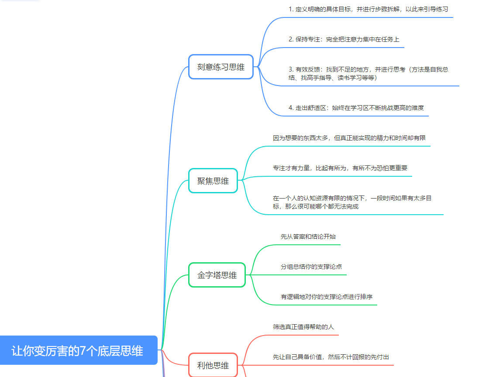
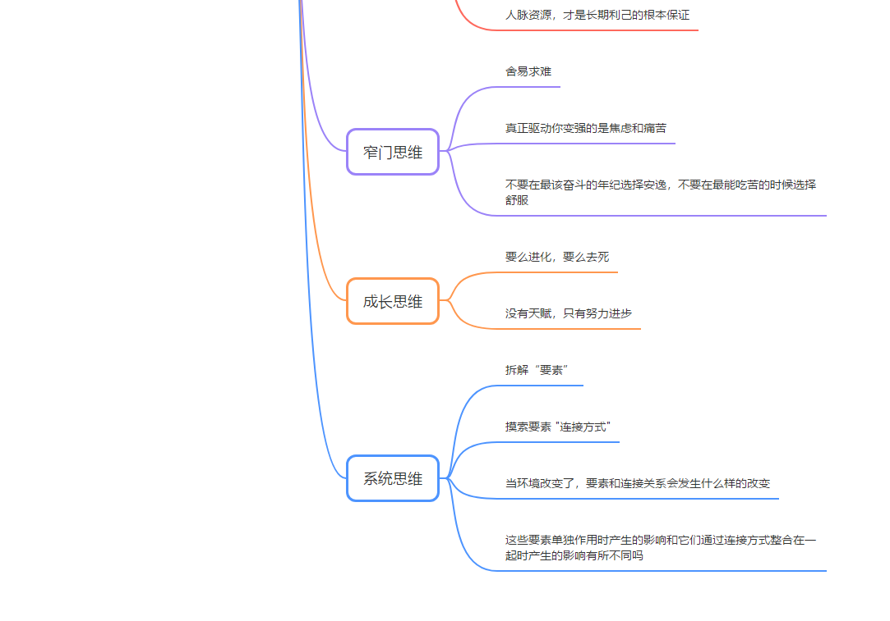
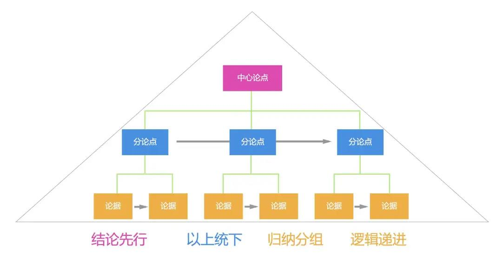

# 让你变厉害的7个底层思维

文章来源于findyi

**如果把你的思维比做操作系统，那思维模型就是一个个App。**

这些App会给你提供新的视角，快速帮你决策，提升你的工作效率。顶级的思维模型能提高你成功的可能性，并帮你避免失败。

华尔街大VFarnam Street曾这样描述思维模型：“思维模型是你大脑中用于做决策的工具箱。你拥有好的工具箱越多，你就越能够做出正确的决策。”

回顾我自己，在学习和工作中的一些案例，比如高考最后四个月提分200多，再比如在职场的快速晋升。

**我发现，正是因为正确使用了一些思维模型，才让我事半功倍。**

**很多时候，正确的思维方式比努力重要100倍。**

**今天和大家分享，能让你变得越来越厉害的7个思维模型。**

## 一、刻意练习思维

**我认为，所有思维模型里面，刻意练习是最重要的那一个。**

**原因无他：刻意练习是成为某项领域高手的最好方式。**

大家初入职场，缺乏经验和技能，往往都是从最基础的工作做起。

不少同学很快进入舒适区，这种状态很平静也很安逸，却是极大的陷阱。

简单的工作重复做的时候，我们能否做得更优秀？

工作中能否观察上级或者其他优秀同事的好的工作方法，并学习应用到自己的工作？

能否保持读书学习的习惯？能否保持总结输出的习惯？能否主动寻找高手来指导自己？

以上这些问题，其实都是刻意练习的实操方法。

职场无论是走管理序列还是专业序列，又或者换其他职业，都需要将刻意练习融入进来。

成为高手意味着你超过了大部分人，也意味着随着时间消逝、年龄增长被淘汰的几率变小。

刻意练习的要诀是：

* 定义明确的具体目标，并进行步骤拆解，以此来引导练习。

* 保持专注：完全把注意力集中在任务上。

* 有效反馈：找到不足的地方，并进行思考（方法是自我总结、找高手指导、读书学习等等）。

* 走出舒适区：始终在学习区不断挑战更高的难度。

**扼住命运的咽喉，先从掌握刻意练习开始**。

## 二、聚焦思维

**我们有自己的人生目标吗？我们有自己的职场目标吗？这些目标足够聚焦吗？**

**这些问题都决定了我们的成长速度和天花板。**

讲个巴菲特的小故事吧：

Mike Flint 做了巴菲特的私人飞行员十年之久，还曾为美国四任总统开过飞机，但他在事业上依然有更多追求。

有一次，他和巴菲特在探讨他的职业生涯目标时，巴菲特让他去做这么一件事。

首先，巴菲特让 Flint 写下他职业生涯最重要的25个目标。

于是Flint花了一些时间把这些目标写了下来。

然后，巴菲特让他审视一下这个清单，然后圈出他认为最重要的5个。

Flint有了2个清单：一个是他认为自己职业生涯最重要的5个目标。

另一个是另外20个他也觉得比较重要的目标。

巴菲特问Flint：“你现在知道该怎么做了么？”

Flint回答道：“知道了。我现在会马上开始着手实现这5个目标。至于另外20 个，并没有那么紧急，所以可以放在闲暇的时间去做，然后慢慢把它们实现。”

巴菲特听完后说到：“不，Flint，你搞错了。那些你并没有圈出来的目标，不是你应该在闲暇时间慢慢完成的事。而是你应该尽全力避免去做的事，你应该像躲避瘟疫一样躲避它们，不去花任何的时间和注意力在它们上面。”

**从这个小故事，大家悟出了什么？**

**那些真正聪明的人，都拥有“聚焦思维”。**

因为想要的东西太多，但真正能实现的精力和时间却有限。

专注才有力量，比起有所为，有所不为恐怕更重要。

在一个人的认知资源有限的情况下，一段时间如果有太多目标，那么很可能哪个都无法完成。

这可能和芒格说的“Invert，always invert” 有相通之处。

放弃的那20个目标，其实也是你感兴趣的或者有意义的，很容易找在这些目标上花费时间。

**但它们消耗掉时间，转移了注意力，又不能真正产出成果。**

**这种目标比看起来明显就很愚蠢的事情更加危险。**

## 三、金字塔思维

**根据金字塔原理，将思想组织成金字塔结构，同时学会用金字塔结构去沟通：**

金字塔原理中的三个核心思想是：

（1）先从答案和结论开始。

（2）分组总结你的支撑论点。

（3）有逻辑地对你的支撑论点进行排序。

**在我们思考沟通中，应用金字塔原理非常重要。**

不知道大家身边有没有这样的同事，讨论一个问题，先扒拉一大堆。然后再慢慢说出自己的看法和结论。

让周围的人都快听晕了，还没听出个所以然。

这种思考沟通方式的危害极大，尤其是跟领导沟通，他们的时间和注意力都极其有限。

先把思想组织成金字塔结构，把答案和观点快速摆出来，而不是慢慢揭示答案。

这样有助于更快地得出结论，并且让自己的想法顺利传导给其他人。

除了语言沟通，文字沟通同样能遵循金字塔原理，也会让你上一个台阶。

**比如写周报、写PPT、写文章等等。**

**而这些，往往决定了我们的职场发展。**

## 四、利他思维

**旧文提过，人脉无比重要，并且人脉具备时间复利的特点。**

很多年轻的朋友抱怨没有人脉，身边大佬都不搭理自己。

其实是因为他们不具备“利他思维”。

**时刻利他才能长期利己。**

不用说，人类的本质都是利己的。圣人的单纯利他价值观，咱都是俗人，崇拜下就可以了。

但人类社会很奇妙，特别讲究等价交换，如果你不能做到不断的利他，反而最终无法利己。

怎么说？如果你没有自身某些方面的价值，并把价值传递给其他人，帮助其他人，在这个等价交换的社会里，没有人会理你，你也不会具备任何人脉。

而人脉资源，才是长期利己的根本保证。

换句话说，先让自己具备价值，然后不计回报的先付出，才能在关键时刻得到他人的支持和帮助，没有人愿意和上来就索取的人打交道。

将“利他思维”融入到工作和生活中，输出真正的价值给那些你能影响到的人。

这个时候，人脉时间的复利就悄悄发芽了。

当然，我们的时间和精力及其有限。

因此时刻利他还有一个基础：筛选真正值得帮助的人。

**有个筛子交给大家：时刻利他需要避开那些把你的付出和帮助当作理所当然，甚至要求更多的人。**

## 五、窄门思维

“你们要进窄门。因为引到灭亡，那门是宽的，路是大的，进去的人也多；引到永生，那门是窄的，路是小的，找着的人也少。”

---《圣经：新约马太福音》

这个世界上，大家总喜欢选择开始简单的事情。虽然开始是“宽门”，但会发现，到后面竞争者挤满了道路，寸步难行。

而另一些人，会选择开始很难的事情，虽然开始是“窄门”，看上去荆棘密布，但一旦披荆斩棘跨，海阔天空。

**其实这个世界上，但凡真正有价值的事物，在获得它之前，都需要去勇闯“窄门”。**

关于“窄门思维”任正非说了这样一句话：

 “华为就是一只大乌龟，二十多年来，只知爬呀爬，全然没看见路两旁的鲜花，不被各种所谓的风口所左右，只傻傻地走自己的路。”

中途，华为做房地产本可以爆发。

中途，华为做互联网本可以爆发。

中途，华为做资本运作本可以爆发。

但任正非从不为这些诱惑所动，他选择了一条最难的路——技术之路。“要在技术上坚持自主创新。”

徐小平曾说过：

“当有两件事摆在你面前，一件你轻松可以上手，一件需要你从头学习摸索，别犹豫，选那件难的。

我也不知道为什么，但是每次都是那件更难的事情成就了更大的成果。

我身边所有高手，都有一种‘舍易求难’的本能。”

**坚持“窄门思维”，就是坚持做有价值，但是最难的事情。**

这条道路非常艰难，人迹罕至，因为大家都惧怕回避。

**但是恰恰因为难，坚持到最后的人，就会变成真正的高手。**

当你觉得选择的路很艰难，很痛苦的时候，说明你正在成长，在走上坡路。

当你觉得选择的路很容易，很轻松的时候，说明你正在熵增，在走下坡路。

真正驱动你变强的是焦虑和痛苦！

要有窄门思维，特别是年轻的时候，不要在最该奋斗的年纪选择安逸，不要在最能吃苦的时候选择舒服。

**年轻时选择走窄门，是我们一生回报最高的投资。**

## 六、成长思维

**我们经常看到一些很优秀的人，会发现他怎么什么都会，做什么都可以有成就。**

原因很简单，他在不断高速自我进化。

**终身成长进化的人，首先需要拥有成长心态，而不是固定心态。**

曾经，我也是个固定心态者，看见比自己强的人总倾向于认为他们有更好的天赋或者能力。

带团队，遇见下属犯的错，第一个想法就是：天赋或能力有问题。那时特别喜欢给别人和自己打各种标签。

最近两年不少看不上的下属已经取得突破成为业内大牛，再看看自己好多年没有突破了。开始顿悟，哪有什么天赋，都是一步步突破才获得的能力。

人最大的障碍就是自己，这个障碍不是身体，而是思维。

改造思维的关键是拥有成长思维，「原则」里有一句话非常精彩：要么进化，要么去死。

**进化是宇宙中最强大的规律，它驱动着一切，改变着一切。我们要相信这个原理！**

再谈谈团队的进化，互联网好的团队大概率是一支学习成长型团队。

特别是创业公司，创业本质上是面对不确定的危险世界，只有不设边界成长的团队才能更好的生存下去。

团队进化速度取决于管理者，天花板也取决于管理者。做管理尤其要不设边界的成长，只有这样，才能带出真正优秀能取得业绩的团队。

**保持高速自我进化，对我们很重要！**

## 七、系统思维

**花半秒钟就看透事物本质的人和花一辈子都看不清事物本质的人注定是截然不同的命运。**

我们如何快速看透事物本质？

答案是训练“系统思维”，这个世界的所有事物背后都对应着一个系统。

洞察系统的运行规律，就是掌握事物本质！

任何系统都可以进一步拆解为多个「要素」，及要素之间的「连接方式」，在这个定义中，有两个关键词：

**1）要素**

**2）连接方式**

比如，一台复杂的电脑，包括主板、显示器、鼠标、cpu、内存、硬盘、等等组件和零件。

这些组件和零件就是「要素」，而这些组件和零件如何衔接，如何搭配让电脑这个系统运转起来，这里的衔接方式，搭配方式就是「连接方式」。

将复杂系统拆解为穷尽的要素，并找到要素和要素之间的「连接方式」。深入理解「要素」之间的连接方式。

我们往往容易看见整体，容易看见要素却常常忽略他们的「连接方式」。

而解决问题的方式常常隐藏在「连接方式」里。

洞悉系统和连接方式需要以下四个问题：

1）你能够识别出各个要素吗

2）这些要素相互之间有连接方式吗，是怎么连接起来的？

3）这些要素单独作用时产生的影响和它们通过连接方式整合在一起时产生的影响有所不同吗？

4）当环境改变了，要素和连接关系会发生什么样的改变？

**这四个问题的答案，代表着你对复杂系统的真正洞察。**

## 写在最后

以上7个能让你变得更厉害，甚至脱胎换骨的思维模型，就说完了。

**这个世界哪有什么天才，哪有什么天赋异禀的人。**

**有的只不过是学会深度思考，不断迭代自身思维模型的人。**

那些大佬们，和我们的差距远没有想象中的大。‘

无非是顿悟之后，每一天的努力积累。

**这里面不断积累顶级的思维模型，且在工作生活中熟练应用，至关重要！**