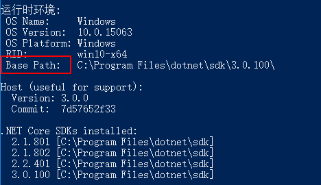
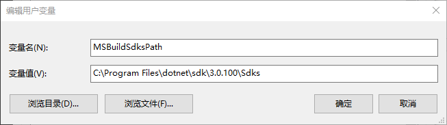

# NetCore常见错误

## 找不到指定的 SDK“Microsoft.NET.Sdk.Web”

1. 查看dotnet安装路径：

    ```bash
    dotnet --info
    ```
    
1. 设置环境变量`MSBuildSdksPath`:
    
    `Linux`添加环境变量同理，修改`/etc/profile`或者`$HOME/.profile`文件，添加如下信息：

    ```bash
    export MSBuildSdksPath='netcore sdk的路径'
    ```