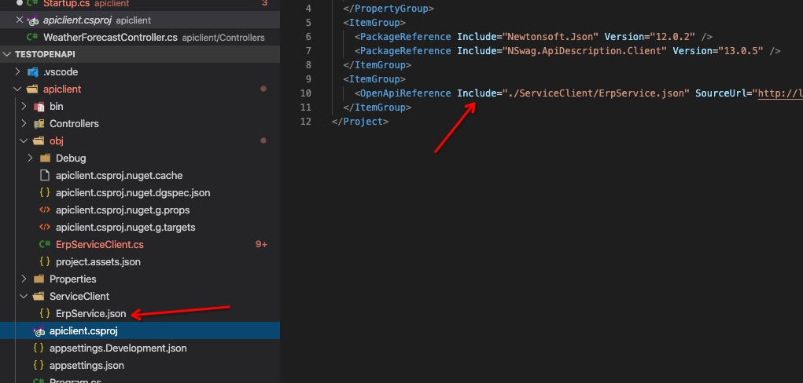

# 后端服务客户端生成脚手架

版本： v1

参考文档：[官方openapi工具](https://docs.microsoft.com/zh-cn/aspnet/core/web-api/microsoft.dotnet-openapi?view=aspnetcore-3.1)

## 使用说明

1. 安装openapi全局工具

    ```bash
    # 默认安装最新版本，一般需要最新的core sdk支持
    dotnet tool install -g Microsoft.dotnet-openapi

    # 安装指定版本
    dotnet tool install --global Microsoft.dotnet-openapi --version 3.1.2
    ```
    有哪些版本可以安装可以查看 [openapi Nuget包](https://www.nuget.org/packages/Microsoft.dotnet-openapi/)
    **建议安装最新版本**，如果提示找不到sdk包，下载对应的`core sdk`包即可

1. 将对应后端服务的`swagger`文档（一般为json文档）引入到我们的项目（调用方）中

    ```bash
    # 这句命令在调用方项目文件夹中运行
    dotnet openapi add url http://test.cn/swagger/v1/swagger.json --output-file ErpService.json

    # 如果没有在项目文件夹中运行，需要指定项目文件地址
    dotnet openapi add url http://test.cn/swagger/v1/swagger.json --output-file ErpService.json --updateProject apiclient.csproj
    ```
    * `--output-file`指定的文件名称建议写成 `服务名+Service.json`，后面生成客户端代码的时候会根据文件名去命名客户端
    * 运行成功之后，可以在调用方项目中看到生成了`ErpService.json`文件，并且`csproj`文件中添加`<OpenApiReference />` 元素
    

1. 生成后端服务客户端cs文件

    ```bash
    # 运行命令之后，在项目的obj文件夹下面会生成ErpServiceClient.cs文件
    dotnet build
    ```
1. 注入生成的client
    
    构造函数不需要`baseUrl`，则使用如下方式注入

    ```csharp
    public void ConfigureServices(IServiceCollection services)
    {
        services.AddHttpClient<ErpServiceClient>();
    }
    ```

    构造函数需要`baseUrl`，则使用如下方式注入

    ```csharp
    public void ConfigureServices(IServiceCollection services)
    {
        services.AddHttpClient<ErpServiceClient>()
        .AddTypedClient(client => {
            return new ErpServiceClient("http://test.cn", client);
        });
    }
    ```
    * 使用时发现后端服务使用`Nswag`和`Swashbuckle`生成的swagger文档在使用`openapi`工具生成的client构造函数不一样，需要注意一下。

1. 直接在构造函数添加`ErpServiceClient`即可使用

    ```csharp
    public WeatherForecastController(ILogger<WeatherForecastController> logger, ErpServiceClient erpServiceClient)
    {
        _logger = logger;
        _erpServiceClient = erpServiceClient;
    }
    ```

## 选型

* 我们系统的后端服务目前统一通过`Swagger`暴露，所以需要的脚手架工具可以通过`Swagger`文档自动生成客户端
* 目前只支持生成c#的客户端
* 通过对比`swagger-generator`和`openapi`代码生成工具发现`openapi`生成的代码更加简洁清晰，并且是微软官方支持的，所以选择`openapi`