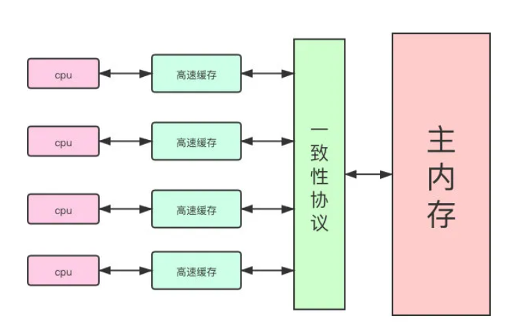

# 从CPU缓存模型到JMM来理解volatile

## 并发编程三大特性

### 一、原子性

一个操作或者多次操作，要么所有的操作全部都得到执行并且不会受到任何因素的干扰而中断，要么所有的操作都执行，要么都不执行。

对于基本数据类型的访问，读写都是原子性的【long和double可能例外】。

如果需要更大范围的原子性保证，可以使用synchronized关键字满足

### 二、可见性

当一个变量对共享变量进行了修改，**另外的线程都能立即看到修改后的最新值**。

`volatile` 保证共享变量可见性，除此之外，`synchronized` 和 `final` 都可以 实现可见性。

`synchronized`：对一个变量执行unclock之前，必须先把此变量同步回主内存中。

`final`：被final修饰的字段在构造器中一旦被初始化完成，并且构造器没有把this的引用传递出去，其他线程中就能够看见final字段的值。

### 三、有序性

即程序执行的顺序按照代码的先后顺序执行【由于指令重排序的存在，Java 在编译器以及运行期间对输入代码进行优化，代码的执行顺序未必就是编写代码时候的顺序】，`volatile`通过禁止指令重排序保证有序性，除此之外，`synchronized`关键字也可以保证有序性，由【一个变量在同一时刻只允许一条线程对其进行lock操作】这条规则获得。

## CPU缓存模型是什么

### 高速缓存为何出现？

计算机在执行程序时，每条指令都是在CPU中执行的，而执行指令过程中，势必涉及到**数据的读取和写入**。由于程序运行过程中的临时数据是存放在主存（物理内存）当中的，这时就存在一个问题，**由于CPU执行速度很快，而从内存读取数据和向内存写入数据的过程跟CPU执行指令的速度比起来要慢的多**，因此如果任何时候对数据的操作都要通过和内存的交互来进行，会大大降低指令执行的速度。

为了解决CPU处理速度和内存不匹配的问题，CPU Cache出现了。


### 缓存一致性问题

当程序在运行过程中，会**将运算需要的数据从主存复制一份到CPU的高速缓存当中**，那么CPU进行计算时就可以**直接从它的高速缓存读取数据和向其中写入数据**，当运算结束之后，再将高速缓存中的数据**刷新到主存**当中。

在单线程中运行是没有任何问题的，但是在多线程环境下问题就会显现。举个简单的例子，如下面这段代码:

```
i = i + 1;
```

按照上面分析，主要分为如下几步：

* 从主存读取i的值，复制一份到高速缓存中。
* CPU执行执行执行对i进行加1操作，将数据写入高速缓存。
* 运算结束后，将高速缓存中的数据刷新到内存中。

**多线程环境**下，可能出现什么现象呢？

* 初始时，两个线程分别读取i的值，存入各自所在的CPU高速缓存中。
* 线程T1进行加1操作，将i的最新值1写入内存。
* 此时线程T2的高速缓存中i的值还是0，进行加1操作，并将i的最新值1写入内存。

> 最终的结果i = 1而不是i = 2，得出结论：**如果一个变量在多个CPU中都存在缓存（一般在多线程编程时才会出现），那么就可能存在缓存不一致的问题**。

### 如何解决缓存不一致

解决缓存不一致的问题，通常来说有如下两种解决方案【都是在硬件层面上提供的方式】：

**通过在总线加LOCK#锁的方式**

在早期的CPU当中，是通过在总线上加LOCK#锁的形式来解决缓存不一致的问题。因为CPU和其他部件进行通信都是通过总线来进行的，如果对总线加LOCK#锁的话，也就是说阻塞了其他CPU对其他部件访问（如内存），从而使得只能有一个CPU能使用这个变量的内存。比如上面例子中 如果一个线程在执行 i = i +1，如果在执行这段代码的过程中，在总线上发出了LCOK#锁的信号，那么只有等待这段代码完全执行完毕之后，其他CPU才能从变量i所在的内存读取变量，然后进行相应的操作。这样就解决了缓存不一致的问题。

但，有一个问题，在锁住总线期间，其他CPU无法访问内存，导致效率低下，于是就出现了下面的缓存一致性协议。

**通过缓存一致性协议**

较著名的就是Intel的MESI协议，MESI协议保S证了每个缓存中使用的共享变量的副本是一致的。

**当CPU写数据时，如果发现操作的变量是共享变量**，即在其他CPU中也存在该变量的副本，会发出信号**通知其他CPU将该变量的缓存行置为无效状态**，因此当其他CPU需要读取这个变量时，发现自己缓存中缓存该变量的缓存行是无效的【嗅探机制：每个处理器通过嗅探在总线上传播的数据来检查自己的缓存的值是否过期】，那么它就会**从内存重新读取**。

> 基于MESI一致性协议，每个处理器需要不断从主内存嗅探和CAS不断循环，无效交互会导致总线带宽达到峰值，出现**总线风暴**。



## JMM内存模型是什么

`JMM【Java Memory Model】`：Java内存模型，是java虚拟机规范中所定义的一种内存模型，Java内存模型是标准化的，屏蔽掉了底层不同计算机的区别，以实现让Java程序在各种平台下都能达到**一致的内存访问效果**。

它描述了**Java程序中各种变量【线程共享变量】的访问规则**，以及在JVM中将变量存储到内存和从内存中读取变量这样的底层细节。

> 注意，为了获得较好的执行性能，Java内存模型并没有限制执行引擎使用处理器的寄存器或者高速缓存来提升指令执行速度，也没有限制编译器对指令进行重排序。也就是说，在java内存模型中，也会存在**缓存一致性问题和指令重排序**的问题。

### JMM的规定

**所有的共享变量都存储于主内存**，这里所说的变量指的是【实例变量和类变量】，不包含局部变量，因为**局部变量是线程私有的，因此不存在竞争问题**。

每个线程都有自己的**工作内存**（类似于前面的高速缓存）。线程对变量的所有操作都必须在工作内存中进行，而不能直接对主存进行操作。

每个线程不能访问其他线程的工作内存。

### Java对三大特性的保证

* 原子性

  在Java中，**对基本数据类型的变量的读取和赋值操作是原子性操作**，即这些操作是不可被中断的，要么执行，要么不执行。

  为了更好地理解上面这句话，可以看看下面这四个例子：

  ```
  x = 10;  	//1
  y = x;   	//2
  x ++;    	//3
  x = x + 1;  //4
  ```

  1. 只有语句1是原子性操作：直接将数值10赋值给x，也就是说线程执行这个语句的会直接将数值10写入到工作内存中。
  1. 语句2实际包含两个操作：先去读取x的值，再将x的值写入工作内存，虽然两步分别都是原子操作，但是合起来就不能算作原子操作了。
  1. 语句3和4表示：先读取x的值，进行加1操作，写入新的值。

  需要注意的点：

  * 在32位平台下，对64位数据的读取和赋值是需要通过两个操作来完成的，不能保证其原子性。在目前64位JVM中，已经保证对64位数据的读取和赋值也是原子性操作了。https://www.zhihu.com/question/38816432
  * Java内存模型只保证了基本读取和赋值是原子性操作，如果要实现更大范围操作的原子性，可以通过synchronized和Lock来实现。

* 可见性

  Java提供了volatile关键字来保证可见性。

  当一个共享变量被volatile修饰时，它会**保证修改的值会立即被更新到主存**，当有其他线程需要读取时，它会去内存中读取新值。

  另外，**通过synchronized和Lock也能够保证可见性**，synchronized和Lock能保证**同一时刻只有一个线程获取锁然后执行同步代码**，并且在释放锁之前会将对变量的修改刷新到主存当中。因此可以保证可见性。

* 有序性

  在Java内存模型中，允许编译器和处理器对指令进行**重排序**，但是重排序过程不会影响到单线程程序的执行，却会影响到多线程并发执行的正确性。

  在Java里面，可以通过volatile关键字来保证有序性，另外也可以通过synchronized和Lock来保证有序性。

  Java内存模型具备一些先天的有序性，前提是**两个操作满足happens-before原则**，摘自《深入理解Java虚拟机》：

  * 程序次序规则：一个线程内，按照代码顺序，书写在前面的操作先行发生于书写在后面的操作【让程序**看起来**像是按照代码顺序执行，虚拟机**只会对不存在数据依赖性的指令进行重排序**，只能保证单线程中执行结果的正确性，多线程结果正确性却无法保证】
  * 锁定规则：一个unLock操作先行发生于后面对同一个锁额lock操作
  * volatile变量规则：对一个变量的写操作先行发生于后面对这个变量的读操作
  * 传递规则：如果操作A先行发生于操作B，而操作B又先行发生于操作C，则可以得出操作A先行发生于操作C
  * 线程启动规则：Thread对象的start()方法先行发生于此线程的每个一个动作
  * 线程中断规则：对线程interrupt()方法的调用先行发生于被中断线程的代码检测到中断事件的发生
  * 线程终结规则：线程中所有的操作都先行发生于线程的终止检测，我们可以通过Thread.join()方法结束、Thread.isAlive()的返回值手段检测到线程已经终止执行
  * 对象终结规则：一个对象的初始化完成先行发生于他的finalize()方法的开始

  如果两个操作的执行次序无法从happens-before原则推导出来，那么它们就不能保证它们的有序性，虚拟机可以随意地对它们进行重排序。

## volatile解决的问题

* 保证了不同线程对共享变量【类的成员变量，类的静态成员变量】进行操作是时的可见性，**一个线程修改了某个变量的值，新值对其他线程来说是立即可见的**。

* 禁止指令重排序。

举个简单的例子，看下面这段代码：

```JAVA
//线程1
boolean volatile stop = false;
while(!stop){
    doSomething();
}
//线程2
stop = true;
```

1. 线程1和2各自都拥有自己的工作内存，线程1和线程2首先都会将stop变量的值拷贝一份放到自己的工作内存中，
1. 共享变量stop通过volatile修饰，线程2将stop的值改为true将会立即写入主内存。
1. 线程2写入主内存之后，导致线程1工作内存中缓存变量stop的缓存行无效。
1. 线程1的工作内存中缓存变量stop的缓存行无效，导致线程1会再次从主存中读取stop值。

## volatile保证原子性吗？怎么解决？

volatile无法保证原子性，如对一个volatile修饰的变量进行自增操作`i ++`，无法保证多线程下结果的正确性。

解决方法：

* 使用synchronized关键字或者Lock加锁，保证某个代码块 在同一时刻只能被一个线程执行。
* 使用JUC包下的原子类，如AtomicInteger等。【Atomic利用CAS来实现原子操作】。

## volatile的实现原理

下面这段话摘自《深入理解Java虚拟机》：

> 观察加入volatile关键字和没有加入volatile关键字时所生成的汇编代码发现，加入volatile关键字时，会多出一个lock前缀指令。lock前缀指令实际上相当于一个内存屏障（也成内存栅栏），内存屏障会提供3个功能：
* 它确保指令重排序时不会把其后面的指令排到内存屏障之前的位置，也不会把前面的指令排到内存屏障的后面；即在执行到内存屏障这句指令时，在它前面的操作已经全部完成；
* 它会强制将对缓存的修改操作立即写入主存；
* 如果是写操作，它会导致其他CPU中对应的缓存行无效。

## volatile和synchronized的区别

> volatile变量读操作的性能消耗与普通变量几乎没有什么差别，但是写操作则会慢一些，因为它需要在本地代码中插入许多内存屏障指令来保证处理器不发生乱序执行。不过即便如此，**大多数场景下volatile的总开销仍然要比锁来的低**。

* volatile只能用于变量，而synchronized可以修饰方法以及代码块。
* volatile能保证可见性，但是不能保证原子性。synchronized两者都能保证。如果只是对一个共享变量进行多个线程的赋值，而没有其他的操作，推荐使用volatile，它更加轻量级。
* volatile 关键字主要用于解决变量在多个线程之间的可见性，而 synchronized 关键字解决的是多个线程之间访问资源的同步性。

## volatile的使用条件

使用volatile必须具备两个条件【保证原子】：

* 对变量的写操作不依赖于当前值。
* 该变量没有包含在具有其他变量的不变式中。

## volatile与双重检查锁实现单例

用双重检查锁的方式实现单例模式：

```JAVA
public class Singleton {
	//注意使用volatile防止指令重排序
    private volatile static Singleton instance;
	//私有化构造方法，单例模式基本操作
    private Singleton() {
    }
	//静态获取单例的方法
    public  static Singleton getInstance() {
       //先判断对象是否已经实例过，没有实例化过才进入加锁代码
        if (instance == null) {
            //类对象加锁
            synchronized (Singleton.class) {
                if (instance == null) {
                    instance = new Singleton();
                }
            }
        }
        return instance;
    }
}
```

使用`volatile`的原因：防止指令重排序。

`instance= new Singleton();`这一步，是一个实例化的过程，底层其实分为三部执行：

1. 为instance分配内存空间：`memory = allocate()`;
1. 实例化instance。`ctorInstance(memory)`;
1. 将instance指向分配的内存地址。`instance = memory`;

由于JVM具有指令重排序的特性，指令的执行顺序可能会变成1，3，2。在多线程环境下，可能某个线程可能会得到未初始化的实例。

举个例子：加入线程A执行了1和2之后，线程B调用getInstance的时候，会发现instance不为null，会直接返回这个没有执行过指令3的实例。