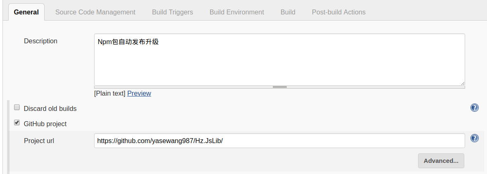
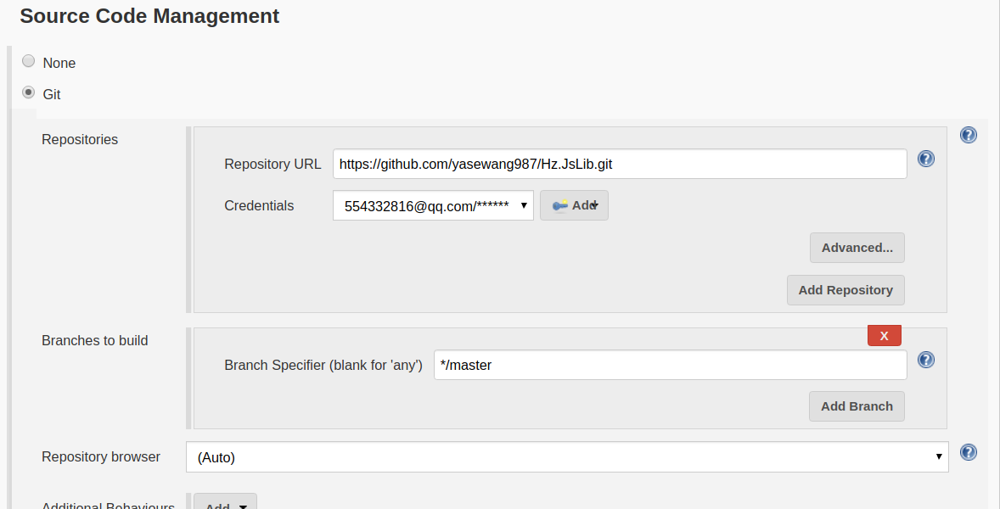
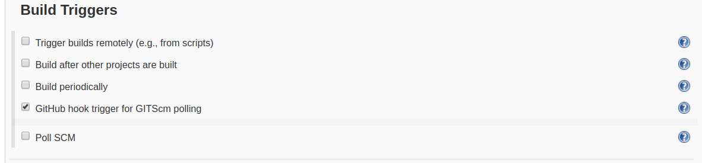
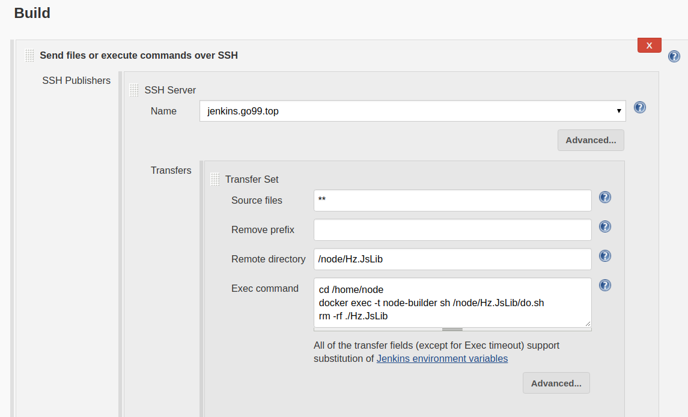
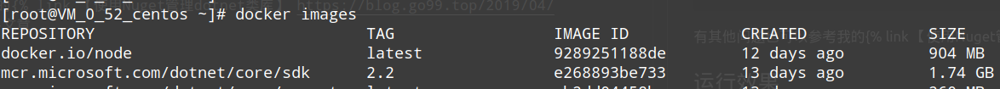
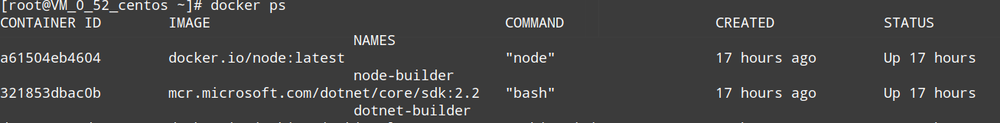
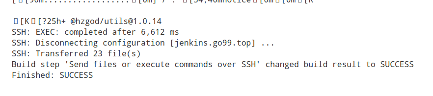
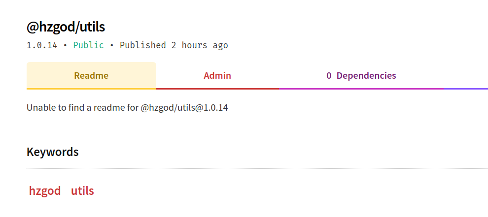

# NpmJs持续集成部署

## Intro

之前的文章中已经介绍了使用`Nuget`管理`dotnet`程序包，那么`js`也有同样的仓库可以去管理`js`程序包，那就是`Npm`，下面我将介绍如何使用`Github`+`Jenkins`+`Npm`持续集成部署`js`程序包。

## 准备

**Github：** 这个大家都懂，作为开发人员应该都有自己的github  
**Jenkins：** 下面文章中会大致介绍如何安装使用  
**NpmJs：** 到npm官网注册账号用于管理程序包，官网地址：https://www.npmjs.com/


## NpmJs申请及配置

参考我的 [【使用NPM库管理前端通用库】](./base.md) 文章

## Jenkins基本安装配置

### 安装及全局配置
[安装及全局配置查看我写的Jenkins安装配置](../../develops/jenkins/install.md)

### 项目配置

1. 【New Item】新建项目`Hz.JsLib`。
1. 填写项目描述及Github项目地址：
    
1. 【Source Code Management】源代码管理配置：
    
    > 由于我使用的是https协议，所以需要先新增一下github的账号密码。如果使用SSH的请自行baidu
1. 触发构建
    
    > 这里只是做简单测试就使用webhook了
1. 构建
    
    > 【Source files】：表示哪些文件需要上传到远程服务器（位置是相对于项目位置的）；  
    > 【Remote directory】：表示上传的原件放在远程服务器的哪个位置（相对于全局设置的位置）  
    > 执行的命令看到我们执行的是一个sh批处理文件（这个批处理文件会一起放在项目里），因为我将基本的操作都写在这个文件里了

    ```sh
    # 这个都是在容器内部执行的，所以文件位置都是容器内的文件位置
    cd /node/Hz.JsLib
    # npm install
    npm publish --access=publish
    ```
    *注意一下这里的版本号需要在上传源代码之前自己修改`package.json`文件中的版本号，还有由于我这边不想在容器里面再编译发布一次项目(需要在本地环境编译一次项目`./node_modules/.bin/tsc`生成`dist`发布内容)，所以会将项目的`dist/`目录（项目的发布目录）也上传到github*  
    当然也可以使用`npm version`命令修改程序包版本：

    ```bash
    npm version v0.1.0      # 版本号变成 0.1.0，即显式设置版本号。
    npm version patch       # 版本号从 0.1.0 变成 0.1.1，即修订版本号加一
    npm version minor       # 版本号从 0.1.1 变成 0.2.0，即子版本号加一
    npm version major       # 版本号从 0.2.0 变成 1.0.0，即主版本号加一

    # 版本号从 1.2.3 变成 1.2.4-0，就是 1.2.4 版本的第一个预发布版本。
    npm version prepatch
    # 版本号从 1.2.4-0 变成 1.3.0-0，就是 1.3.0 版本的第一个预发布版本。
    npm version preminor
    # 版本号从 1.2.3 变成 2.0.0-0，就是 2.0.0 版本的第一个预发布版本。
    npm version premajor
    # 版本号从 2.0.0-0 变成 2.0.0-1，就是使预发布版本号加一。
    npm version prerelease
    ```

## 其他

我这边发布NpmJs是使用`node`容器发布的，所以会使用`docker exec -t node-builder sh do.sh`命令（注意，这里不能的执行命令不能加上`-i`参数，不然会报错）

* `node`项目编译容器运行  

```bash
# 这里一定要使用-i以交互模式运行容器，不然容器启动之后就会退出
docker run -d -i -u root -v /home/node:/node --name node-builder docker.io/node
```



有其他问题也可以参考我的[【使用NPM库管理前端通用库】 ](./base.md) 文章

## 运行效果



