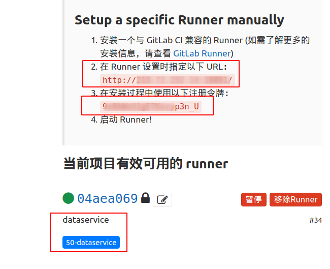
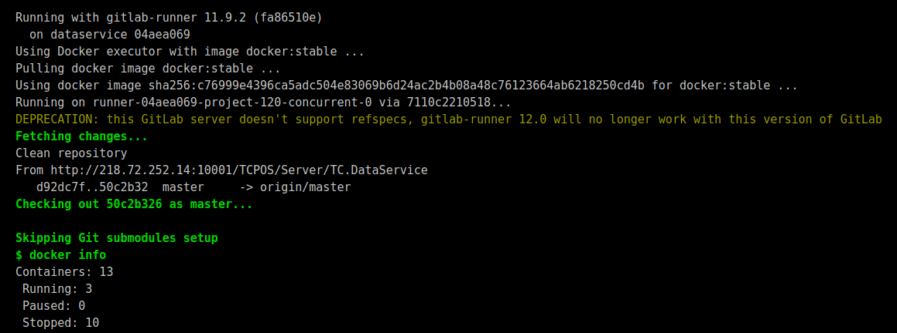
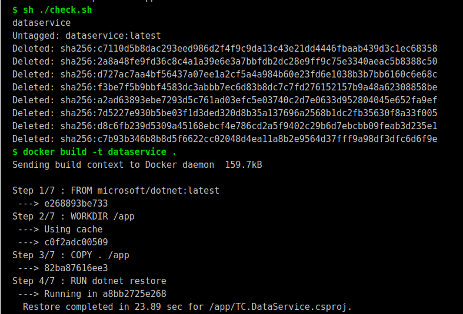
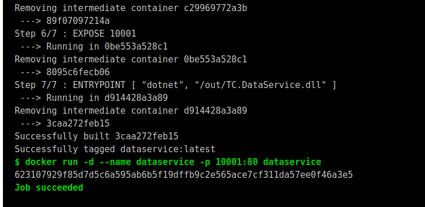
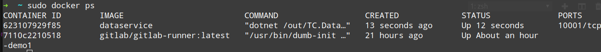
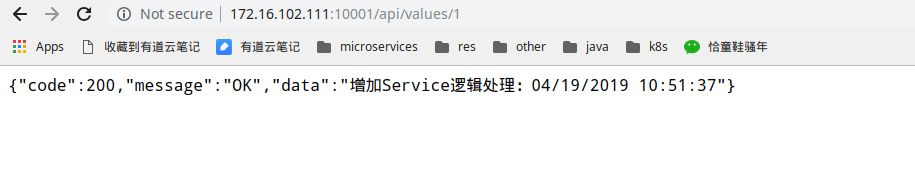
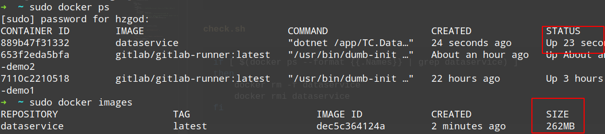

# Gitlab-Runner持续集成Asp.net Core


[Gitlab-Runner官方资料](https://docs.gitlab.com/runner/#install-gitlab-runner)

## 实现目标
1. 在docker中安装`Gitlab-Runner`
1. 代码push到Gitlab后自动触发`Gitlab-Runner`编译项目生成`Docker`镜像
1. 使用`Docker`启动`Asp.net Core`

## Gitlab-Runner安装

这里介绍在Docker中安装Gitlab-Runner（因为懒，只想在docker中安装），下面开始安装：

1. 拉取`runner`镜像

```bash
$ sudo docker pull gitlab/gitlab-runner
```
1. 运行`Gitlab-Runner`容器

    ```bash
    $ sudo docker run -d --name gitlab-runner-demo1 --restart always \
    -v /srv/gitlab-runner/config:/etc/gitlab-runner \
    -v /var/run/docker.sock:/var/run/docker.sock \
    gitlab/gitlab-runner:latest
    ```
    > 映射`/var/run/docker.sock`这个文件是为了让容器可以通过`/var/run/docker.sock`与`Docker守护进程`通信，管理其他`Docker容器`
    > `-v /srv/gitlab-runner/config:/etc/gitlab-runner`是将runner的配置文件映射到宿主机`/srv/gitlab-runner/config`方便调整和查看配置

### 方案1

使用一个`GitRunner`跑所有任务

1. 将新建的Runner注册到Gitlab

    ```bash
    $ sudo docker exec -it gitlab-runner-demo1 gitlab-runner register
    # 根据提示一步一步填写相关信息

    # 输入gitlab的地址
    Please enter the gitlab-ci coordinator URL (e.g. https://gitlab.com/):
    http://1.2.3.4:10001/

    # 输入秘钥（可以在项目的CI/CD中查看）
    Please enter the gitlab-ci token for this runner:
    9x8kWsU1gE7Kozyp3n_U

    # runner的描述
    Please enter the gitlab-ci description for this runner:
    [7110c2210518]: dataservice 

    # runner的tag（在编写yml文件时可以根据tag筛选执行的runnner）
    Please enter the gitlab-ci tags for this runner (comma separated):
    50-dataservice

    Registering runner... succeeded                     runner=9x8kWsU1

    # 选择执行器
    Please enter the executor: virtualbox, docker+machine, docker, parallels, shell, kubernetes, docker-ssh, ssh, docker-ssh+machine:
    docker

    # 选择docker作为执行器会要求选择默认镜像，如果`.gitlab-ci.yml`文件中没有使用镜像，则使用这个默认镜像
    Please enter the default Docker image (e.g. ruby:2.1):
    docker:stable # 一定要指定，才能正常使用docker命令
    ```
    > 当然也可以直接在注册的时候指定参数

        ```bash
        gitlab-runner register \
        --url http://1.2.3.4:10001/ \
        --registration-token "PROJECT_REGISTRATION_TOKEN" \
        --executor docker \
        --docker-image "docker:stable" \
        --description "dataservice" \
        --tag-list "50-dataservice" \
        --docker-volumes /var/run/docker.sock:/var/run/docker.sock
        ```
1. 打开配置文件`sudo cat //srv/gitlab-runner/config/config.toml`确认配置是否正确

    ```bash
    [[runners]]
        name = "dataservice"
        url = "http://1.2.3.4:10001/"
        token = "指定项目的授权码"
        executor = "docker"
        [runners.docker]
            tls_verify = false
            image = "docker:stable"
            privileged = false
            disable_entrypoint_overwrite = false
            oom_kill_disable = false
            disable_cache = false
            volumes = ["/var/run/docker.sock:/var/run/docker.sock", "/cache"]
            shm_size = 0
    ```
    *一定要确保`volumes = ["/var/run/docker.sock:/var/run/docker.sock", "/cache"]`存在，不然无法使用`docker`命令*
1. 打开gitlab查看是否注册成功
    

## WebAPI创建配置

1. 新建webapi项目`dotnet new webapi -n TC.Dataservice`
1. webapi项目中添加`Dockerfile`，内容如下

    ```bash
    FROM microsoft/dotnet:latest
    WORKDIR /app
    COPY . /app
    RUN dotnet restore
    RUN dotnet publish -o /out -c Release
    EXPOSE 10001
    ENTRYPOINT [ "dotnet", "/out/TC.DataService.dll" ]

    # 编译项目使用dotnet-sdk，发布项目可以使用-aspnetcore-runtime镜像，生成的镜像会小很多,这里我就偷懒了
    # 相关镜像可以到dockerhub上查询
    ```
1. 项目中添加`.gitlab-ci.yml`

    ```bash
    stages:
        - build
        - deploy
    build-job:
        stage: build
        only:
            - master
        before_script:
            - docker info
        script:
            - sh ./check.sh  # 这个是检测dataservice容器是否已经存在，如果存在则先删除
            - docker build -t dataservice .
            # 这里可以添加将生成好的image上传到dockerhub或者docker本地仓库
            
            ### 如果生成的镜像需要统一上传到仓库管理，则后面的逻辑可以分离到另外一个runner去执行
            # 这里可以添加从dockerhub或本地仓库拉取指定镜像
            - docker run -d --name dataservice -p 10001:80 dataservice
        tags:
            - 50-dataservice
    ```
1. 项目中添加`check.sh`检测文件

    ```bash
    # 检查容器是否已经存在，如果存在则先删除
    if [ $(docker ps --format {{.Names}} | grep dataservice) ]
    then
        docker rm -f dataservice
        docker rmi dataservice
    fi
    ```

## 运行结果查看

1. 上传代码，查看gitlab的ci作业是否正常，如果顺利的话运行结果如下图
    
    
    
1. 查看docker容器运行状态
    
1. 查看网站运行状态
    


## 方案2

思路：将构建webapi与发布到docker分成2个阶段，构建使用`50-dataservice-builder`的`GitLab-Runner`,发布使用`50-dataservice`的`Gitlab-Runner`

原理其实和上面实现的是差不多的，我这里把关键的配置贴出来

### 50-dataservice-builder的runner运行注册

```bash
# 创建配置文件目录
sudo mkdir -p /srv/gitlab-runner/demo2

# 运行runner
sudo docker run -d --name gitlab-runner-demo2 --restart always \
> -v /srv/gitlab-runner/demo2:/etc/gitlab-runner \
> -v /var/run/docker.sock:/var/run/docker.sock \
> gitlab/gitlab-runner:latest

# 注册runner
sudo docker exec -it gitlab-runner-demo2 gitlab-runner register

# 配置runner
Please enter the gitlab-ci coordinator URL (e.g. https://gitlab.com/):
http://1.2.3.4:10001

Please enter the gitlab-ci token for this runner:
9x8kWsU1gE7Kozyp3n_U

Please enter the gitlab-ci description for this runner:
[653f2eda5bfa]: dataservice-builder

Please enter the gitlab-ci tags for this runner (comma separated):
50-dataservice-builder

Registering runner... succeeded                     runner=9x8kWsU1
Please enter the executor: docker-ssh, docker+machine, docker-ssh+machine, kubernetes, docker, parallels, shell, ssh, virtualbox:
docker

Please enter the default Docker image (e.g. ruby:2.1):
microsoft/dotnet:latest #注意这里使用dotnet镜像
```
原来的`50-dataservice`在这里被专门用来做发布使用,里面配置不需要更改

### 修改webapi相关配置文件

#### `.gitlab-ci.yml`

```bash
stages:
  - build
  - deploy

# 构建
build-job:
  stage: build
  only:
    - test
  cache:
    untracked: true
  script:
    - dotnet restore
    - dotnet publish -o ./out -c Release
  artifacts:
    expire_in: 30 days
    paths:
      - out/
  tags:
    - 50-dataservice-builder

# 发布
deploy-job:
  stage: deploy
  only:
    - test
  dependencies:
    - build-job  # 这里一定要依赖build-job，不然dockerfile里面的out目录无法使用
  script:
    - ls out/
    - sh ./check.sh
    - docker build -t dataservice .
    # 这里可以添加将生成好的image上传到dockerhub或者docker本地仓库
    
    ### 如果生成的镜像需要统一上传到仓库管理，则后面的逻辑可以分离到另外一个runner去执行
    # 这里可以添加从dockerhub或本地仓库拉取指定镜像
    - docker run -d --name dataservice -p 10001:80 dataservice
  tags:
    - 50-dataservice
```

#### `Dockerfile`

```bash
FROM microsoft/dotnet:2.2-aspnetcore-runtime
WORKDIR /app
COPY out/ /app
EXPOSE 10001
ENTRYPOINT [ "dotnet", "/app/TC.DataService.dll" ]
```

#### `check.sh`

```bash
if [ $(docker ps --format {{.Names}} | grep dataservice) ]
then
    docker rm -f dataservice
    docker rmi dataservice
fi
```

### 查看测试结果



发现使用runtime镜像编译生成之后的webapi镜像比原来小很多。

