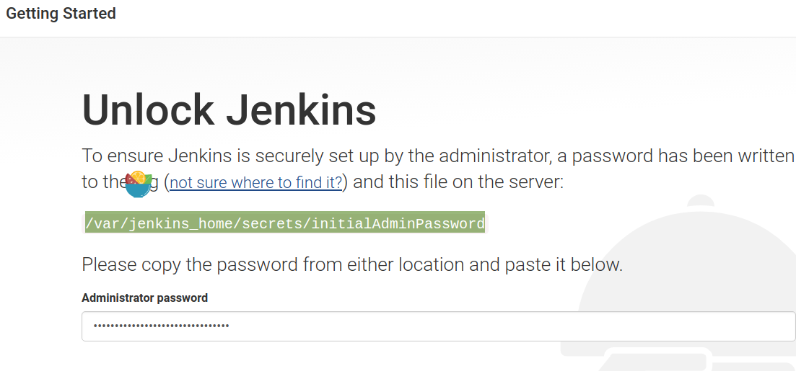
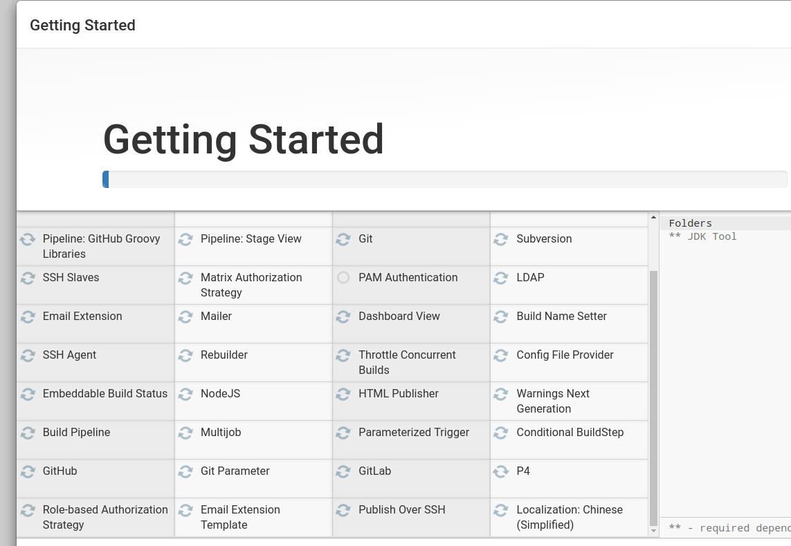
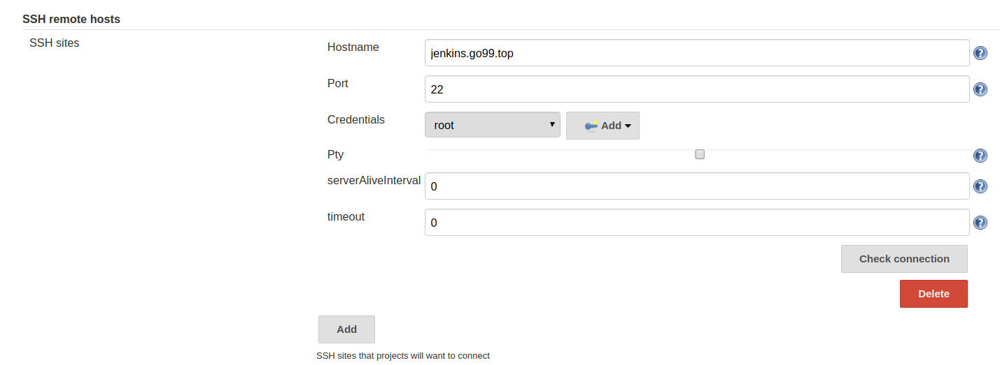
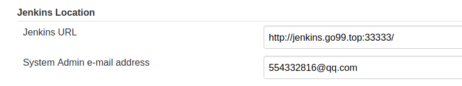

# 在Docker中安装Jenkins

## Intro

目前在企业中使用`Jenkins`做持续集成部署已经非常常见了，这里介绍一下如何使用`Docker`安装`Jenkins`。

## 安装Jenkins


> Jenkins镜像地址：https://hub.docker.com/r/jenkins/jenkins  
> Jenkins使用文档: https://jenkins.io/zh/doc/book/installing/#%E5%9C%A8docker%E4%B8%AD%E4%B8%8B%E8%BD%BD%E5%B9%B6%E8%BF%90%E8%A1%8Cjenkins

1. 下载镜像：
    ```bash
    sudo docker pull jenkins/jenkins
    ```
    * 也可以使用`jenkinsci/blueocean`镜像
1. 启动jenkins容器

    ```bash
    sudo docker run -d --name jenkins \ 
    -p 13333:8080 -p 50000:50000 \
    -v $HOME/jenkins_home:/var/jenkins_home \
    -v /var/run/docker.sock:/var/run/docker.sock \
    jenkins/jenkins
    ```
    * 注意如果想在重启容器的时候保持`Jenkins`状态，需要将容器的`/var/jenkins_home`目录映射到宿主机的目录`jenkins_home`（这里使用的是服务器的用户目录下的`jenkins_home`，不然有可能出现权限问题），如果还是提示权限有问题，可以在run命令后面加上`-u root`以root用户运行。  
    * 由于jenkins官方的镜像是基于`debian`linux的，所以可能在运行了`jenkins`容器的时候无法正常使用docker命令（映射了`/var/run/docker.sock`也无法使用）。在测试的时候我也遇到了这个问题，有2种方法可以解决这个问题：  
        一、 自己做一个基于centos或其他的linux的jenkins镜像  
        二、 使用`jenkins`中的`SSH`连接到服务器执行`docker`命令

1. 解锁`Jenkins`,访问`http://localhost:13333`,解锁密码在可以查看`jenkins`容器的`/var/jenkins_home/secrets/initialAdminPassword`文件内容
    
1. 选择需要安装的插件
    
    > Generic WebHook Trigger => 触发WebHook必备  
    MSTest & xUnit => 进行基于MSTest或基于xUnit的单元测试  
    Nuget Plugin => 拉取Nuget包必备  
    Pipeline => 实现Pipeline任务必备，建议将Pipeline相关插件都安装上  
    Publish Over SSH => 远程ssh（这个属于必备的插件）  
    WallDisplay => 电视投屏构建任务列表必备  
    Email Extension => 发送邮件

## Jenkins系统配置

* SSH站点配置：
    
    > 需要先添加ssh登录的账号，再点击【check connection】如果提示Successfull说明成功。

* 配置jenkins地址和管理员邮箱
    

* `Publish over SSH`插件全局配置：
    
    > `Jenkins SSH Key Passphrase` 如果使用的是rsa验证方式登录，这里是私钥密码，如果是账号密码登录这里是密码。`Remote Directory` 是指登录之后的默认位置。配置完成之后点击【Test Connection】提示`Success`说明配置成功