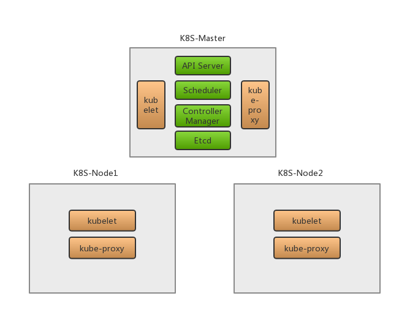

# Kubernetes - 基础知识

## K8s基础概念

### 1.Cluster 集群

计算、存储和网络资源的集合，Kubernetes利用这些资源运行各种基于容器的应用。

### 2.Master

Master是Cluster的大脑(控制平面)，负责调度（决定将应用放在哪里运行），一般为了实现高可用，会有多个Master

### 3.Node

负责运行具体的容器，Node由Master管理，它会监控并汇报容器的状态，同时根据Master的要求管理容器的生命周期。

### 4. Pod

Kubernetes的最小工作单元，每个Pod包含一个或多个容器。Pod中的容器会被作为一个整体被Master调度到一个Node上运行。

* 为何引入Pod？

  一是方便管理：  
  　有些容器天生联系紧密，需要在一起工作。Pod提供了比容器更高层次的抽象，将它们封装到一个部署单元中。K8S以Pod为最小单位进行调度、扩展、共享资源、管理生命周期。

  二是可以共享资源和通信：  
　　Pod中所有容器使用同一个网络namespace，即相同的IP和端口空间，可以直接用localhost通信，而且还可以共享存储（本质是通过将Volume挂载到Pod中的每个容器）

* 如何使用Pod？

  运行单个容器：one-container-per-Pod，K8S中最常见的模型，即使这种情形下，K8S管理的也是Pod而不是单个容器。

　运行多个容器：将联系非常紧密的多个容器部署到一个Pod中，可以直接共享资源。

### 5.Controller

K8S不会直接创建Pod，是通过Controller来管理Pod的。为了满足不同业务场景，K8S提供了多种Controller：

　　（1）Deployment  
　　最常见的Controller，可以管理Pod的多个副本，并确保Pod按照期望的状态运行。

　　（2）ReplicaSet  
　　实现了Pod的多副本管理，使用Deployment时会自动创建ReplicaSet。换句话说，Deployment是通过ReplicaSet来管理Pod的多个副本的，通常不需要直接使用ReplicaSet。

　　（3）DaemonSet  
　　用于每个Node最多只运行一个Pod副本的场景，DaemonSet通常用于运行daemon（守护进程、后台程序）。

　　（4）StatefuleSet  
　　用于保证Pod的每个副本在整个生命周期中名称是不变的，而其他的Controller不提供这个功能。（非StatefuleSet下，当某个Pod发生故障需要删除并重启时，Pod的名称是会变化的）

　　（5）Job  
　　用于运行结束就删除的应用，其他Controller下Pod通常是长期持续运行的。

### 6.Service

K8S定义了外界访问一个或一组特定Pod的方式，就是Service。每个Service有自己的IP和端口，并且为Pod提供了负载均衡。

　　如果说K8S运行Pod的任务是交给了Controller去做，那么访问Pod的任务则是交给了Service去做。

### 7. Namespace

Namespace将一个物理的Cluster从逻辑上划分为多个虚拟Cluster，每个虚拟Cluster就是一个Namespace，不同Namespace中的资源是完全隔离的。

K8S中会自动创建两个Namespace：

　　（1）default：创建资源时如果不指定Namespace就会放到这里

　　（2）kube-system: K8S自己创建的系统资源都会放到这个Namespace中

## K8s架构解析

下面展示了一个最小化的K8S集群，一个master节点和两个node节点

### 1. Master节点

K8S集群的“大脑”，运行以下多个Daemon服务：

* API Server（kube-apiserver）
  1. 提供Restful API => Kubernetes API，供其他组件调用以管理Cluster的各种资源
* Scheduler（kube-scheduler）
  1. 负责决定将Pod放在哪个Node上Run起来
  1. 调度时会根据指定算法选择Pod（eg.集群拓扑结构、各节点负载情况、HA等等）
* Controller Manager（kube-controller-manager）
  1. 负责管理集群中的各种资源，保证资源处于预期的状态
  1. 由多种Controller组成
      * Replication Controller：管理Deployment、StatefuleSet、DaemonSet的生命周期
      * Endpoints Controller
      * Namespace Controller：管理Namespace资源
      * Serviceaccounts Controller
* Etcd
  1. 负责保存K8S集群中的配置信息和各种资源的状态信息
  1. 当数据发生变化时，会及时通知K8S相关组件
* Pod网络
  1. 保证Pod能够相互通信，Flannel、Calico是一个可选方案

## 2. Node节点

运行Pod的主战场，主要运行以下K8S组件：

* kubelet
  1. Node的Agent，负责创建运行容器与向Master报告运行状态
* kube-proxy
  1. 每个Node都会运行proxy，它负责请求转发到后端的容器
* Pod网络
  1. 保证Pod能够相互通信，Flannel、Calico是一个可选方案