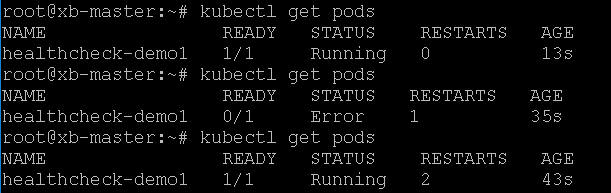

# Kubernetes - HealthCheck

## 一、K8s中的建康检查

K8s可以帮助我们快捷地部署容器集群，如果部署上错误的容器导致服务崩溃，通常情况下我们都会通过一些高可用机制进行故障转移。但是，前提条件是有健康检查。

K8s自然帮我们考虑到了这个问题，健康检查是K8s的重要特性之一，默认有健康检查机制，此外还可以主动设置一些自定义的健康检查。

默认情况下，每个容器启动时都会执行一个进程，由Dockerfile中的CMD或ENTRYPOINT指定。如果进程退出时的返回码不为0，则认为容器发生了故障，K8s会根据重启策略（restartPolicy）重启容器，例如下面例子所示，注意查看文件中的args选项。

```yaml
apiVersion: v1
kind: Pod
metadata:
  name: healthcheck-demo1
  labels:
    name: healthcheck
spec:
  restartPolicy: OnFailure
  containers:
  - name: healthcheck
    image: busybox
    imagePullPolicy: IfNotPresent
    args:
      - /bin/sh
      - -c
      - sleep 10; exit 1
```

其中 sleep 10; exit 1代表启动10秒之后就非正常退出（返回码不为0），然后通过kubectl创建Pod：

```bash
kubectl apply -f health-check.yaml
```

运行效果图如下：

可以看到，该容器已经重启了2次。也可以看出，restartPolicy简单直接暴力有效。
但是，这样做会有一个问题：必须等到进程退出后的返回值是非零才会触发重启策略，不能直接监测容器是否是健康。

那么，K8s中有没有更好的机制能够实现智能一点的健康检查呢？答案就是使用Liveness与Readinesss。