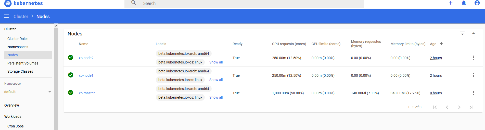

# Kubernetes - 集群部署Kubeadm

搭建K8S环境有几种常见的方式如下：

（1）Minikube

Minikube是一个工具，可以在本地快速运行一个单点的K8S，供初步尝试K8S或日常开发的用户使用，不能用于生产环境。

安装参考：[K8s - Minikube](./k8s-install-mini.md)


（2）Kubeadm

Kubeadm是K8S官方社区推出的一套用于简化快速部署K8S集群的工具，Kubeadm的设计目的是为新用户开始尝试K8S提供一种简单的方法。

K8s官网安装参考：https://kubernetes.io/docs/setup/production-environment/tools/kubeadm/install-kubeadm/

（3）二进制包

除了以上两种方式外，我们还可以通过从官方下载二进制包，手动部署每个组件组成K8S集群，这也是目前企业生产环境中广为使用的方式，但对K8S管理人员的要求较高。

本次学习实践我们主要借助Kubeadm工具搭建K8S集群，以便后续实践部署ASP.NET Core应用集群。

## 一、环境准备

我这边使用的是vmware，服务器版本用的是`ubuntu 18.04 server`，一共准备3台虚拟机，2核2G最基础的配置

名称|内存|ip|安装
---|---|---|---
xb-master|2G|99.99.99.100|docker,kubeadm,kubelet,kubectl
xb-node1|2G|99.99.99.101|docker,kubeadm,kubelet
xb-node2|2G|99.99.99.102|docker,kubeadm,kubelet

### 安装Docker

K8S 支持多种容器运行时环境，这里选择 docker 作为运行时环境，首先为所有节点服务器安装 docker，目前 kubernetes 最新版(v1.15.2) 可以完全兼容支持的 docker 最高版本为 v18.09，所以这里安装 v18.09 这个版本。

[版本对应关系查看官网的Release Notes](https://kubernetes.io/docs/home/)

安装步骤可以参考K8s官网，只需要注意关键步骤即可（https://kubernetes.io/docs/setup/production-environment/container-runtimes/）

```bash
# 删除旧版本docker
sudo apt-get remove docker docker-engine docker.io containerd runc

# 更新 apt 
sudo apt-get update

# 安装工具包
sudo apt-get install \
    apt-transport-https \
    ca-certificates \
    curl \
    gnupg-agent \
    software-properties-common

# 添加Docker官方 GPG key
curl -fsSL https://download.docker.com/linux/ubuntu/gpg | sudo apt-key add -

# 添加 stable apt 源
sudo add-apt-repository \
   "deb [arch=amd64] https://download.docker.com/linux/ubuntu \
   $(lsb_release -cs) \
   stable"

# 查看docker版本列表
apt-cache madison docker-ce

# 安装 Docker CE
sudo apt-get update
sudo apt-get install docker-ce=5:18.09.8~3-0~ubuntu-bionic docker-ce-cli=5:18.09.8~3-0~ubuntu-bionic containerd.io
```

* 有时候因为网络原因无法拉取docker镜像，可以使用阿里云镜像仓库：

    ```bash
    # step 1: 安装必要的一些系统工具
    sudo apt-get update
    sudo apt-get -y install apt-transport-https ca-certificates curl software-properties-common

    # step 2: 安装GPG证书
    curl -fsSL http://mirrors.aliyun.com/docker-ce/linux/ubuntu/gpg | sudo apt-key add -

    # Step 3: 写入软件源信息
    sudo add-apt-repository "deb [arch=amd64] http://mirrors.aliyun.com/docker-ce/linux/ubuntu $(lsb_release -cs) stable"

    # Step 4: 更新并安装 Docker-CE
    sudo apt-get -y update

    # 选择安装版本，这里选择 5:18.09.8~3-0~ubuntu-bionic
    apt-cache madison docker-ce

    # sudo apt-get -y install docker-ce=[version]
    sudo apt-get -y install docker-ce=5:18.09.8~3-0~ubuntu-bionic
    ```

### 其他准备工作（也可以参考k8s官网安装步骤）

* 当前用户加入`docker`用户组

  ```bash
  sudo usermod -aG docker $USER
  ```

* 配置 cgroup 驱动为 `systemd`(这个如果不改，在初始化kubeadm的时候有可能报错)

  ```bash
  #  创建文件 /etc/docker/daemon.json ，内容如下：
  {
    "exec-opts": ["native.cgroupdriver=systemd"]
  }
  ```
* 重启服务生效配置

  ```bash
  sudo systemctl daemon-reload
  sudo systemctl restart docker.service
  ```
* 检查配置是否生效

  ```bash
  docker info | grep Cgroup

  # ECHO ------
  Cgroup Driver: systemd
  ```
* 关闭 swap（k8s不支持swap）

  ```bash
  sudo swapoff -a && sudo sed -i 's/^.*swap/#&/g' /etc/fstab
  ```

### 安装 kubelet kubeadm kubectl

* 由于国内网络原因，直接安装可能安装不了，需要配置一下阿里云镜像仓库

  ```bash
  sudo apt-get update && sudo apt-get install -y apt-transport-https

  curl https://mirrors.aliyun.com/kubernetes/apt/doc/apt-key.gpg | sudo apt-key add -
  ```
* 创建文件 `/etc/apt/sources.list.d/kubernetes.list` 添加如下内容：

  ```bash
  # /etc/apt/sources.list.d/kubernetes.list
  deb https://mirrors.aliyun.com/kubernetes/apt/ kubernetes-xenial main
  ```
* 安装 kubelet kubectl kubeadm

  ```bash
  sudo apt-get update
  sudo apt-get install -y kubelet kubeadm kubectl
  ```
* 设置kubelet开机启动

  ```bash
  sudo systemctl enable kubelet
  ```

## 二、部署控制平面Master

过程中会用到一些列 docker 镜像文件，这些文件在 Google 的镜像仓库，可以通过 `kubeadm config images pull` 命令验证网络是否能够正常拉取镜像。国内环境，十有八九无法直接连接，可从其他镜像仓库下载，然后再修改镜像标签，以便启动相关 pod。

### 初始化控制平面节点

控制平面节点是控制平面组件运行的机器，包括etcd（集群数据库）和 API server （kubectl CLI与之通信）。

需要安装pod网络插件，才能使得集群 pod 间可以相互通信，必须在任何应用程序之前部署 pod 网络。此外，CoreDNS将不会在安装网络之前启动。kubeadm仅支持基于容器网络接口（CNI）的网络，有几个项目使用CNI提供了Kubernetes pod网络，其中一些还支持网络策略。有关可用网络加载项的完整列表，请参阅 [网络组件页面](https://kubernetes.io/docs/setup/production-environment/tools/kubeadm/create-cluster-kubeadm/#pod-network)。

另外，请注意，Pod网络不得与任何主机网络重叠，因为这可能会导致问题。如果发现网络插件的首选Pod网络与某些主机网络之间发生冲突，应为 `kubeadm init` 指定 `--pod-network-cidr` 参数配置网络网络，并在网络插件的YAML中修改相应信息。

这里选择 `calico` 网络，根据 calico 文档说明，我们需为 kubeadm init 指定 `--pod-network-cidr=192.168.0.0/16` 参数。现在运行 `kubeadm init <args>`

* 直接使用阿里云镜像

  1. 初始化`kubeadm`:

    ```bash
    kubeadm init --kubernetes-version v1.15.2 --apiserver-advertise-address=99.99.99.100 --pod-network-cidr=192.192.0.0/16 --image-repository registry.aliyuncs.com/google_containers
    ```

  1. 如果一切正常，安装成功，将输入类似下面的结果信息

    ```bash
    Your Kubernetes control-plane has initialized successfully!

    To start using your cluster, you need to run the following as a regular user:

      mkdir -p $HOME/.kube
      sudo cp -i /etc/kubernetes/admin.conf $HOME/.kube/config
      sudo chown $(id -u):$(id -g) $HOME/.kube/config

    You should now deploy a pod network to the cluster.
    Run "kubectl apply -f [podnetwork].yaml" with one of the options listed at:
      https://kubernetes.io/docs/concepts/cluster-administration/addons/

    Then you can join any number of worker nodes by running the following on each as root:

    kubeadm join 99.99.99.100:6443 --token xxxx.xxxxxx \
        --discovery-token-ca-cert-hash sha256:xxxxxxxxxx
    ```
  1. 根据提示消息，依次执行以下命令：

    ```bash
    mkdir -p $HOME/.kube
    sudo cp -i /etc/kubernetes/admin.conf $HOME/.kube/config
    sudo chown $(id -u):$(id -g) $HOME/.kube/config
    ```
  1. 注意记录输出结果中的 kubeadm join *** 信息，随后在添加工作节点到集群时需要用到，可以复制后暂存在某个地方。

* 如果不适用阿里云镜像也可以自己拉取镜像的修改tag的方式运行

  使用 `kubeadm config images list` 查看需要的镜像

  ```bash
  kubeadm config images list

  # list
  k8s.gcr.io/kube-apiserver:v1.15.2
  k8s.gcr.io/kube-controller-manager:v1.15.2
  k8s.gcr.io/kube-scheduler:v1.15.2
  k8s.gcr.io/kube-proxy:v1.15.2
  k8s.gcr.io/pause:3.1
  k8s.gcr.io/etcd:3.3.10
  k8s.gcr.io/coredns:1.3.1
  ```

  docker hub 中的 mirrorgooglecontainers 拉取镜像副本，然后更新tag，再删除镜像副本，脚本如下（这里测试的时候有点问题，amd64的镜像在`kubeadm init`的时候无法使用）：

  ```bash
  images=(kube-proxy:v1.15.2 kube-scheduler-amd64:v1.15.2 kube-controller-manager-amd64:v1.15.2 kube-apiserver:v1.15.2 etcd:3.3.10 pause:3.1)
  for imageName in ${images[@]} ; do
    docker pull mirrorgooglecontainers/$imageName  
    docker tag mirrorgooglecontainers/$imageName k8s.gcr.io/$imageName  
    docker rmi mirrorgooglecontainers/$imageName
  done
  ```

  mirrorgooglecontainers 下面没有 coredns，我们可以从另一个位置单独拉取，命令如下：

  ```bash
  docker pull coredns/coredns:1.3.1
  docker tag coredns/coredns:1.3.1 k8s.gcr.io/coredns:1.3.1
  docker rmi coredns/coredns:1.3.1
  ```

### 安装网络

1. 通过 `kubectl get pods --all-namespaces` 命令，应该可以看到 `CoreDNS pod` 处于 pending 状态，安装网网络以后，它才能处于 running 状态。我们选择 calico 为 pod 提供网络，pod 网络组件本身以 k8s 应用的形式运行，执行下面命令进行安装

  ```bash
  sudo kubectl apply -f https://docs.projectcalico.org/v3.8/manifests/calico.yaml
  ```
1. 安装了pod网络后，可以通过`kubectl get pods --all-namespaces`检查 CoreDNS pod 是否在输出中运行来确认它是否正常工作(这里需要等几分钟)

  ```bash
  NAME                                       READY   STATUS    RESTARTS   AGE
  calico-kube-controllers-65b8787765-gqxxg   1/1     Running   0          157m
  calico-node-dwr6k                          1/1     Running   0          157m
  coredns-bccdc95cf-hxqb6                    1/1     Running   0          163m
  coredns-bccdc95cf-w5w45                    1/1     Running   0          163m
  etcd-xb-master                             1/1     Running   0          162m
  kube-apiserver-xb-master                   1/1     Running   0          162m
  kube-controller-manager-xb-master          1/1     Running   0          162m
  kube-proxy-kzvn4                           1/1     Running   0          163m
  kube-scheduler-xb-master                   1/1     Running   0          162m
  ```

## 三、加入工作节点Node

CoreDNS pod 启动并运行后，我们可以为集群添加工作节点。工作节点服务器需安装 `docker 、kubeadm 、kubelet`，安装过程请参考 master 节点部署流程

### 拉取镜像

工作节点服务器需要至少启动两个 pod ，用到的镜像为 `kube-proxy 、 pause` ，同理我们无法直接从 k8s.grc.io 下载，需要提前拉取镜像并修改 tag ，执行下面命令：

```bash
images=(kube-proxy:v1.15.2 pause:3.1)
for imageName in ${images[@]} ; do
  docker pull mirrorgooglecontainers/$imageName  
  docker tag mirrorgooglecontainers/$imageName k8s.gcr.io/$imageName  
  docker rmi mirrorgooglecontainers/$imageName
done
```

### 加入集群

```bash
kubeadm join --token <token> <master-ip>:<master-port> --discovery-token-ca-cert-hash sha256:<hash>
```

命令中的 `--token` 和 `--discovery-token-ca-cert-hash` 在集群master节点部署完成后的结果信息中有体现，直接复制出来即可使用。

节点执行完 join 命令后，可以在控制平面节点检查 pod 启动进度 `watch kubectl get pods --all-namespaces -o wide`，观察新节点服务器上的 pod 状态，正常启动则加入成功且节点状态为 Ready。

* 如果忘记 token 和 discovery-token-ca-cert-hash 可以通过如下方法查看

  1. `token`: 在控制平面执行如下命令
    
    ```bash
    kubeadm token list
    ```
  1. `discovery-token-ca-cert-hash`: 控制平面执行如下命令

    ```bash
    openssl x509 -pubkey -in /etc/kubernetes/pki/ca.crt | openssl rsa -pubin -outform der 2>/dev/null | \
   openssl dgst -sha256 -hex | sed 's/^.* //'
    ```
* 注意，如果需要重新执行 `kubeadm join` ，需在控制平面节点删除该节点 `kubectl delete node node-name`，并在工作节点上执行 `kubeadm reset` 进行清理工作。

### 检查工作节点

工作节点加入集群后，随着工作节点上相应 pod 的正常启动，工作节点状态会由 `NotReady` 切换到 `Ready`，Pod 启动需要时间，请耐心等待。所有节点正常加入集群后，可以通过命令查看节点状态：

```bash
kubectl get nodes

#结果
NAME        STATUS   ROLES    AGE     VERSION
xb-master   Ready    master   7h37m   v1.15.2
xb-node1    Ready    <none>   17m     v1.15.2
xb-node2    Ready    <none>   16m     v1.15.2
```

## 四、安装Dashboard

Dashboard的版本与k8s要匹配，具体的版本对应关系查看dashboard的 [dashboard github release](https://github.com/kubernetes/dashboard/releases) 介绍

1. 由于我们用的是1.15.2版本的k8s,那就下载最新的dashboard

    ```bash
    wget https://raw.githubusercontent.com/kubernetes/dashboard/v2.0.0-beta3/aio/deploy/recommended.yaml
    ```

1. 修改配置文件`recommended.yaml`

    ```bash
    vim recommended.yaml
    ```

    ```yaml
    kind: Service
    apiVersion: v1
    metadata:
      labels:
        k8s-app: kubernetes-dashboard
      name: kubernetes-dashboard
      namespace: kubernetes-dashboard
      annotations:
        kubernetes.io/ingress.class: traefik
    spec:
      type: NodePort   # here
      ports:
        - port: 443
          targetPort: 8443
          nodePort: 30001 # here
      selector:
        k8s-app: kubernetes-dashboard
    ```
1. 创建dashboard

    ```bash
    kubectl apply -f recommended.yaml
    ```
1. 等几分钟，查看dashboard运行状态

    ```bash
    kubectl get pods -n kubernetes-dashboard

    # 输出
    NAME                                        READY   STATUS    RESTARTS   AGE
    dashboard-metrics-scraper-fb986f88d-szz7f   1/1     Running   0          88m
    kubernetes-dashboard-7d8b9cc8d-g2cvt        1/1     Running   0          88m
    ```
1. 使用firefox浏览器访问（chrome不行）

    ```text
    https://99.99.99.101:30001
    ```
1. 看到了登录界面，需要我们配置kubeconfig或输入token，这里我们选择后者，通过以下命令获取输出的token

    ```bash
    kubectl create serviceaccount dashboard-admin -n kube-system
    kubectl create clusterrolebinding dashboard-admin --clusterrole=cluster-admin --serviceaccount=kube-system:dashboard-admin
    kubectl describe secrets -n kube-system $(kubectl -n kube-system get secret | awk '/dashboard-admin/{print $1}')
    ```
1. 拿到token在登录界面的令牌区域输入，然后点击登录
    
