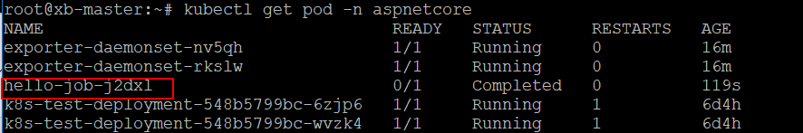
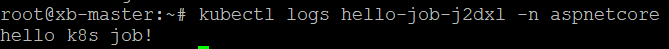
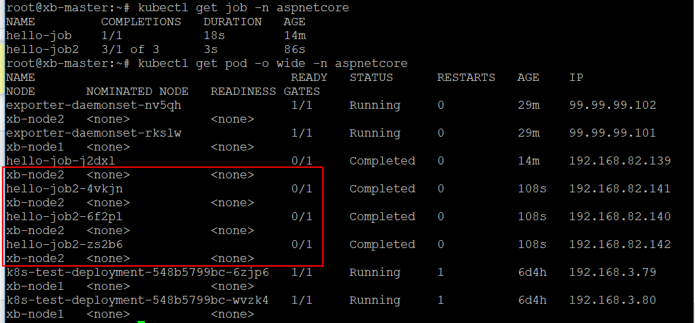
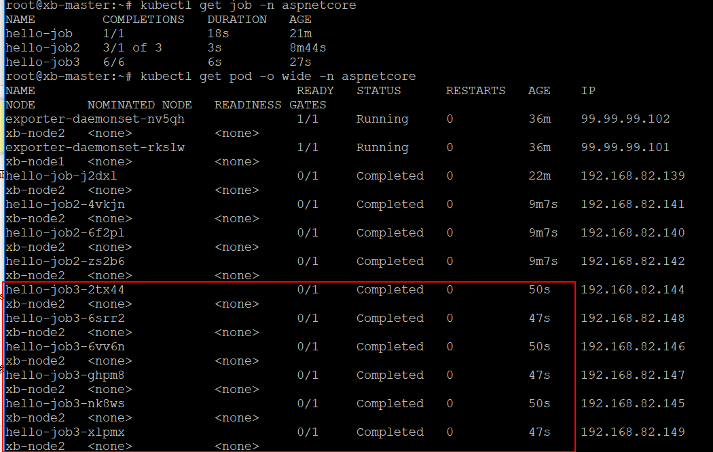

# Kubernetes - Job

## Job简介

对于ReplicaSet、Deployment、DaemonSet等类型的控制器而言，它希望Pod保持预期数目并且持久运行下去，除非用户明确删除，否则这些对象一直存在，因此可以说他们说持久服务型任务的。

对于非耐久性任务，比如压缩文件，任务完成后，Pod需要结束运行，不需要Pod继续保持在系统中，这个时候就要用到Job。因此也可以说，Job是对ReplicaSet、Deployment、DaemonSet等持久性控制器的补充。

## Job创建、运行

1. 新建yaml文件，配置DaemonSet资源清单(这里我们以一个简单的小Job为例，看看一个简单的Job：当Job启动后，只运行一个Pod，Pod运行结束后整个Job也就立刻结束。)

    ```yaml
    apiVersion: batch/v1
    kind: Job
    metadata:
      name: hello-job
      namespace: aspnetcore
    spec:
      template:
        metadata:
          labels:
            app: hello-job
        spec:
          containers:
          - name: hello-job
            image: busybox
            imagePullPolicy: IfNotPresent
            command: ["echo", "hello k8s job!"]
          restartPolicy: Never
    ```
    这里需要注意的是，对Job而言，其restartPolicy只能为Never或者OnFailure，这也是它与其他控制器的差别（如Deployment控制器还允许设置为Always）。这个Job要执行的任务也很简单，就是输出一段话“hello edison's k8s job!”就结束其生命了。
1. 执行Job:

    ```bash
    kubectl apply -f hello-job.yaml
    ```
    这里用到了一个busybox的镜像，busybox是一个软件工具箱，里边集成了Linux中几百个常用的Linux命令以及工具。如果我们只需要一个小型的Linux运行环境跑命令，完全可以使用这个busybox镜像，而不用拉取一个CentOS镜像。
1. 查看Job运行状态：
    
    ```bash
    kubectl get pod -n aspnetcore
    ```
    
    通过查看Job运行情况可以知道，其运行结束就结束了，如下图所示，变成了Completed状态。

1. 还可以通过查看Log看看这个Job执行的情况：

    ```bash
    kubectl logs hello-job-j2dxl -n aspnetcore
    ```
    

1. 并行Job（如果希望能够同时并行运行多个Pod以提高Job的执行效率，Job提供了一个配置：parallesim。例如下面的配置，我们将上面的小Job改为并行运行的Pod数量设置为3。）
    ```yaml
    apiVersion: batch/v1
    kind: Job
    metadata:
      name: hello-job2
      namespace: aspnetcore
    spec:
      parallelism: 3
      template:
        metadata:
          labels:
            app: hello-job2
        spec:
          containers:
          - name: hello-job2
            image: busybox
            imagePullPolicy: IfNotPresent
            command: ["echo", "hello k8s job!"]
          restartPolicy: OnFailure
    ```
1. 执行hello-job2(默认parallelism值为1)：`kubectl apply -f hello-job2.yaml`
1. 使用上面的配置文件创建了资源后，通过以下命令查看验证:
    ```bash
    kubectl get job -n aspnetcore
    kubectl get pod -o wide -n aspnetcore
    ```
    
    可以看出，Job一共启动了3个Pod，都是同时结束的（可以看到三个Pod的AGE都是相同的）。
1. 此外，Job还提供了一个`completions`属性使我们可以设置Job完成的Pod总数（默认completions也为1），还是上面的例子：
    
    ```yaml
    apiVersion: batch/v1
    kind: Job
    metadata:
      name: hello-job3
      namespace: aspnetcore
    spec:
      parallelism: 3
      completions: 6
      template:
        metadata:
          labels:
            app: hello-job3
        spec:
          containers:
          - name: hello-job3
            image: busybox
            imagePullPolicy: IfNotPresent
            command: ["echo", "hello k8s job!"]
          restartPolicy: OnFailure
    ```
    上面的配置意思就是：每次运行3个Pod，直到总共有6个Pod就算成功完成。同样通过命令验证一下：

1. 执行查看效果：

    ```bash
    kubectl get job -n aspnetcore
    kubectl get pod -o wide -n aspnetcore
    ```
    
1. 可以看到，状态和AGE都符合预期，第一批3个Pod的AGE为47s，第二批3个Pod的AGE为53s。

## CronJob创建、运行

K8S中提供了一个CronJob帮助我们实现定时任务

1. 定义CronJob资源配置文件（hello-cronjob.yaml）

    ```yaml
    apiVersion: batch/v1beta1
    kind: CronJob
    metadata:
      name: hello-cronjob
      namespace: aspnetcore
    spec:
      jobTemplate:
        spec:
          template:
            spec:
              containers:
              - name: hello-cronjob
                image: busybox
                imagePullPolicy: IfNotPresent
                command: ["echo", "hello cron job"]
              restartPolicy: OnFailure
      schedule: "*/1 * * * *"
    ```
1. 需要注意的是schedule，它的格式和Linux Cron一样，这里的"*/1 * * * *"代表每一分钟启动执行一次。对于CronJob，它需要的是jobTemplate来定义Job的模板。

    
    可以看到，在过去的二分钟里，每一分钟都启动了一个Pod，符合预期。