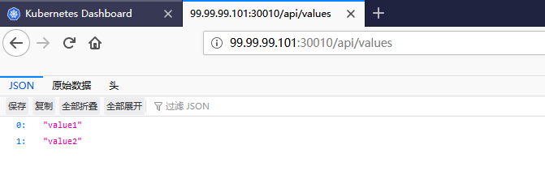

# Kubernetes - Service

前面几篇文章介绍的核心都是如何生成Pod，但是Pod在K8s集群中分配的IP都是随机的，每次重启Pod都是新的IP地址，这样服务间的相互调用根本无法实现，接下来的Service就是为了处理这个问题。

## Service介绍

Service是一个抽象概念，它定义了逻辑集合下**访问Pod组的策略**。通过使用Service，我们就可以不用关心这个服务下面的Pod的增加和减少、故障重启等，只需通过Service就能够访问到对应服务的容器，即**通过Service来暴露Pod的资源**。

举个例子，假设我们的一个服务Service A下面有3个Pod，我们都知道Pod的IP都不是持久化的，重启之后就会有变化。那么Service B想要访问Service A的Pod，它只需跟绑定了这3个Pod的Service A打交道就可以了，无须关心下面的3个Pod的IP和端口等信息的变化。换句话说，就像一个Service Discovery服务发现的组件，你无须关心具体服务的URL，只需知道它们在服务发现中注册的Key就可以通过类似Consul、Eureka之类的服务发现组件中获取它们的URL一样，还是实现了负载均衡效果的URL。

## Service创建、运行

### 一、ClusterIP

ClusterIP 服务是 Kubernetes 的默认服务。它给你一个集群内的服务，集群内的其它应用都可以访问该服务，但是集群外部无法访问它。因此，这种服务常被用于内部程序互相的访问，且不需要外部访问，那么这个时候用ClusterIP就比较合适，如下面的yaml文件所示：

```yaml
apiVersion: v1
kind: Service
metadata:
  name: test-internal-service
  namespace: aspnetcore
spec:
  type: ClusterIP
  selector:
    app: k8s-test_webapi
  ports:
  - port: 80
    name: http
    targetPort: 80
    protocol: TCP
```

调用测试（直接进入pod容器，然后使用curl命令测试）：

```bash
# 进入容器
kubectl exec k8s-test-deployment-548b5799bc-6zjp6 -it /bin/bash -n aspnetcore

# 验证
curl http://test-internal-service.aspnetcore/api/values
```

每当有新的Service被创建时，coredns会添加该Service的DNS记录，于是在Cluster中的Pod便可以通过servicename.namespacename来访问Service了，从而可以做到一个服务发现的效果

那么，如果需要从外部访问呢（比如我们在开发模式下总得调试吧）？可以启用K8S的代理模式：

```bash
kubectl proxy --port=8080
```
如此一来，便可以通过K8S的API来访问了，例如下面这个URL就可以访问在yaml中定义的这个`test-internal-service`了:

```bash
http://物理机ip:8080/api/v1/proxy/namespaces/aspnetcore/services/test-internal-service:http/
```

**PS:** ClusterIP是一个虚拟IP，由K8S节点上的iptables规则管理的。iptables会将访问Service的流量转发到后端Pod，而且使用类似于轮询的负载均衡策略转发的。

### 二、NodePort

除了只在内部访问的服务，我们总有很多是需要暴露出来公开访问的服务吧。在ClusterIP基础上为Service在每台机器上绑定一个端口，这样就可以通过`<NodeIP>:NodePort`来访问这些服务。例如，下面这个yaml中定义了服务为NodePort类型：

```yaml
apiVersion: v1
kind: Service
metadata:
  name: test-nodeport-service
  namespace: aspnetcore
spec:
  type: NodePort
  selector:
    app: k8s-test_webapi
  ports:
  - port: 80
    name: http
    targetPort: 80
    nodePort: 30010
    protocol: TCP
```
访问node1或者node2节点的ip+地址验证：


**PS：** 这种方式顾名思义需要一个额外的端口来进行暴露，且端口范围只能是 30000-32767，如果节点/VM 的 IP 地址发生变化，你需要能处理这种情况。

最后，再次总结一下三个端口配置：

　　（1）nodePort => Node节点上监听的端口，也就是外部访问的Service端口

　　（2）port => ClusterIP上监听的端口，即内部访问的Service端口

　　（3）targetPort => Pod上监听的端口，即容器内部的端口

### 三、LoadBalancer

oadBalancer 服务是暴露服务到 internet 的标准方式，它借助Cloud Provider创建一个外部的负载均衡器，并将请求转发到`<NodeIP>:NodePort`（向节点导流）：

```yaml
apiVersion: v1
kind: Service
metadata:
  name: test-service
  namespace: aspnetcore
spec:
  type: LoadBalancer
  selector:
    app: k8s-test_webapi
  ports:
  - port: 80
    name: http
    targetPort: 80
    protocol: TCP
  loadBalancerIP: 78.11.24.19
  clusterIP: 10.0.171.239
status:
  loadBalancer:
    ingress:
    - ip: 146.148.47.155
```

**PS：** 每一个用 LoadBalancer 暴露的服务都会有它自己的 IP 地址，每个用到的 LoadBalancer 都需要付费，这将是比较昂贵的花费,这里就不测试了，了解一下即可。
