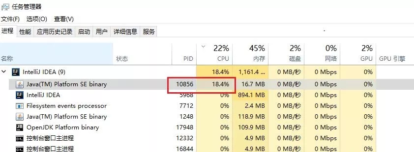
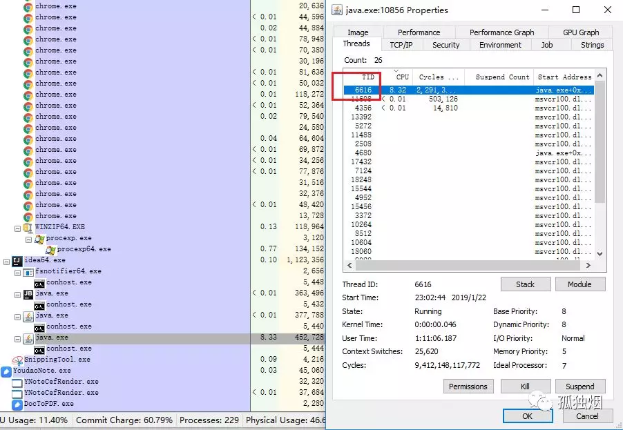
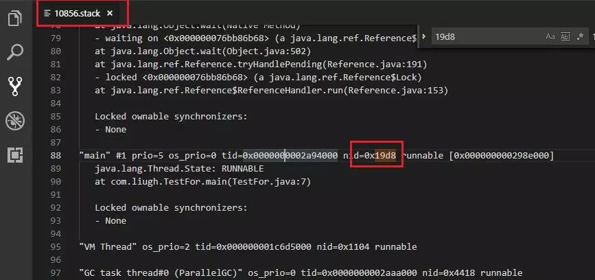
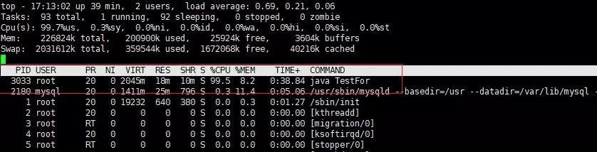
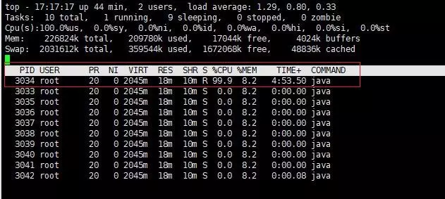
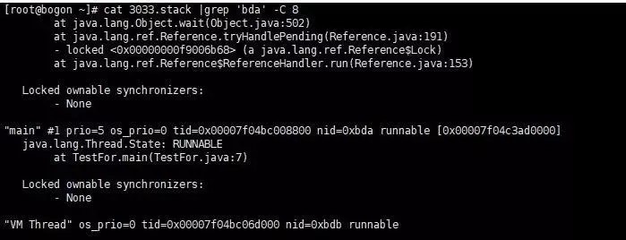

# CPU 问题排查

## 一、CPU 100%问题排查

排查流程：

1. 查消耗cpu最高的进程PID
1. 根据PID查出消耗cpu最高的线程号
1. 根据线程号查出对应的线程，进行处理

准备一行死循环代码：

```java
public class Test {
    public static void main (String[] args) {
        int random = 0;
        while (random < 100) {
            random = random * 10;
        }
    }
}
```

### 1.1 Windows版

1. 查消耗cpu最高的进程PID
    
    * 以win 10为例，截图给大家看一下，先调出PID显示项
    

    * 然后发现进程PID如下图所示，为10856

    

1. 根据PID查出消耗cpu最高的线程号

    * 这里用到微软的工具Process Explorer v16.22，地址如下
https://docs.microsoft.com/zh-cn/sysinternals/downloads/process-explorer
如图所示
    
    * 发现最耗cpu的线程的TId为6616
    * 这是十进制的数据，转成十六进制为19d8

1. 根据线程号查出对应的java线程，进行处理
    * 执行命令,导出进程快照
    
    ```bash
    jstack -l 10856 > c:/10856.stack
    ```
    * 打开文件 c:/10856.stack，搜索19d8，如下图所示
    
    根据文件就可以看出，我们的Test.java文件第七行一直在跑，至此定位到问题

### 1.2 Linux版

1. 查消耗cpu最高的进程PID
    * 执行top -c ，显示进程运行信息列表。按下P,进程按照cpu使用率排序。如下图所示，PID为3033的进程耗费cpu最高
    

1. 根据PID查出消耗cpu最高的线程号
    * top -Hp 3033 ，显示一个进程的线程运行信息列表。按下P,进程按照cpu使用率排序。如下图所示，PID为3034的线程耗费cpu最高
    
    这是十进制的数据，转成十六进制为0xbda

1. 根据线程号查出对应的java线程，进行处理
    * 执行命令,导出进程快照

    ```bash
    jstack -l 3033 > ./3033.stack
    ```
    * 执行，grep命令，看线程0xbda做了什么
    ```bash
    cat 3033.stack |grep 'bda' -C 8
    ```
    