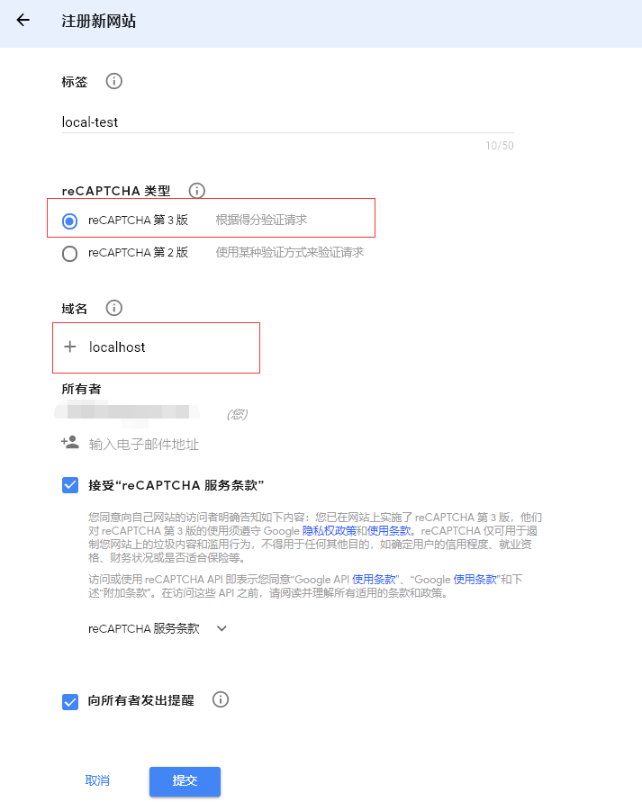
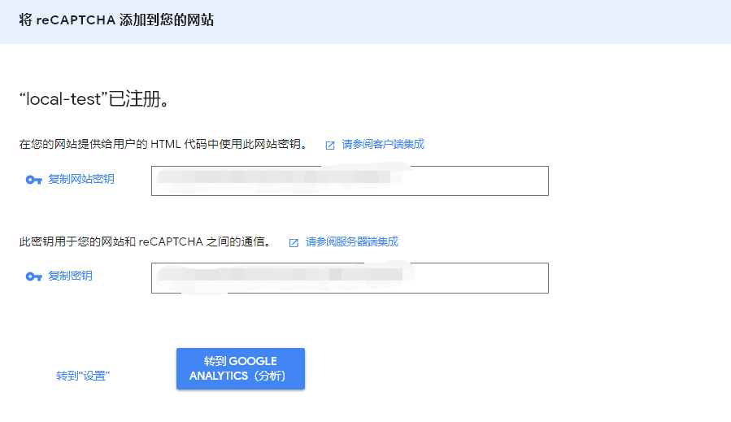
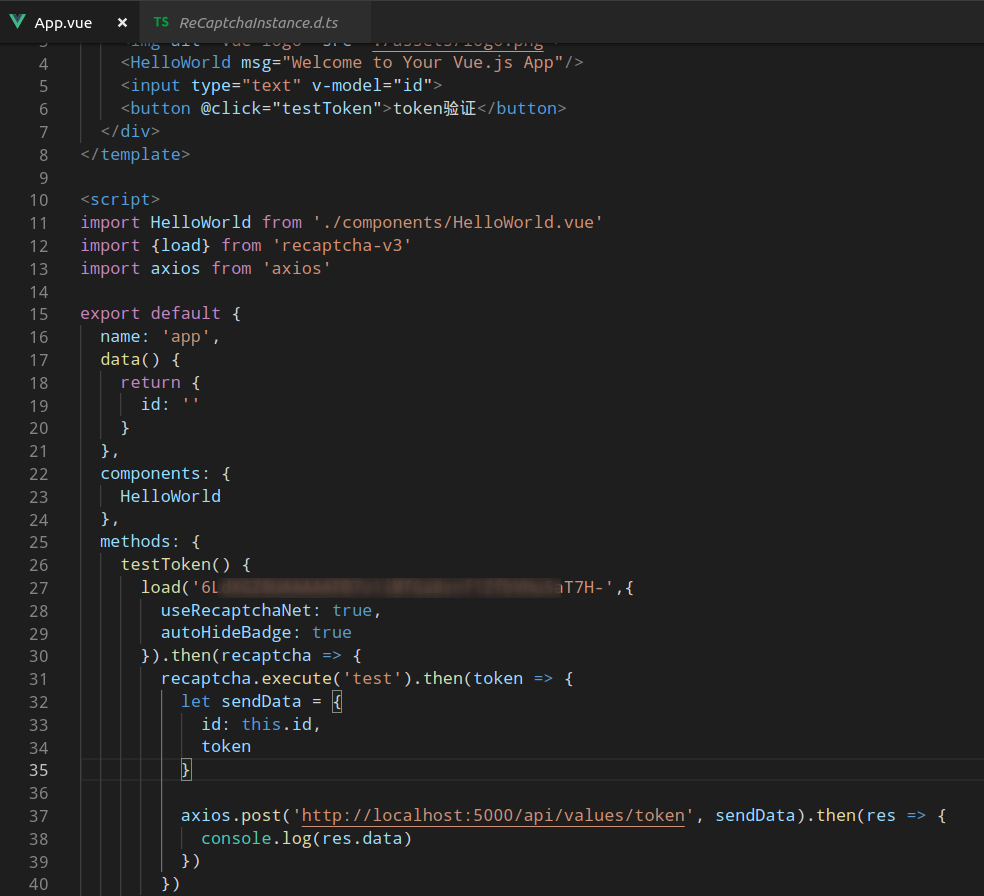
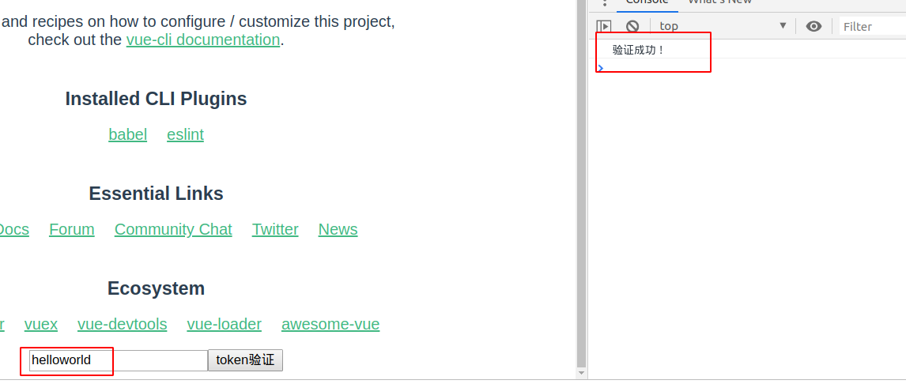

# 验证码

## NetCore WebAPI+Vue前后台分离使用Google验证码reCAPTCHA

### Intro

平常开发中验证码对我们来说非常常见，功能大家都懂就不介绍了，属于必不可少的功能之一，偶然看到博客园有篇文章介绍白嫖Goole验证码[【原文链接】](https://www.cnblogs.com/stulzq/p/10714417.html)，对于能白嫖的东西当然是不能放过，MVC的使用方式在园友的文章中已经介绍过，再去做一遍也没什么意思，所以这边就用了最近比较流行的前后台分离（`webapi + vue`）做了个测试，需要了解原理的可以直接去官网查看，这里只做测试。

### 白嫖前准备

1. 使用 https://www.google.com/recaptcha/admin/create ，注册网站（需要有谷歌账号，能KX上网）
    
    * 注意需要选择`v3`版本，填写的域名可以多个，可以一次性将本地`localhost`和`xxxx.com`域名一次都加入
1. 提交之后保存`site key`和`secret key`
    
    * 注意将2个key都保存到本地文件里

### WebAPI

1. 创建api项目：`dotnet new webapi -n api --no-https`
1. 引入`reCAPTCHA`组件库：`dotnet add package Unicorn.reCAPTCHA.AspNetCore`
1. 添加`reCAPTCHA`相关配置到`appsettings.json`文件

    ```json
    {
        "RecaptchaSettings": {
            "SiteKey": "<你的SiteKey>",
            "SecretKey": "<你的SecretKey>",
            "Version": "v3",
            "Domain": "www.recaptcha.net"
            }
    }
    ```
    * 注意这里的域名使用`www.recaptcha.net`不要用`www.google.com`
1. `startup.cs`文件中注入谷歌token验证对象

    ```csharp
    public void ConfigureServices(IServiceCollection services)
    {
        services.AddMvc().SetCompatibilityVersion(CompatibilityVersion.Version_2_2);

        // 注入谷歌token验证对象
        services.AddGoogleRecaptcha(Configuration.GetSection("RecaptchaSettings"));
    }
    ```
1. 配置允许跨域（因为是前后台分离的项目，会有跨域问题）
    
    ```csharp
    public void Configure(IApplicationBuilder app, IHostingEnvironment env)
    {
        ...

        // 处理跨域
        app.UseCors(cors => {
            cors.AllowAnyHeader().AllowAnyMethod().AllowAnyOrigin();
        });

        ...
    }
    ```
1. 在`ValuesController`中初始化token验证对象
    
    ```csharp
    private readonly IRecaptchaService _recaptchaService;
    public ValuesController(IRecaptchaService recaptchaService)
    {
        _recaptchaService = recaptchaService;
    }
    ```
1. 添加验证api接口(在`ValuesController`中添加如下方法)
    
    ```csharp
    [HttpPost("token")]
    public async Task<ActionResult<string>> TestGoogleToken([FromBody]GoogleToken model)
    {
        var validateResult = await _recaptchaService.Validate(model.token);
        if(!validateResult.success || validateResult.score < 0.5m) // 这里可以自己调节验证的阀值
        {
            return "验证失败！";
        }
        else
        {
            return "验证成功！";
        }
    }
    ```

### Vue

1. 创建前台项目`vue create web`(选择默认的模板即可)
1. 引入`recaptcha-v3`：`npm i recaptcha-v3`
1. 修改`App.vue`代码，内容如下
    
    * `useRecaptchaNet`:参数表示使用`recaptcha.net`，`autoHideBadge`：表示自动隐藏reCAPTCHA徽章

### 测试结果




**所有测试代码已经上传到Github,需要的同学[【戳此下载】](https://github.com/yasewang987/Hz.DonetDemo/tree/master/Hz.GooleToken)**