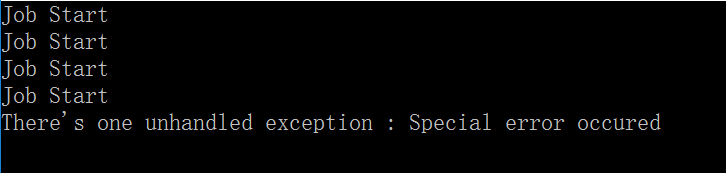
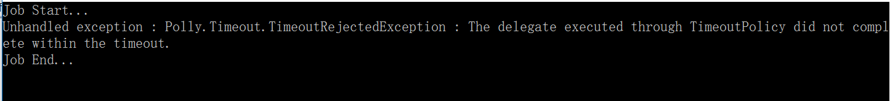
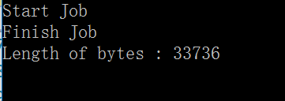
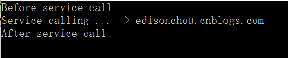
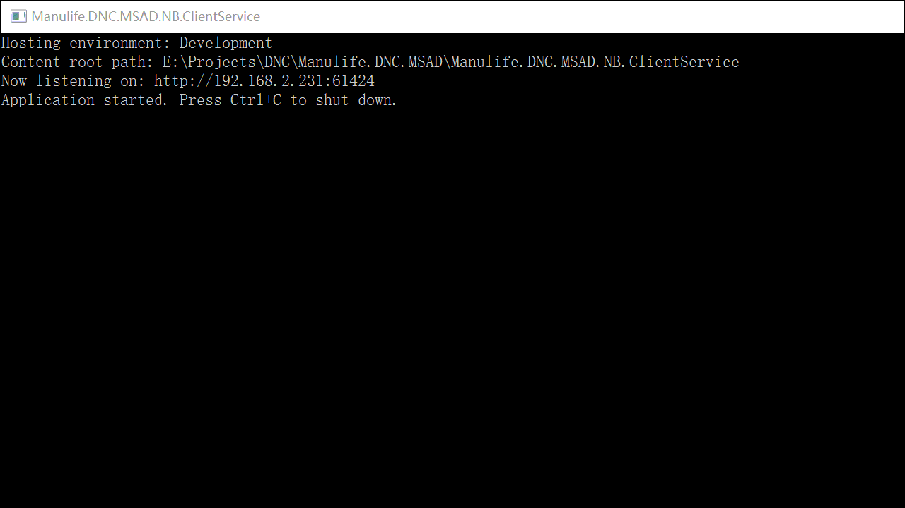

# Polly+AspectCore实现熔断+降级

## 一、熔断、降级与AOP

### 1.1 熔断
　　在广义的解释中，熔断主要是指为控制股票、期货或其他金融衍生产品的交易风险，为其单日价格波动幅度规定区间限制，一旦成交价触及区间上下限，交易则自动中断一段时间(“熔即断”)，或就此“躺平”而不得超过上限或下限(“熔而不断”)。

　　而对于微服务来说，熔断就是我们常说的“保险丝”，意为当服务出现某些状况时，切断服务，从而防止应用程序不断地常识执行可能会失败的操作造成系统的“雪崩”，或者大量的超时等待导致系统卡死等情况，很多地方也将其成为“过载保护”。

### 1.2 降级
降级的目的就是当某个服务提供者发生故障的时候，向调用方返回一个替代响应或者错误响应。

　　例如：假设有一个短信服务，其调用联通接口服务器发送短信服务（假设这里调用联通接口最方便，最省事也最经济）失败之后，会尝试改用移动短信服务器（假设这里调用移动服务器比较不方便也不经济）发送，如果移动服务器调用也失败，那么还会尝试改用电信短信服务器（假设这里调用电信服务器最不省事和最不经济），如果还失败，则返回“失败”响应；

　　降级的另一个概念也可以看作是服务的“选择性放弃”，比如在双11或618等大型的电商活动日中，在高峰值的情形下，一般的电商系统都会采用部分服务的优先级降低或者干脆延时或停止服务，以确保主要的服务能够使用最大化的资源为客户提供服务。等待峰值下降之后，再通过处理恢复那些降级的服务的原有优先级。

### 1.3 AOP
　　AOP（Aspect Oriented Programming）意为面向切面编程，它是指在运行时，动态地将代码切入到类的指定方法、指定位置上的编程思想就是面向切面的编程。比如说，我们在两个类中，可能都需要在每个方法中做日志。按面向对象的设计方法，我们就必须在两个类的方法中都加入日志的内容。也许他们是完全相同的，但就是因为面向对象的设计让类与类之间无法联系，而不能将这些重复的代码统一起来。而AOP就是为了解决这个问题而生的，一般而言，我们把切入到指定类指定方法的代码片段称为切面，而切入到哪些类、哪些方法则叫切入点。有了AOP，我们就可以把几个类共有的代码，抽取到一个切片中，等到需要时再切入对象中去，从而改变其原有的行为。

　　AOP是OOP（Object Oriented Programming）的补充，OOP从横向上区分出一个个的类来，而AOP则从纵向上向对象中加入特定的代码。有了AOP，OOP变得立体了。

## 二、Polly的基本使用

官方文档：https://github.com/App-vNext/Polly

### 2.1 Polly极简介绍

Polly是一个被.NET基金会认可的弹性和瞬态故障处理库，允许我们以非常顺畅和线程安全的方式来执诸如行重试，断路，超时，故障恢复等策略，其主要功能如下：

* 功能1：重试（Retry）
* 功能2：断路器（Circuit-Breaker）
* 功能3：超时检测（Timeout）
* 功能4：缓存（Cache）
* 功能5：降级（Fallback）

Polly的策略主要由“故障”和“动作”两个部分组成，“故障”可以包括异常、超时等情况，“动作”则包括Fallback（降级）、重试（Retry）、熔断（Circuit-Breaker）等。策略则用来执行业务代码，当业务代码出现了“故障”中的情况时就开始执行“动作”。

### 2.2 Polly基础使用

1. nuget安装`Polly`
1. Fallback：当出现故障，则进入降级动作

    ```csharp
    public static void Case1()
    {
        ISyncPolicy policy = Policy.Handle<ArgumentException>().Fallback(() =>
        {
            Console.WriteLine("Error occured");
        });

        policy.Execute(() => {
            Console.WriteLine("Job Start");
            throw new ArgumentException("Hello Polly!");
            Console.WriteLine("Job End");
        });
    }
    ```
    
1. Retry：重试

    ```csharp
    public static void Case2()
    {
        ISyncPolicy policy = Policy.Handle<Exception>().Retry(3);

        try
        {
            policy.Execute(() =>
            {
                Console.WriteLine("Job Start");
                if (DateTime.Now.Second % 10 != 0)
                {
                    throw new Exception("Special error occured");
                }
                Console.WriteLine("Job End");
            });
        }
        catch (Exception ex)
        {
            Console.WriteLine("There's one unhandled exception : " + ex.Message);
        }
    }
    ```
    
1. CircuitBreaker: 短路保护,当一块业务代码/服务 出现了N次错误，则把“熔断器”（保险丝）熔断，等待一段时间后才允许再次执行，在这段等待的时间内如果再执行则直接抛出BrokenCircuitException异常.

    ```csharp
    public static void Case3()
    {
        // Stop for 10s after retry 6 times
        ISyncPolicy policy = Policy.Handle<Exception>()
            .CircuitBreaker(6, TimeSpan.FromSeconds(10));

        while (true)
        {
            try
            {
                policy.Execute(() =>
                {
                    Console.WriteLine("Job Start");
                    throw new Exception("Special error occured");
                    Console.WriteLine("Job End");
                });
            }
            catch (Exception ex)
            {
                Console.WriteLine("There's one unhandled exception : " + ex.Message);
            }

            Thread.Sleep(500);
        }
    }
    ```
    发生了故障的时候，则重试了5次还是有故障（代码中的6代表的是在执行短路保护策略之前允许6次故障），那么久停止服务10s钟，10s之后再允许重试。
    
1. Timeout 与 Wrap => Wrap是指策略封装，可以把多个ISyncPolicy合并到一起执行。Timeout则是指超时处理，但是超时策略一般不能直接使用，而是其其他策略封装到一起使用。这里我们封装两个策略，一个是基本的Fallback，另一个则是超时策略，如果调用执行时间超过2s则触发Fallback。这里涉及到Polly中关于超时的两个策略：一个是悲观策略（Pessimistic），一个是乐观策略（Optimistic）。其中，悲观策略超时后会直接抛异常，而乐观策略则不会，而只是触发CancellationTokenSource.Cancel函数，需要等待委托自行终止操作。一般情况下，我们都会用悲观策略。

    ```csharp
    public static void Case4()
    {
        try
        {
            ISyncPolicy policyException = Policy.Handle<TimeoutRejectedException>()
                .Fallback(() =>
                {
                    Console.WriteLine("Fallback");
                });
            ISyncPolicy policyTimeout = Policy.Timeout(3, Polly.Timeout.TimeoutStrategy.Pessimistic);
            ISyncPolicy mainPolicy = Policy.Wrap(policyTimeout, policyException);
            mainPolicy.Execute(() =>
            {
                Console.WriteLine("Job Start...");
                Thread.Sleep(5000);
                //throw new Exception();
                Console.WriteLine("Job End...");
            });
        }
        catch (Exception ex)
        {
            Console.WriteLine($"Unhandled exception : {ex.GetType()} : {ex.Message}");
        }
    }
    ```
    

1. 除此之外，Polly还提供了一些异步方法供调用以实现以上介绍的功能，比如在业务代码中有一些Http的调用或者IO操作时，不妨用用异步操作来提高一点效率，可以看下面这个例子：
    ```csharp
    public static async void Case5()
    {
        Policy<byte[]> policy = Policy<byte[]>.Handle<Exception>()
            .FallbackAsync(async c =>
            {
                Console.WriteLine("Executed Error!");
                return new byte[0];
            }, async r =>
            {
                Console.WriteLine(r.Exception);
            });

        policy = policy.WrapAsync(Policy.TimeoutAsync(20, TimeoutStrategy.Pessimistic,
            async (context, timespan, task) =>
            {
                Console.WriteLine("Timeout!");
            }));

        var bytes = await policy.ExecuteAsync(async ()=>
        {
            Console.WriteLine("Start Job");
            HttpClient httpClient = new HttpClient();
            var result = await httpClient.GetByteArrayAsync("https://images2018.cnblogs.com/blog/381412/201806/381412-20180606230929894-145212290.png");
            Console.WriteLine("Finish Job");

            return result;
        });

        Console.WriteLine($"Length of bytes : {bytes.Length}");
    }
    ```
    

## 三、AspectCore的基本使用

### 3.1 为什么要用AOP框架

从上面的例子可以看出，如果直接使用Polly，那么就会造成我们的业务代码中**混杂大量的业务无关的代码**。所以，我们会使用AOP的方式来封装Polly，目前大家都在用AspectCore（国产，作者Lemon），它采用动态动态代理/织入，并且支持异步方法的拦截。`Install-Package AspectCore.Core`

### 3.2 AspectCore的极简使用
这里假设我们要针对一个类的某些类的某些方法进行拦截，我们一般会经过一下几个步骤：  
（1）编写一个拦截器，一般继承自AbstractInterceptorAttribute

```csharp
/// <summary>
/// 自定义拦截器
/// </summary>
public class CustomInterceptorAttribute : AbstractInterceptorAttribute
{
    /// <summary>
    /// 每个被拦截的方法中执行
    /// </summary>
    /// <param name="context"></param>
    /// <param name="next"></param>
    /// <returns></returns>
    public override async Task Invoke(AspectContext context, AspectDelegate next)
    {
        try
        {
            Console.WriteLine("Before service call");
            await next(context); // 执行被拦截的方法
        }
        catch (Exception)
        {
            Console.WriteLine("Service threw an exception");
            throw;
        }
        finally
        {
            Console.WriteLine("After service call");
        }
    }
}
```
这里我们通过为被拦截方法增加一些处理前和处理后的logic来实现AOP。

（2）编写需要被代理拦截的类

```csharp
/// <summary>
/// 实现AoP的两个要求：
/// 1.public 类
/// 2.virtual 方法
/// </summary>
public class Person
{
    [CustomInterceptor]
    public virtual void Say(string message)
    {
        Console.WriteLine($"Service calling ... => {message}");
    }
}
```
可以看到我们在要拦截的方法Say()的声明之上加了一个Attribute：CustomInterceptor，正是我们之前新增的.

（3）通过AspectCore创建代理对象实现AOP

```csharp
public class Program
{
    public static void Main(string[] args)
    {
        ProxyGeneratorBuilder proxyGeneratorBuilder = new ProxyGeneratorBuilder();
        using (IProxyGenerator proxyGenerator = proxyGeneratorBuilder.Build())
        {
            Person p = proxyGenerator.CreateClassProxy<Person>();
            p.Say("edisonchou.cnblogs.com");
        }
        Console.ReadKey();
    }
}
```

代码很清晰，不再解释。直到这里，我们看到了不管是Polly的使用，还是AspectCore的使用，都存在一些业务无关的声明代码，而且我们需要结合Polly和AspectCore才能完整地实现适合ASP.NET Core的熔断降级组件，下面我们就来模仿Spring Cloud中的Hystrix

## 四、Polly+AspectCore的结合使用

### 4.1 封装一个Hystrix

```bash
NuGet>Install-Package Polly

NuGet>Install-Package AspectCore.Core

NuGet>Install-Package Microsoft.Extensions.Caching.Memory
```

```csharp
[AttributeUsage(AttributeTargets.Method)]
public class HystrixCommandAttribute : AbstractInterceptorAttribute
{
    /// <summary>
    /// 最多重试几次，如果为0则不重试
    /// </summary>
    public int MaxRetryTimes { get; set; } = 0;

    /// <summary>
    /// 重试间隔的毫秒数
    /// </summary>
    public int RetryIntervalMilliseconds { get; set; } = 100;

    /// <summary>
    /// 是否启用熔断
    /// </summary>
    public bool IsEnableCircuitBreaker { get; set; } = false;

    /// <summary>
    /// 熔断前出现允许错误几次
    /// </summary>
    public int ExceptionsAllowedBeforeBreaking { get; set; } = 3;

    /// <summary>
    /// 熔断多长时间（毫秒）
    /// </summary>
    public int MillisecondsOfBreak { get; set; } = 1000;

    /// <summary>
    /// 执行超过多少毫秒则认为超时（0表示不检测超时）
    /// </summary>
    public int TimeOutMilliseconds { get; set; } = 0;

    /// <summary>
    /// 缓存多少毫秒（0表示不缓存），用“类名+方法名+所有参数ToString拼接”做缓存Key
    /// </summary>

    public int CacheTTLMilliseconds { get; set; } = 0;

    private static ConcurrentDictionary<MethodInfo, Policy> policies 
        = new ConcurrentDictionary<MethodInfo, Policy>();

    private static readonly IMemoryCache memoryCache 
        = new MemoryCache(new Microsoft.Extensions.Caching.Memory.MemoryCacheOptions());

    /// <summary>
    /// HystrixCommandAttribute
    /// </summary>
    /// <param name="fallBackMethod">降级的方法名</param>
    public HystrixCommandAttribute(string fallBackMethod)
    {
        this.FallBackMethod = fallBackMethod;
    }

    public string FallBackMethod { get; set; }

    public override async Task Invoke(AspectContext context, AspectDelegate next)
    {
        //一个HystrixCommand中保持一个policy对象即可
        //其实主要是CircuitBreaker要求对于同一段代码要共享一个policy对象
        //根据反射原理，同一个方法的MethodInfo是同一个对象，但是对象上取出来的HystrixCommandAttribute
        //每次获取的都是不同的对象，因此以MethodInfo为Key保存到policies中，确保一个方法对应一个policy实例
        policies.TryGetValue(context.ServiceMethod, out Policy policy);
        lock (policies)//因为Invoke可能是并发调用，因此要确保policies赋值的线程安全
        {
            if (policy == null)
            {
                policy = Policy.NoOpAsync();//创建一个空的Policy
                if (IsEnableCircuitBreaker)
                {
                    policy = policy.WrapAsync(Policy.Handle<Exception>().CircuitBreakerAsync(ExceptionsAllowedBeforeBreaking, TimeSpan.FromMilliseconds(MillisecondsOfBreak)));
                }
                if (TimeOutMilliseconds > 0)
                {
                    policy = policy.WrapAsync(Policy.TimeoutAsync(() => TimeSpan.FromMilliseconds(TimeOutMilliseconds), Polly.Timeout.TimeoutStrategy.Pessimistic));
                }
                if (MaxRetryTimes > 0)
                {
                    policy = policy.WrapAsync(Policy.Handle<Exception>().WaitAndRetryAsync(MaxRetryTimes, i => TimeSpan.FromMilliseconds(RetryIntervalMilliseconds)));
                }
                Policy policyFallBack = Policy
                .Handle<Exception>()
                .FallbackAsync(async (ctx, t) =>
                {
                    AspectContext aspectContext = (AspectContext)ctx["aspectContext"];
                    var fallBackMethod = context.ServiceMethod.DeclaringType.GetMethod(this.FallBackMethod);
                    Object fallBackResult = fallBackMethod.Invoke(context.Implementation, context.Parameters);
                    //不能如下这样，因为这是闭包相关，如果这样写第二次调用Invoke的时候context指向的
                    //还是第一次的对象，所以要通过Polly的上下文来传递AspectContext
                    //context.ReturnValue = fallBackResult;
                    aspectContext.ReturnValue = fallBackResult;
                }, async (ex, t) => { });

                policy = policyFallBack.WrapAsync(policy);
                //放入
                policies.TryAdd(context.ServiceMethod, policy);
            }
        }

        //把本地调用的AspectContext传递给Polly，主要给FallbackAsync中使用，避免闭包的坑
        Context pollyCtx = new Context();
        pollyCtx["aspectContext"] = context;

        //Install-Package Microsoft.Extensions.Caching.Memory
        if (CacheTTLMilliseconds > 0)
        {
            //用类名+方法名+参数的下划线连接起来作为缓存key
            string cacheKey = "HystrixMethodCacheManager_Key_" + context.ServiceMethod.DeclaringType+ "." + context.ServiceMethod + string.Join("_", context.Parameters);
            //尝试去缓存中获取。如果找到了，则直接用缓存中的值做返回值
            if (memoryCache.TryGetValue(cacheKey, out var cacheValue))
            {
                context.ReturnValue = cacheValue;
            }
            else
            {
                //如果缓存中没有，则执行实际被拦截的方法
                await policy.ExecuteAsync(ctx => next(context), pollyCtx);
                //存入缓存中
                using (var cacheEntry = memoryCache.CreateEntry(cacheKey))
                {
                    cacheEntry.Value = context.ReturnValue;
                    cacheEntry.AbsoluteExpiration = DateTime.Now + TimeSpan.FromMilliseconds(CacheTTLMilliseconds);
                }
            }
        }
        else//如果没有启用缓存，就直接执行业务方法
        {
            await policy.ExecuteAsync(ctx => next(context), pollyCtx);
        }
    }
}
```

### 4.2 在Core中使用

（1）为了简化代理类对象的注入，不用在Core中再通过ProxyGeneratorBuilder进行注入，我们引入一个AspectCore的DI扩展包：`NuGet>Install-Package AspectCore.Extensions.DependencyInjection`

（2）改写Startup类的ConfigureService方法，把返回值从void改为IServiceProvider  

```csharp
// This method gets called by the runtime. Use this method to add services to the container.
public IServiceProvider ConfigureServices(IServiceCollection services)
{
    services.AddMvc();
    .......
    // AoP - AspectCore
    RegisterServices(this.GetType().Assembly, services);
    return services.BuildAspectCoreServiceProvider();
}
```
这里BuildAspectCoreServiceProvider就是让AspectCore接管注入。RegisterService方法如下所示：
```csharp
private static void RegisterServices(Assembly asm, IServiceCollection services)
{
    foreach (var type in asm.GetExportedTypes())
    {
        bool hasHystrixCommand = type.GetMethods().Any(m =>
            m.GetCustomAttribute(typeof(HystrixCommandAttribute)) != null);
        if (hasHystrixCommand)
        {
            services.AddSingleton(type);
        }
    }
}
```
这里使用反射，筛选出那些带有HystrixCommandAttribute的类进行注入，从而减少一行一行注入的代码工作量

（3）这里假设我们需要进行熔断保护的方法所在类是一个ProductService类，它主要的功能就是通过HttpClient去调用ProductService的某个API，它的定义如下：

```csharp
public class ProductService
{
    [HystrixCommand(nameof(GetAllProductsFallBackAsync),
        IsEnableCircuitBreaker = true,
        ExceptionsAllowedBeforeBreaking = 3,
        MillisecondsOfBreak = 1000 * 5)]
    public virtual async Task<string> GetAllProductsAsync(string productType)
    {
        Console.WriteLine($"-->>Starting get product type : {productType}");
        string str = null;
        str.ToString();
        
        // to do : using HttpClient to call outer service to get product list

        return $"OK {productType}";
    }

    public virtual async Task<string> GetAllProductsFallBackAsync(string productType)
    {
        Console.WriteLine($"-->>FallBack : Starting get product type : {productType}");

        return $"OK for FallBack  {productType}";
    }
}
```
这里假设我们主要针对GetAllProductsAsync这个方法进行熔断保护，假设它会调用另一个Service的获取产品的接口，这个接口会访问核心数据库，其每天的访问量很大，我们对此接口进行熔断保护，设置在启用熔断保护前允许两次故障（这里主要指异常），熔断保护时间为5s。

在Controller中，通过构造函数注入：
```csharp
[Produces("application/json")]
[Route("api/Client")]
public class ClientController : Controller
{
    private readonly IClientService clientService;
    private readonly ProductService productService;

    public ClientController(IClientService _clientService, ProductService _productService)
    {
        clientService = _clientService;
        productService = _productService;
    }

    [HttpGet("{id}")]
    public async Task<string> Get(int id)
    {
        var product = await productService.GetAllProductsAsync("B");

        return product;
    }
}
```

为了能够在控制台中看到熔断的信息，我们增加一句Console.WriteLine到HystrixCommandAttribute中：
```csharp
// 启用熔断保护（CircuitBreaker）
if (IsEnableCircuitBreaker)
{
    policy = policy.WrapAsync(Policy.Handle<Exception>()
        .CircuitBreakerAsync(ExceptionsAllowedBeforeBreaking,
        TimeSpan.FromMilliseconds(MillisecondsOfBreak), (ex, ts) =>
        {
                // assuem to do logging
                Console.WriteLine($"Service API OnBreak -- ts = {ts.Seconds}s, ex.message = {ex.Message}");
        }, () => {}));
}
```
这样当Polly启用熔断时便会在控制台中输出一段消息，实际使用中可以往日志中写一段日志信息。

（4）开起内置服务器进行测试

Step1.借助命令行启动一个WebAPI程序

Step2.借助Postman/SoapUI等API测试工具，输入我们的URL，测试结果如下图所示：

可以看到我们通过在Postman中访问这个URL从而触发Service中的异常，两次异常之后，便进入了熔断保护时间，此后5s内的访问都没有再进行实际代码的执行，而直接进入了Fallback方法执行降级后的逻辑。5s保护时间之后，则再次进入实际代码的执行。目前，这个Hystrix还存在一些问题，需继续完善，还无法正式投入使用，后续会结合Polly和Ocelot，在API网关处做统一熔断保护

