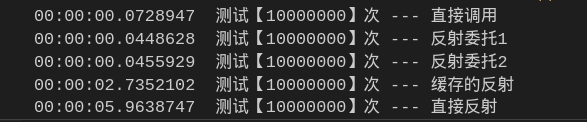
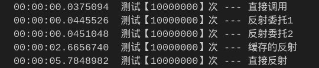
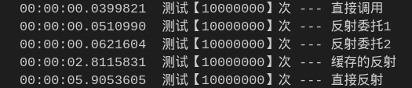

# Dotnet使用委托提升反射性能

## Intro

反射在平常开发的时候偶尔会使用到，但是大家都知道，直接使用反射调用方法多少会有性能的损失，那有什么办法可以提升性能呢？  
今天就看到一篇干货就是解决这个问题的，[原文连接](https://blog.walterlv.com/post/create-delegate-to-improve-reflection-performance.html)。

## 目标

对比【直接调用】、【反射调用】、【反射得到的方法缓存调用】、【使用反射创建的委托调用】四种方式调用方法的性能

## 准备代码

* 定义测试类以及方法

```csharp
public class ReflectionClass
{
    public int Sum(int a, int b)
    {
        return a+b;
    }
}
```

* 反射转换化成委托的帮助类

```csharp
public static class ReflectionHelper<T1, T2, TReturn>
{
    /// <summary>
    /// 得到反射方法的委托
    /// 调用方法：var result = func(1,2)
    /// </summary>
    /// <param name="instance"></param>
    /// <param name="method"></param>
    /// <returns></returns>
    public static Func<T1,T2, TReturn> BuilderDelegate(MethodInfo method, object instance)
    {
        if(instance == null) throw new ArgumentNullException(nameof(instance));
        if(method == null) throw new ArgumentNullException(nameof(method));

        var delegateMethod = (Func<T1,T2, TReturn>)method.CreateDelegate(typeof(Func<T1,T2, TReturn>), instance);

        return delegateMethod;
    }

    /// <summary>
    /// 得到反射方法的委托
    /// 调用方法：var result = func(this,1,2)
    /// </summary>
    /// <param name="method"></param>
    /// <typeparam name="TInstance"></typeparam>
    /// <returns></returns>
    public static Func<TInstance, T1, T2, TReturn> BuilderDelegate<TInstance>(MethodInfo method)
    {
        if(method == null) throw new ArgumentNullException(nameof(method));

        return (Func<TInstance, T1, T2, TReturn>)method.CreateDelegate(typeof(Func<TInstance, T1, T2, TReturn>));
    }
}
```

* 测试方法

```csharp
static void Main(string[] args)
{
    // 实例
    var instance = new ReflectionClass();

    // 反射得到的方法
    var method = typeof(ReflectionClass).GetMethod(nameof(ReflectionClass.Sum), new[] {typeof(int), typeof(int)});

    // 根据需要反射的方法生成的委托
    var func = ReflectionHelper<int,int,int>.BuilderDelegate(method, instance);

    // 根据需要反射的方法生成的委托2
    var func2 = ReflectionHelper<int,int,int>.BuilderDelegate<ReflectionClass>(method);

    // 测试1千万次
    int testTimes = 10000000;

    // 直接调用
    var watch = new Stopwatch();

    watch.Start();
    for(int i=0; i<testTimes; i++)
    {
        var sum = instance.Sum(1,2);
    }
    watch.Stop();

    Console.WriteLine($"{watch.Elapsed}  测试【{testTimes}】次 --- 直接调用");

    // 反射委托调用1
    watch.Restart();
    for(int i=0; i<testTimes; i++)
    {
        var sum = func(1,2);
    }
    watch.Stop();

    Console.WriteLine($"{watch.Elapsed}  测试【{testTimes}】次 --- 反射委托1");

    // 反射委托调用2
    watch.Restart();
    for(int i=0; i<testTimes; i++)
    {
        var sum = func2(instance,1,2);
    }
    watch.Stop();

    Console.WriteLine($"{watch.Elapsed}  测试【{testTimes}】次 --- 反射委托2");

    // 使用缓存的发射方法
    watch.Restart();
    for(int i=0; i<testTimes; i++)
    {
        var sum = method.Invoke(instance, new object[]{1,2});
    }
    watch.Stop();

    Console.WriteLine($"{watch.Elapsed}  测试【{testTimes}】次 --- 缓存的反射");

    // 直接反射
    watch.Restart();
    for(int i=0; i<testTimes; i++)
    {
        var sum = typeof(ReflectionClass)
            .GetMethod(nameof(ReflectionClass.Sum), new[] {typeof(int), typeof(int)}).Invoke(instance, new object[] {1, 2});
    }
    watch.Stop();

    Console.WriteLine($"{watch.Elapsed}  测试【{testTimes}】次 --- 直接反射");
}
```

## 结果

一共进行了3次测试，结果如下：

第一次：



第二次：



第三次：



通过测试可以很明显的看出来，通过生成反射的委托去调用方法，速度上与直接调用相差不大，可以说大幅度提升了发射调用的性能。

测试代码已经上传到`GitHub`,需要的朋友 [戳这里下载](https://github.com/yasewang987/Hz.DonetDemo/tree/master/Hz.Reflection)
