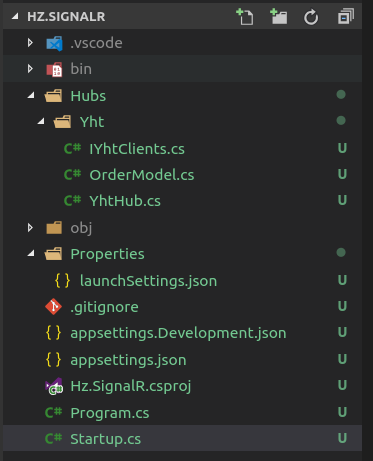

# Dotnet实时通讯SignalR

microsoft资料地址：https://docs.microsoft.com/zh-cn/aspnet/core/signalr/introduction?view=aspnetcore-2.2

## 服务端

这里只记录强类型的服务端
1. 新建空的web项目：`dotnet new web -n Hz.SignalR`
1. 目录结构  
    

    * 这里将Hubs放在文件夹中是为了多个hub划分清晰一点

1. 新建客户端方法接口`IYhtClients`（实现代码在客户端），内容如下

    ```csharp
    public interface IYhtClients
    {
        // 这个是客户端中的其中一个方法，接收的参数为自定义模型
        Task OrderClient(OrderModel model);
    }
    ```
1. 新建数据传输模型`OrderModel.cs`

    ```csharp
    public class OrderModel {
        public string name { get; set; }
        public string phone { get; set; }
        public string tag { get; set; }
        public string orderTime { get; set; } = DateTime.Now.ToString();
        public string status { get; set; }
    }
    ```
1. 新建自定义hub`YhtHub`(需要继承自Hub)

    ```csharp
    public class YhtHub: Hub<IYhtClients>
    {
        private readonly string _orderGroupName = "Order"; 

        public async Task AddToGroup_Order()
        {
            await Groups.AddToGroupAsync(Context.ConnectionId, _orderGroupName);
        }
        public async Task OrderService(OrderModel model)
        {
            await Clients.Group(_orderGroupName).OrderClient(model);
        }
    }
    ```
1. 添加SignalR中间件到服务端项目中（ps：如果服务端为独立项目，需要添加跨域处理），修改`Startup.cs`

    ```csharp
    public class Startup
    {
        private readonly string _policyName = "CorsPolicy";
        public IConfiguration Configuration {get;}

        public Startup(IConfiguration configuration)
        {
            Configuration = configuration;
        }
        public void ConfigureServices(IServiceCollection services)
        {
            var origins = new List<string>();
            Configuration.GetSection("AllowCors").Bind(origins);            
            services.AddCors(options => 
                options.AddPolicy(_policyName, builder =>
                    builder.AllowAnyMethod().AllowAnyHeader()
                        .AllowCredentials()
                        .WithOrigins(origins.ToArray())));

            services.AddSignalR();
            //services.AddMvc();
        }
        public void Configure(IApplicationBuilder app, IHostingEnvironment env)
        {
            if (env.IsDevelopment())
            {
                app.UseDeveloperExceptionPage();
            }
            app.UseCors(_policyName);
            
            app.UseSignalR(options => {
                options.MapHub<Hubs.Yht.YhtHub>("/yhthub");
                // 需要添加其他hub，直接新增即可
                // options.MapHub<Hubs.Yht.YhtHub>("/hub2");
            });
            //app.UseMvc();
        }
    }
    ```
    * 这里跨域需要修改`application.json`文件，意思是允许下面2个地址的跨域请求
        ```json
        // 添加如下内容
        {
            "AllowCors": [
                "http://localhost:8080",
                "http://localhost:5000"
            ],
        }
        ```


## JS客户端

1. 引用signalr客户端

    ```js
    import * as signalR from "@aspnet/signalr"
    ```
1. 连接到signalr服务端

    ```js
    // 初始化连接
    const connection2 = new signalR.HubConnectionBuilder().withUrl("http://localhost:8888/yhthub").build();

    // 连接到服务器端，连接成功之后调用`AddToGroup_Order`方法加入到order组
    connection2.start().then( v =>
        connection2.invoke("AddToGroup_Order")
    ).catch(error => document.write(error));

    // 客户端方法OrderClient，供服务端调用
    connection2.on("OrderClient", res => {
        // 接收到服务端传递过来的参数，在客户端执行一系列操作
        let m = ''
        m = `${res.name}---${res.phone}---${res.orderTime}---${res.tag}---${res.status}`;
    })

    btnSend2.addEventListener("click", send2);

    function send2() {
        // 客户端调用服务端的OrderService方法，并将内容发送给服务端处理
        connection2.invoke("OrderService", { name: username2, phone: tbMessage2.value, tag: "WX", status: "2" })
            .then(() => tbMessage2.value = "");
    }
    ```

* 其他客户端参考 microsoft docs 中的资料
