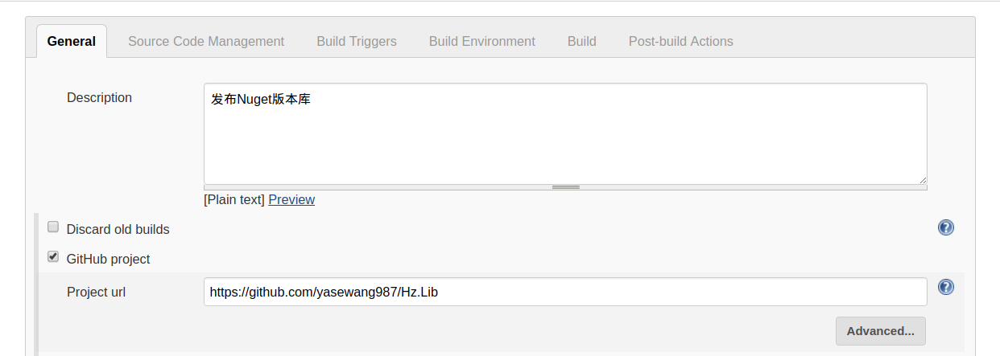
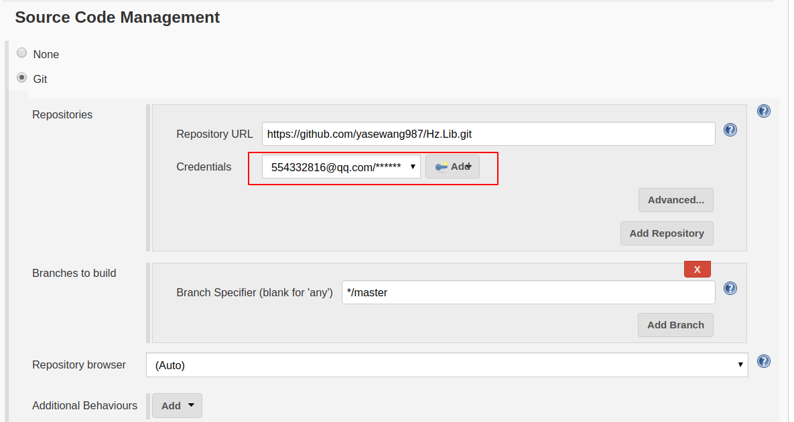
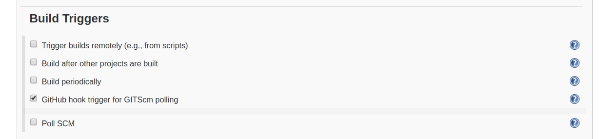
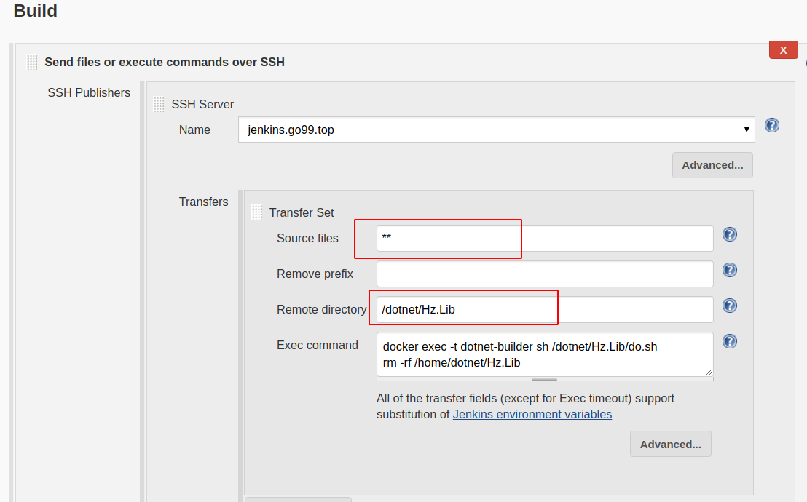
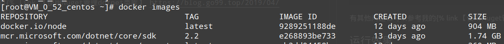
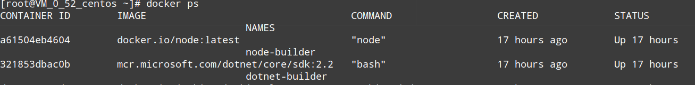
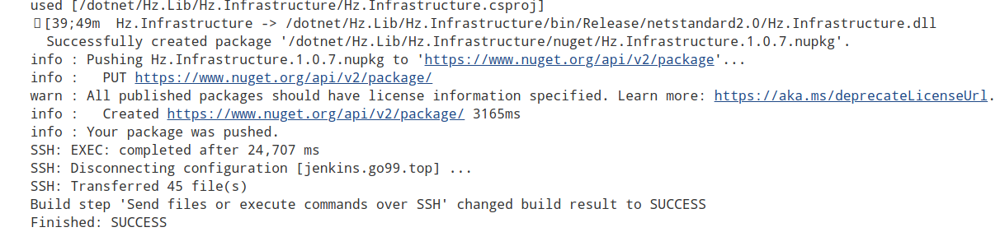
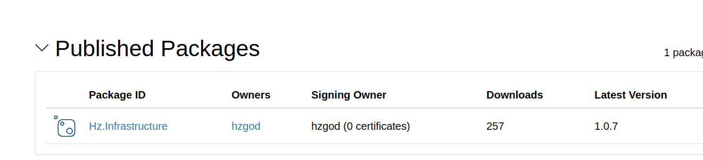

# Nuget持续集成、部署

## Intro

不管是dotnet、java、js都需要程序包的版本管理。`Nuget`对于dotnet开发者来说再熟悉不过了，使用大厂的程序包都是通过nuget来引用管理的。`Nuget`对于公司或者个人的程序包管理都非常有用，今天我就介绍一下如何使用`Github`+`Jenkins`+`Nuget`实现`Nuget`的持续集成部署。

## 准备

**Github：** 这个大家都懂，作为开发人员应该都有自己的github  
**Jenkins：** 下面文章中会大致介绍如何安装使用  
**Nuget：** 到nuget官网注册账号用于管理程序包，官网地址：https://www.nuget.org/

## Nuget申请及Dotnet-Cli发布Nuget包

* 参考资料：https://docs.microsoft.com/zh-cn/nuget/quickstart/create-and-publish-a-package-using-the-dotnet-cli

### 创建并发布Nuget .Net Standard包Cli

1. 注册账号：https://www.nuget.org/
1. 开启双重认证：右上角-》account setting-》Login Account-》Two-factor authentication
1. 创建API Keys：右上角-》API Keys-》Create
1. 选择“创建”，提供密钥名称，选择“选择范围”>“推送”。 在“API 密钥”下，输入“Glob 模式“`*`，然后选择“创建”。
<!-- more -->
1. 创建密钥后，选择“复制”,`将你的密钥保存在安全位置`，因为以后无法再次复制密钥。 如果返回到 API 密钥页，则需要重新生成密钥以对其进行复制。 如果不再希望通过 CLI 推送包，还可以删除 API 密钥
1. 创建包的相关信息,打开项目文件 (.csproj)，并在现有 `<PropertyGroup>` 标记内至少添加以下属性，同时根据需要更改值：
    ```xml
    <PackageId>yasewang</PackageId>
    <Version>1.0.0</Version>
    <Authors>your_name</Authors>
    <Company>your_company</Company>
    ```
1. 若要在运行 dotnet build 时自动运行 dotnet pack，请将以下行添加到 <PropertyGroup> 中的项目文件内：
    ```xml
    <GeneratePackageOnBuild>true</GeneratePackageOnBuild>
    ```
1. 生成包：`dotnet pack -o ./nuget -c Release`
1. 发布包到nuget：`dotnet nuget push ./nuget/*.nupkg -k your_api_key -s https://api.nuget.org/v3/index.json`
1. 包发布之后要一段时间验证之后才能正常使用，可以在用户中心的包管理中查看


## Jenkins基本安装配置

### 安装及全局配置
[安装及全局配置查看我写的Jenkins安装配置](https://blog.go99.top/2019/04/24/other-jenkins/)

### 项目配置

1. 【New Item】新建项目`HzLib`。
1. 填写项目描述及Github项目地址：
    
1. 【Source Code Management】源代码管理配置：
    
    > 由于我使用的是https协议，所以需要先新增一下github的账号密码。如果使用SSH的请自行baidu
1. 触发构建
    
    > 这里只是做简单测试就使用webhook了
1. 构建
    
    > 【Source files】：表示哪些文件需要上传到远程服务器（位置是相对于项目位置的）；  
    > 【Remote directory】：表示上传的原件放在远程服务器的哪个位置（相对于全局设置的位置）  
    > 执行的命令看到我们执行的是一个sh批处理文件，因为我将基本的操作都写在这个文件里了

    ```sh
    # 这个都是在容器内部执行的，所以文件位置都是容器内的文件位置
    cd /dotnet/Hz.Lib/Hz.Infrastructure
    dotnet pack -o ./nuget -c Release
    dotnet nuget push ./nuget/*.nupkg -k xxxxxxxxxx -s https://api.nuget.org/v3/index.json
    ```
    *注意一下这里的版本号需要在上传源代码之前自己修改`csproj`文件中的版本号*

## 其他

我这边发布Nuget是使用`dotnet`容器发布的，所以会使用`docker exec -t dotnet-builder sh do.sh`命令（注意，这里不能的执行命令不能加上`-i`参数，不然会报错）

* `dotnet`项目编译容器运行  
```bash
# 这里一定要使用-i以交互模式运行容器，不然容器启动之后就会退出
docker run -d -i -u root -v /home/dotnet:/dotnet --name dotnet-builder mcr.microsoft.com/dotnet/core/sdk
```



有其他问题也可以参考我的[【使用Nuget管理dotnet类库】](https://blog.go99.top/2019/04/09/dotnet-nuget/)文章

## 运行效果


