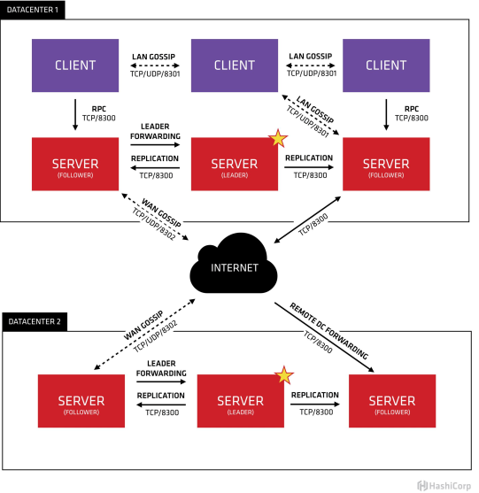
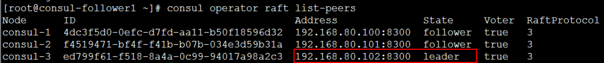
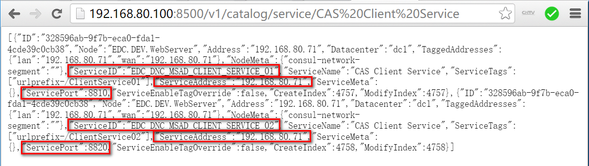
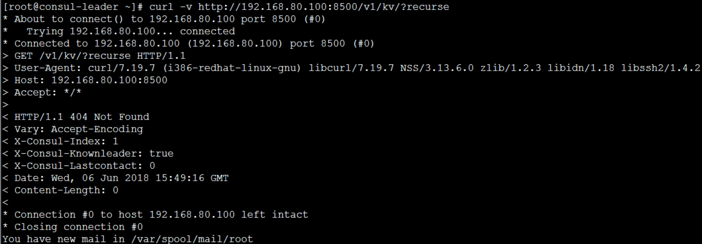
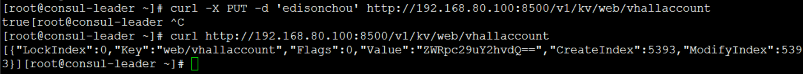
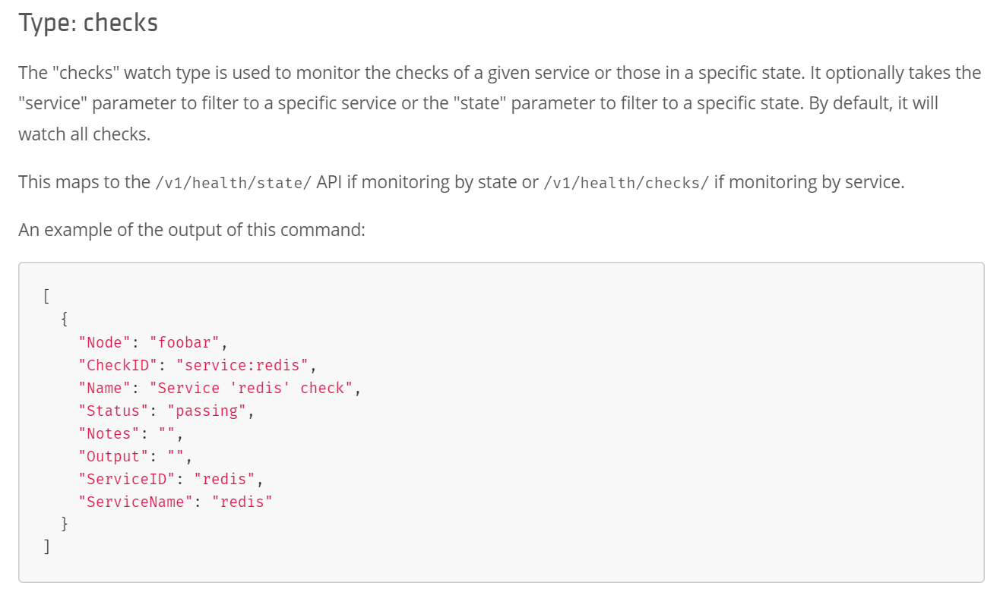

# Consul基础

## 1. 简介

Consul是HashiCorp公司推出的开源工具，用于实现分布式系统的服务发现与配置。与其他分布式服务注册与发现的方案，比如 Airbnb的SmartStack等相比，Consul的方案更“一站式”，内置了服务注册与发现框 架、分布一致性协议实现、健康检查、Key/Value存储、多数据中心方案，不再需要依赖其他工具（比如ZooKeeper等），使用起来也较 为简单。  

Consul用Golang实现，因此具有天然可移植性（支持Linux、windows和Mac OS X）；安装包仅包含一个可执行文件，方便部署，与Docker等轻量级容器可无缝配合。

关于Consul的架构以及相关的角色，如下图所示：



要想利用Consul提供的服务实现服务的注册与发现，我们需要建立Consul Cluster。在Consul方案中，每个提供服务的节点上都要部署和运行Consul的Client Agent，所有运行Consul Agent节点的集合构成Consul Cluster。Consul Agent有两种运行模式：Server和Client。这里的Server和Client只是Consul集群层面的区分，与搭建在Cluster之上的应用服务无关。以Server模式运行的Consul Agent节点用于维护Consul集群的状态，官方建议每个Consul Cluster至少有3个或以上的运行在Server Mode的Agent，Client节点不限。

Consul支持多数据中心，每个数据中心的Consul Cluster都会在运行于Server模式下的Agent节点中选出一个Leader节点，这个选举过程通过Consul实现的raft协议保证，多个 Server节点上的Consul数据信息是强一致的。处于Client Mode的Consul Agent节点比较简单，无状态，仅仅负责将请求转发给Server Agent节点。

## 2. Consul集群搭建

1. 准备3台虚拟机，其中，192.168.80.100会作为leader角色，其余两台192.168.80.101和192.168.80.102会作为follower角色。当然，实际环境中leader角色不会是一个固定的，会随着环境的变化（比如Leader宕机或失联）由算法选出新的leader。在进行下面的操作会前，请确保三台节点能够相互ping通，并能够和宿主机也ping通。另外，192.168.80.71会作为client角色，并且和其余三台虚拟机互相ping通。

1. 下载Consul：直接去 https://www.consul.io/downloads.html 选择对应的平台即可。
1. 下载之后是一个zip文件，我们通过XFtp等工具将其传送到我们的linux节点中即可。
1. 如果linux中未安装解压软件，先安装：`sudo yum install unzip`
1. 解压：`unzip consul_1.4.1_linux_amd64.zip`
1. 下面这些操作第一次测试未起作用（ps：后面测试可以正常使用）：
    > 复制consul到自定义目录：`cp consul /usr/local/bin`  
    > 设置环境变量：`vim /etc/profile` (ps:如果放入bin文件夹，后面可以不配置) 
    > 在profile中增加如下内容：

        ```bash
        # consul
        export CONSUL_HOME=/usr/local/consul
        export PATH=$PATH:$CONSUL_HOME
        ```
    > 生效配置`source /etc/profile`
    > 测试是否生效：`>consul`，看看是否有命令提示
1. 启动server(s),分别在3台节点执行一下命令启动consul(如果上一步环境变量的设置生效了，直接使用`consul`，如果没有生效则使用`./consul`)

    ```bash
    192.168.80.100>consul agent -server -ui -bootstrap-expect=3 -data-dir=/tmp/consul -node=consul-1 -client=0.0.0.0 -bind=192.168.80.100 -datacenter=dc1

    192.168.80.101>consul agent -server -ui -bootstrap-expect=3 -data-dir=/tmp/consul -node=consul-2 -client=0.0.0.0 -bind=192.168.80.101 -datacenter=dc1 -join 192.168.80.100

    192.168.80.102>consul agent -server -ui -bootstrap-expect=3 -data-dir=/tmp/consul -node=consul-3 -client=0.0.0.0 -bind=192.168.80.102 -datacenter=dc1 -join 192.168.80.100
    ```
    注意101和102的启动命令中，有一句 -join 192.168.80.100 => 有了这一句，就把101和102加入到了100所在的集群中
1. 如果在上一步中，101或者102加入100节点的时候提示错误`Failed to join 192.168.80.101:dial tcp 192.168.80.101:8301:connect:no route to host`，则需要关闭服务器的防火墙或者打开对应的端口，详细资料参考 [防火墙设置](../../../../other/linux/firewall.md) ,注意需要将三台服务器的`8300,，8301,8302,8500`端口都放开
1. 访问`http://192.168.80.100:5000`通过webui查看集群状态
1. 关闭100服务器测试集群功能
1. 通过命令查看各个`server`状态：`consul members`或者`consul operator raft list-peers`

   虽然这里80.100这个原leader节点挂掉了，但是只要超过一半的Server（这里是2/3还活着）还活着，集群是可以正常工作的，这也是为什么像Consul、ZooKeeper这样的分布式管理组件推荐我们使用3个或5个节点来部署的原因。

## 3. Consul客户端服务注册

Consul的客户端注册分2种：  
1. 集成到webapi项目中注册
1. 配置文件注册（推荐）

这里以`ASP.NET Core WebAPI`为例  
1. 创建api项目：`dotnet new webapi -n ClientService1`
1. 创建一个HealthController用于Consul的健康检查（Consul会通过call这个API来确认Service的健康状态）
    ```csharp
    [Produces("application/json")] // 这个可以不用
    [Route("api/Health")]
    public class HealthController : Controller
    {
        [HttpGet]
        public IActionResult Get() => Ok("ok");
    }
    ```

### 集成到项目中注册

接上面步骤：改写启动代码，调用Consul API注册服务  
1. 引用`consul`类库：`dotnet add package Consul`
    > 这个是个开源操作的`Consul API`的类库，`Github`搜索`Consul`选择`c#`类型，star最多的就是，[直接访问点击这里](https://github.com/PlayFab/consuldotnet)
1. 基于IApplicationBuilder写一个扩展方法，用于调用Consul API
    ```csharp
    public static class AppBuilderExtensions
    {
        public static IApplicationBuilder RegisterConsul(this IApplicationBuilder app, IApplicationLifetime lifetime, ServiceEntity serviceEntity)
        {
            var consulClient = new ConsulClient(x => x.Address = new Uri($"http://{serviceEntity.ConsulIP}:{serviceEntity.ConsulPort}"));//请求注册的 Consul 地址
            var httpCheck = new AgentServiceCheck()
            {
                DeregisterCriticalServiceAfter = TimeSpan.FromSeconds(5),//服务启动多久后注册
                Interval = TimeSpan.FromSeconds(10),//健康检查时间间隔，或者称为心跳间隔
                HTTP = $"http://{serviceEntity.IP}:{serviceEntity.Port}/api/health",//健康检查地址
                Timeout = TimeSpan.FromSeconds(5)
            };

            // Register service with consul
            var registration = new AgentServiceRegistration()
            {
                Checks = new[] { httpCheck },
                ID = Guid.NewGuid().ToString(),
                Name = serviceEntity.ServiceName,
                Address = serviceEntity.IP,
                Port = serviceEntity.Port,
                Tags = new[] { $"urlprefix-/{serviceEntity.ServiceName}" }//添加 urlprefix-/servicename 格式的 tag 标签，以便 Fabio 识别
            };

            consulClient.Agent.ServiceRegister(registration).Wait();//服务启动时注册，内部实现其实就是使用 Consul API 进行注册（HttpClient发起）
            lifetime.ApplicationStopping.Register(() =>
            {
                consulClient.Agent.ServiceDeregister(registration.ID).Wait();//服务停止时取消注册
            });

            return app;
        }
    }
    ```
1. 在Starup类的Configure方法中，调用此扩展方法

    ```csharp
    // This method gets called by the runtime. Use this method to configure the HTTP request pipeline.
    public void Configure(IApplicationBuilder app, IHostingEnvironment env, IApplicationLifetime lifetime)
    {
        if (env.IsDevelopment())
        {
            app.UseDeveloperExceptionPage();
        }

        app.UseMvc();
        // register this service
        ServiceEntity serviceEntity = new ServiceEntity
        {
            IP = NetworkHelper.LocalIPAddress,
            Port = Convert.ToInt32(Configuration["Service:Port"]),
            ServiceName = Configuration["Service:Name"],
            ConsulIP = Configuration["Consul:IP"],
            ConsulPort = Convert.ToInt32(Configuration["Consul:Port"])
        };
        app.RegisterConsul(lifetime, serviceEntity);
    }

    // 其中ServiceEntity类定义如下：
    public class ServiceEntity
    {
        public string IP { get; set; }
        public int Port { get; set; }
        public string ServiceName { get; set; }
        public string ConsulIP { get; set; }
        public int ConsulPort { get; set; }
    }
    ```
1. 配置appSettings.json：

    ```bash
    {
        "Service": {
            "Name": "CAS.NB.ClientService",
            "Port": "8810"
        },
        "Consul": {
            "IP": "192.168.80.101",
            "Port": "8500"
        },
        "Logging": {
            "IncludeScopes": false,
            "Debug": {
            "LogLevel": {
                "Default": "Warning"
            }
            },
            "Console": {
            "LogLevel": {
                "Default": "Warning"
            }
            }
        }
    }
    ```
1. 保留默认创建的ValuesController，其余不再创建任何API，不是本次实验的重点。当然，你可以集成一下Swagger，这样有个界面文档可以看:`http://localhost:8810/api/health`
1. 访问consul的webui`http://192.168.0.100:8500`查看服务是否注册成功。

### 配置文件注册

* 配置文件`services_config.json`,放到config目录下
```bash
# services_config.json
{
    "services":[
        {
            "id": "EDC_DNC_MSAD_CLIENT_SERVICE_01",
            "name" : "CAS Client Service",
            "tags": [
                "urlprefix-/ClientService01"
            ],
            "address": "192.168.80.71",
            "port": 8810,
            "checks": [
                {
                    "name": "clientservice_check",
                    "http": "http://192.168.80.71:8810/api/health",
                    "interval": "10s",
                    "timeout": "5s"
                }
            ]
        },
    　　{
            "id": "EDC_DNC_MSAD_CLIENT_SERVICE_02",
            "name" : "CAS Client Service",
            "tags": [
                "urlprefix-/ClientService02"
            ],
            "address": "192.168.80.71",
            "port": 8820,
            "checks": [
                {
                    "name": "clientservice_check",
                    "http": "http://192.168.80.71:8820/api/health",
                    "interval": "10s",
                    "timeout": "5s"
                }
            ]
        }
     ]
}
```
* 启动Consul Client服务：`consul agent -bind 0.0.0.0 -client 192.168.80.71 -config-dir=C:\Server\Consul\config -data-dir=C:\Server\Consul\tempdata -node EDC.DEV.WebServer -join 192.168.80.100`（如果本机有多个地址需要将改成`-bind 192.168.80.71`）
* 启动之后，可以看到Consul已经通过扫描配置文件，去注册了这2个ClientService的实例

1. 访问consul的webui`http://192.168.0.100:8500`查看服务是否注册成功。
1. Consul不仅仅提供了服务注册，还提供了服务发现，我们可以通过调用其提供的API来发现服务的IP和Port:`192.168.80.100:8500/v1/catalog/service/CAS Client Service`  
    **我们可以看到返回了ClientService的ServiceAddress和ServicePort，就可以通过其组成URL进行服务调用了。当然，我们可能会对一个服务部署多个实例，以组成集群来实现负载均衡。我们可以设置一些负载均衡的策略，假设通过取模运算随机选择一个服务地址返回给服务消费者**

    
    可以看到返回了两个服务实例的信息，当然，这里建议服务名还是不要有空格为好。此外，在服务发现的过程中，会加以一定的负载均衡策略，从这两个服务实例中选择一个返回给服务消费端，比如：随机、轮询、加权轮询、基于性能的最小连接数等等

## 4. Consul集群之Key/Value存储

Consul除了可以实现服务注册和服务发现之外，还提供了强大的KV（Key/Value）存储。我们可以使用Consul的分层KV存储干任何事情，比如：动态配置，特征标记，协调，leader选举等。KV存储的API是基于http的。

* 查看所有KV:`curl -v http://192.168.80.100:8500/v1/kv/?recurse`

可以看到，返回的是404 Not Found，可见现在木有一个Key/Value存储项。  
*.关于?recurse参数=>用来指定查看多个KV  
当然我们也可以通过WebUI来查看和管理KV  

* 新增KV(key:vhallaccount, value:edisonchou):`curl -X PUT -d 'edisonchou' http://192.168.80.100:8500/v1/kv/web/vhallaccount`

* 查看KV：`curl http://192.168.80.100:8500/v1/kv/web/vhallaccount`

**.由于Consul的Value是经过Base64编码的（主要是为了允许非UTF-8的字符），所以这里看到的是编码后的结果。我们可以通过解码得到最终的Value值。*

* 验证KV同步：由于我们调用的是Leader节点进行的KV存储，我们想要验证一下是否在另外两个节点进行了同步，否则KV只存在一个节点达不到同步的效果。  
　192.168.80.101 节点：`consul kv get web/vhallaccount`,可以看到对应的值已经同步到fllower

* 编辑KV:`curl -X PUT -d 'andyai' http://192.168.80.100:8500/v1/kv/web/vhallaccount`

* 删除KV:`curl -X DELETE http://192.168.80.100:8500/v1/kv/web/vhallaccount`

## Consul服务告警之Watch机制

熔断保护在Consul和Ocelot中都有实现，意思就是当一个服务不正常时（比如我们的一个服务实例挂了，Consul的健康检查机制检测到了），应该给系统维护人员给以告警。在Consul中，服务告警也是通过配置文件来实现的

1. 添加配置文件`watches_config.json`
1. 添加如下内容
    ```bash
    {
        "watches": [
            {
                "type": "checks",
                "handler_type": "http",
                "state": "critical",
                "http_handler_config": {
                    "path": "http://192.168.80.71:9000/notice",
                    "method": "POST",
                    "timeout": "10s",
                    "header": { "Authorization": [ "token" ] }
                }
            }
        ]
      }
    ```
1. 将文件放到config目录下，重启Consul Clinet Agent即可
1. 添加NoticeService服务，新写一个ASP.NET Core WebAPI程序，其主要功能就是接受Consul POST过来的参数并调用方法发送电子邮件（[消息发送参考](../../DotNet/sendmessage.md)）。
1. Consul官方文档中watches页中的checks类型如下图：

1. 发布NoticeService到192.168.80.71服务器中，同样也可以加入Consul配置文件中：
```bash
{
    "services":[
        {
            "id": "EDC_DNC_MSAD_CLIENT_SERVICE_01",
            "name" : "CAS.Client.Service",
            "tags": [
                "urlprefix-/ClientService01"
            ],
            "address": "192.168.80.71",
            "port": 8810,
            "checks": [
                {
                    "name": "clientservice_check",
                    "http": "http://192.168.80.71:8810/api/health",
                    "interval": "10s",
                    "timeout": "5s"
                }
            ]
        },
    {
            "id": "EDC_DNC_MSAD_CLIENT_SERVICE_02",
            "name" : "CAS.Client.Service",
            "tags": [
                "urlprefix-/ClientService02"
            ],
            "address": "192.168.80.71",
            "port": 8820,
            "checks": [
                {
                    "name": "clientservice_check",
                    "http": "http://192.168.80.71:8820/api/health",
                    "interval": "10s",
                    "timeout": "5s"
                }
            ]
    },
    {
            "id": "EDC_DNC_MSAD_NOTICE_SERVICE",
            "name" : "CAS.Notice.Service",
            "tags": [
                "urlprefix-/NoticeService"
            ],
            "address": "192.168.80.71",
            "port": 9000,
            "checks": [
                {
                    "name": "noticeservice_check",
                    "http": "http://192.168.80.71:9000/api/health",
                    "interval": "10s",
                    "timeout": "5s"
                }
            ]
        }
     ]
}
```
1. 发布完成之后，重启Consul Client节点（192.168.80.71）的Consul服务，可以看到NoticeService也注册成功
1. 关闭`clientservice1`，确认一下是否收到作业告警邮件