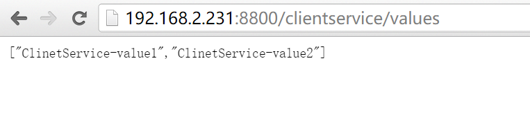
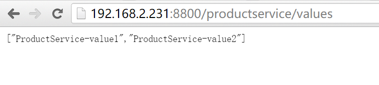
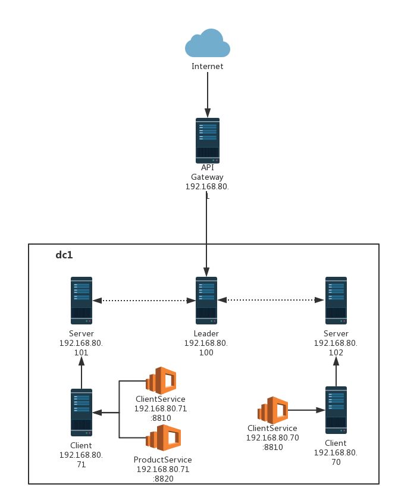

# Ocelot

## 一、简介
Ocelot是一个使用Core平台上的一个API Gateway，这个项目的目标是在.NET上面运行微服务架构。Ocelot框架内部集成了IdentityServer（身份验证）和Consul（服务注册发现），还引入了Polly（熔断降级）来处理进行故障处理

## 二、简单使用Ocelot

### 2.1 安装Ocelot

```bash
Nuget> Install-Package Ocelot
```
### 2.2 准备两个测试api服务

1. ClientService：`dotnet new webapi -n TC.ClientService`
1. 修改ValuesController:

    ```csharp
    [Route("api/[controller]")]
    public class ValuesController : Controller
    {
        // GET api/values
        [HttpGet]
        public IEnumerable<string> Get()
        {
            return new string[] { "ClinetService-value1", "ClinetService-value2" };
        }

        ......
    }
    ```
1. 增加健康检测HealthController

    ```csharp
    [Route("api/[controller]")]
    [ApiController]
    public class HealthController : ControllerBase
    {
        [HttpGet]
        public ActionResult<string> Get() => Ok("ok");
    }
    ```
1. 同理新建一个ProductService
1. 使用Docker发布这2个服务：(docker发布的webapi默认是80端口)

    ```dockerfile
    FROM microsoft/dotnet:latest
    WORKDIR /app
    COPY . /app
    RUN dotnet publish "TC.ClientService.csproj" -c Release -o /out
    EXPOSE 80
    ENTRYPOINT ["dotnet", "/out/TC.ClientService.dll"]
    ```
    * 打包镜像：`sudo docker build -t clientservice .`
    * 运行容器：`sudo docker run -d -p 8000:80 --name clientservice clientservice`
1. 使用Consul注册这2个服务：`consul agent -bind 172.16.65.1 -client 172.16.65.1 -config-dir=/home/hzgod/work/cc/microservices/TC.Config -data-dir=/tmp/consul -node EDC.DEV.HzServer -join 172.16.65.101`,配置文件内容：

    ```json
    {
        "services": [
            {
                "id": "EDC_HZ_TCProductService_01",
                "name": "TC.ProductService",
                "tags": [
                    "urlprefix-/Product01"
                ],
                "address": "172.16.65.1",
                "port": 8000,
                "checks": [
                    {
                        "name": "TC.ProductService_Check",
                        "http": "http://172.16.65.1:8000/api/health",
                        "interval": "10s",
                        "timeout": "5s"
                    }
                ]
            },
            {
                "id": "EDC_HZ_TCClientService_01", // id必须唯一
                "name": "TC.ClientService", // name相同的时候认为是同一个服务，在负载均衡的时候会用到
                "tags": [
                    "urlprefix-/Client",
                    "clientservice01"
                ],
                "address": "172.16.65.1",
                "port": 8001,
                "checks": [
                    {
                        "name": "TC.ClientService_Check",
                        "http": "http://172.16.65.1:8001/api/health",
                        "interval": "10s",
                        "timeout": "5s"
                    }
                ]
            },
            {
                "id": "EDC_HZ_TCClientService_02",
                "name": "TC.ClientService",
                "tags": [
                    "urlprefix-/Client",
                    "clientservice02"
                ],
                "address": "172.16.65.1",
                "port": 8002,
                "checks": [
                    {
                        "name": "TC.ClientService_Check02",
                        "http": "http://172.16.65.1:8002/api/health",
                        "interval": "10s",
                        "timeout": "5s"
                    }
                ]
            }
        ]
    }
    ```

### 2.3 静态配置2个api服务

1. 新建一个api网关TC.APIGateway:`dotnet new webapi -n TC.APIGateway`
1. 新增json文件：`mkdir config && vim ocelot.config.json`

    ```json
    {
        "ReRoutes": [],
        "GlobalConfiguration": {
            "BaseUrl": "https://api.mybusiness.com"
        }
    }
    ```
    这里特别注意一下BaseUrl是我们外部暴露的Url，比如我们的Ocelot运行在http://123.111.11.1的一个地址上，但是前面有一个Nginx绑定了域名http://api.edisonchou.cn，那这里我们的BaseUrl就是 http://api.edisonchou.cn。现在我们的实验环境不存在这个条件，所以我们暂时不需要配置这个option。下面我们根据模板将刚刚创建并启动的两个Service的信息进行了配置：

    ```json
    {
        "ReRoutes": [
            // API:CAS.ClientService
            {
                "DownstreamPathTemplate": "/api/{url}",
                "DownstreamScheme": "http",
                "DownstreamHostAndPorts": [
                    {
                    "Host": "192.168.2.231",
                    "Port": "8810"
                    }
                ],
                "UpstreamPathTemplate": "/ClientService/{url}",
                "UpstreamHttpMethod": [ "Get", "Post" ]
            },
            // API:CAS.ProductService
            {
                "DownstreamPathTemplate": "/api/{url}",
                "DownstreamScheme": "http",
                "DownstreamHostAndPorts": [
                    {
                    "Host": "192.168.2.231",
                    "Port": "8820"
                    }
                ],
                "UpstreamPathTemplate": "/ProductService/{url}",
                "UpstreamHttpMethod": [ "Get", "Post" ]
            }
        ]
    }
    ```
    * Downstream 是下游服务配置 => 即我们刚刚创建的提供API服务的配置，我们会指定PathTemplate，Host和Port等信息（具体调哪一台服务器是由我说了算）
    * UpStream 是上游服务配置 => 即服务消费方（eg.MVC Server, SPA App）的调用配置（你要怎么按照什么URL格式和什么HTTP类型调用我才能理解）  
    通过配置文件，我们可以猜测Ocelot的实现原理大致应该就是把客户端对网关的请求(Request)，按照configuration.json的映射配置，转发给对应的后端http service，然后从后端http service获取响应(Response)后，再返回给客户端
1. 改写Program和StartUp类，才能正常使用Ocelot

    * 熔断使用Polly实现：`Polly`，`Ocelot.Provider.Polly`  
    * 服务注册发现使用Consul实现：`Consul`，`Ocelot.Provider.Consul`

    ```csharp
    // Program.cs
    public class Program
    {
        public static void Main(string[] args)
        {
            CreateWebHostBuilder(args).Build().Run();
        }

        public static IWebHostBuilder CreateWebHostBuilder(string[] args) =>
            WebHost.CreateDefaultBuilder(args)
                .UseStartup<Startup>()
                .ConfigureAppConfiguration((hostContext, builder) => {
                    builder.AddJsonFile("config/ocelot.config.json",false,true);
                });
    }

    // StartUp.cs
    public class Startup
    {
        public Startup(IConfiguration configuration)
        {
            Configuration = configuration;
        }

        public IConfiguration Configuration { get; }

        // This method gets called by the runtime. Use this method to add services to the container.
        public void ConfigureServices(IServiceCollection services)
        {
            //services.AddMvc().SetCompatibilityVersion(CompatibilityVersion.Version_2_2);
            services.AddOcelot(Configuration).AddConsul().AddPolly();
        }

        // This method gets called by the runtime. Use this method to configure the HTTP request pipeline.
        public void Configure(IApplicationBuilder app, IHostingEnvironment env)
        {
            if (env.IsDevelopment())
            {
                app.UseDeveloperExceptionPage();
            }
            else
            {
                // The default HSTS value is 30 days. You may want to change this for production scenarios, see https://aka.ms/aspnetcore-hsts.
                app.UseHsts();
            }

            // app.UseHttpsRedirection();
            // app.UseMvc();
            app.UseOcelot().Wait();
        }
    }
    ```
### 2.4 测试

1. 启动ClientService和ProductService
1. 再启动网关APIGateway


## 三、Ocelot+Consul组合



1. 使用consul注册3个服务，与上面例子一致
1. 引入Polly和Consul库到APIGateway项目：`Ocelot.Provider.Consul`、`Consul`、`Ocelot.Provider.Polly`、`Polly`
1. 修改APIGateway中的Ocelot配置文件：

    ```json
    {
        "ReRoutes": [
            // TC.ClientService
            {
                "DownstreamPathTemplate": "/api/{url}",
                "DownstreamScheme": "http",
                "UpstreamPathTemplate": "/Client/{url}",
                "UpstreamHttpMethod": ["Get", "Post"],
                "ReRoutesCaseSensitive": false, // 大小写敏感
                // 使用consul
                "UseServiceDiscovery": true,
                // 对应consul中的服务名称
                "ServiceName": "TC.ClientService",
                // 负载均衡策略（RoundRobin：轮询，LeastConnection：最小连接数，NoLoadBalance：不使用负载）
                "LoadBalancerOptions": {
                    "Type": "RoundRobin"
                },
                // 请求缓存（只支持get类型）
                "FileCacheOptions": {
                    "TtlSeconds": 10,
                    "Region": "somename"
                },
                // 限流
                "RateLimitOptions": {
                    "ClientWhitelist": ["admin"], // 白名单
                    "EnableRateLimiting": true, // 是否启动限流
                    "Period": "1m", // 统计时间段：1s, 5m, 1h, 1d
                    "Limit": 5, // 在统计时间段内允许的最大请求数
                    "PeriodTimespan": 15 // 多少秒之后客户端可以重试
                },
                // 熔断（Qos）(也可以放在全局配置)
                // "QoSOptions": {
                //     "ExceptionsAllowedBeforeBreaking": 2, // 允许多少个异常请求
                //     "DurationOfBreak": 5, // 熔断的时间：毫秒
                //     "TimeoutValue": 3000 // 如果下游请求的处理时间超过3s则视如该请求超时,则会抛出Timeout Exception。如果抛出了第二次Timeout Exception，那么停止服务访问5s钟。
                // }
            },
            // TC.ProductService
            {
                "DownstreamPathTemplate" : "/api/{url}",
                "DownstreamScheme":"http",
                "UpstreamPathTemplate":"/Product/{url}",
                "UpstreamHttpMethod":["Get","Post"],
                "ReRoutesCaseSensitive": false,
                "UseServiceDiscovery": true,
                "ServiceName": "TC.ProductService",
                "LoadBalancerOptions": {
                    "Type": "RoundRobin"
                },
            }
        ],
        "GlobalConfiguration": {
            "ServiceDiscoveryProvider": {
                "Host": "172.16.65.101",
                "Port": "8500",
                "Type": "Consul"
            },
            // 限流全局配置
            "RateLimitOptions": {
                "DisableRateLimitHeaders": false, // Http头  X-Rate-Limit 和 Retry-After 是否禁用
                "QuotaExceededMessage": "Too Quick ^_^", // 当请求过载被截断时返回的消息
                "HttpStatusCode": 999, // 当请求过载被截断时返回的http status
                "ClientIdHeader": "ClientId" // 用来识别客户端的请求头，默认是 ClientId,请求头中如果包含`ClientId=admin`,则不限流
            },
            // 熔断（Qos）
            // "QoSOptions": {
            //     "ExceptionsAllowedBeforeBreaking": 2, // 允许多少个异常请求
            //     "DurationOfBreak": 5, // 熔断的时间：毫秒
            //     "TimeoutValue": 3000 // 如果下游请求的处理时间超过3s则视如该请求超时,则会抛出Timeout Exception。如果抛出了第二次Timeout Exception，那么停止服务访问5s钟。
            // },
            //// 负载均衡
            // "LoadBalancerOptions": {
            //     "Type": "LeastConnection",
            //     "Key": null,
            //     "Expiry": 0
            // },
            // "HttpHandlerOptions": {
            //     "AllowAutoRedirect": false,
            //     "UseCookieContainer": false,
            //     "UseTracing": false
            // },
            //// 动态路由
            //// Example：http://api.edc.com/productservice/api/products => Ocelot会将productservice作为key调用Consul服务发现API去得到IP和Port，
            //// 然后加上后续的请求URL部分（api/products）进行最终URL的访问：http://ip:port/api/products
            // "DownstreamScheme": "http"
        }
    }
    ```
1. 启动API网关

## 四、集成Swagger统一API文档入口

* 后续考虑集成：https://www.cnblogs.com/edisonchou/p/api_gateway_ocelot_foundation_02.html