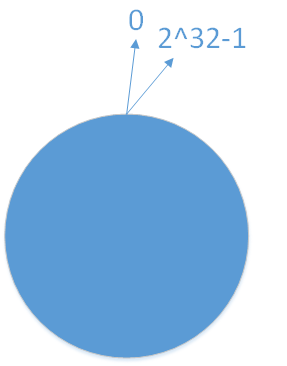
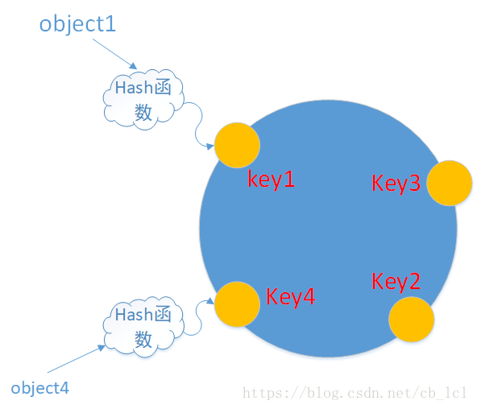
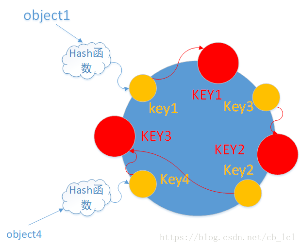
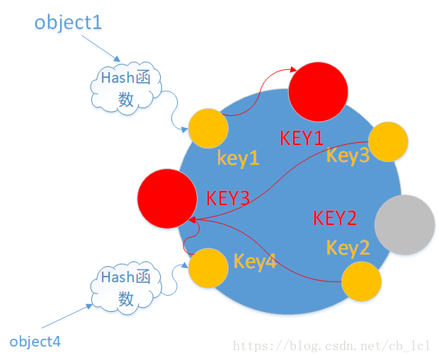
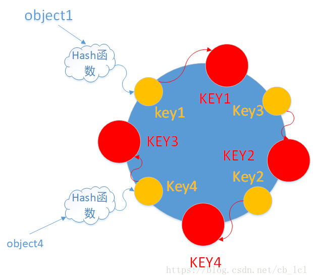
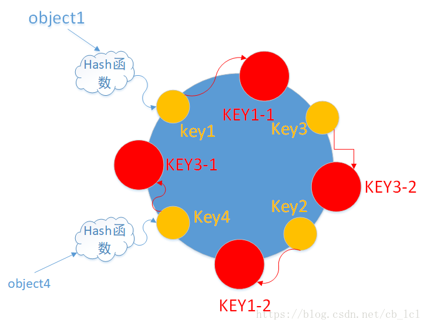
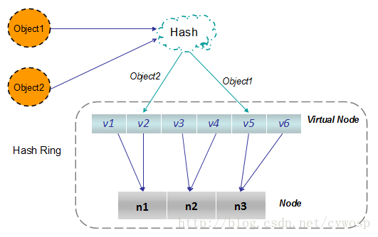

# 一致性Hash算法

## 简介

一致性Hash算法在1997年由麻省理工学院提出的一种分布式哈希（DHT）实现算法，设计目标是为了解决因特网中的热点（Hot Spot）问题，初衷和CARP十分相似。一致性Hash修正了CARP使用的简单哈希算法带来的问题，使得分布式哈希（DHT）可以在P2P环境中真正得到应用。

一致性Hash算法提出了在动态变化的Cache环境中，判定哈希算法好坏的四个定义：

* 平衡性（Balance）：平衡性是指哈希的结果能够尽可能分布在所有的缓冲(Cache)中去，这样可以使得所有的缓冲空间得到利用。很多哈希算法都能够满足这一条件。

* 单调性（Monotonicity）：单调性是指如果已经有一些内容通过哈希分派到了相应的缓冲中，又有新的缓冲加入到系统中。哈希的结果应该能够保证原有已分配的内容可以被映射到原有的或者新的缓冲中去，而不会映射到旧的缓冲集合中的其他缓冲区。

* 分散性（Spread）：在分布式环境中，终端有可能看不到所有的缓冲，而只能看到其中的一部分。当终端希望通过哈希过程将内容映射到缓冲上去，由于不同终端所见的缓冲范围有可能不同，从而导致哈希的结果不一致，最终的结果是相同的内容被不同的终端映射到不同的缓冲区中。这种情况显然是应该避免的，因为它导致相同内容被存储到不同缓冲中去，降低了系统存储的效率。分散性的定义就是上述情况发生的严重程度。好的哈希算法应该能够尽量避免不一致的情况发生，也就是尽量降低分散性。

* 负载（Load）：负载问题实际上是从另一个角度看待分散性问题。既然不同的终端可能将相同的内容映射到不同的缓冲区中，那么对于一个特定的缓冲区而言，也可能被不同的用户映射到不同的内容。与分散性一样，这种情况也是应当避免的，因此好的哈希算法应能够尽量降低缓冲的负荷。

在分布式集群中，对机器的添加删除，或者机器故障后自动脱落集群这些操作是分布式集群管理最基本的功能。如果采用常用的hash(object)%N算法，那么在有机器添加或者删除后，很多原有的数据就无法找到了，这样严重的违反了单调性原则。

* 解释使用hash(object)%N，其中N是指N个cache服务器/N个节点为啥不行：

    如果N个cache服务器中编号为a的服务器故障了，需要把a从服务器群中移除，这个时候cache服务器的数量就变成了N-1台，那么所有对象(object)映射到cache服务器的计算公式就变成了hash(object)%N-1，对，影响到了所有的对象与cache服务器的映射关系，类似，由于访问加重，需要添加cache服务器，这时候cache服务器是N+1台，映射公式就变成了hash(object)%N+1,这就意味着几乎所有的cache都失效了，对于服务器而言，这是一场灾难，所有访问都会直接冲向后台服务器。

## 哈希算法如何设计

1. 环形Hash空间

    按照常用的hash算法来将对应的key哈希到一个具有2^32次方个桶的空间中，即0~（2^32）-1的数字空间。现在我们可以将这些数字头尾相连，想象成一个闭合的环形。如下图

    

1. 把数据(对象)通过一定的hash算法处理后映射到环上

    现在我们将object1、object2、object3、object4四个对象通过特定的Hash函数计算出对应的key值，然后散列到hash换上。如下图：
    ```
    Hash(object1)=key1;
    Hash(object2)=key2;
    Hash(object3)=key3;
    Hash(object4)=key4;
    ```
    

1. 将机器通过hash算法映射到环上

    在采用一致性哈希算法的分布式集群中将新的机器加入，其原理是通过使用与对象存储一样的Hash算法将机器也映射到换种（一般情况下对机器的hash计算是采用机器的IP或者唯一的别名作为输入值），然后以顺时针的方向计算，将所有对象存储到离自己最近的机器中。

    假设现在有NODE1,NODE2,NODE3三台机器中，通过hash算法得到对应的KEY值，映射到环中，其示意图如下：
    ```
    Hash（NODE1）=KEY1;Hash（NODE2）=KEY2;Hash（NODE3）=KEY3;
    ```
    
    通过上图可以看出对象与机器处于同一个哈希空间中，这样按顺时针转动object1（对象）存储到了NODE1（机器）中,object3（对象）存储到了NODE2（机器）中,object2、object4（对象）存储到了NODE3（机器）中。在这样的部署环境中，hash环是不会变更的，因此，通过算出对象的hash值就能快速的定位到对应的机器中，这样就能找到对象真正的存储位置了。

1. 机器删除与添加

    普通hash求余算法最为不妥的地方就是在有机器的添加与删除以后会造成大量的对象存储位置的失效，这样就大大的不满足单调性了。下面来分析一下一致性哈希算法是如何处理的。

    * 节点（机器）的删除

        以上面的分布式集群为例，如果NODE2出现故障被删除了，那么按照顺时针迁移的方法，object3将会被迁移到NODE3中，这样仅仅是object3的映射位置发生了变化，其他的对象没有任何的变动，如下图
        
    
    * 节点（机器）的添加

        如果往集群中添加一个新的节点NODE4,通过对应的Hash算法得到KEY4，并映射到环中，如下图：
        
        通过按照顺时针迁移的规则，那么object2被迁移到NODE4中，其他对象还保持这原有的存储位置。通过对节点的添加和删除的分析，一致性哈希算法在保持了单调性的同时，还是数据的迁移达到了最小，这样的算法对分布式集群来说非常合适的，避免了大量收数据迁移，减少了服务器的压力。 

1. 平衡性

    根据上面的图解分析，一致性哈希算法满足了单调性和负载均衡的特性以及一般hash算法的分散性，但这还并不能当做其被广泛应用的原由，因为缺少了平衡性。下面将分析一致性哈希算法是如何满足平衡性的。hash算法是不保证平衡性的，如上面只部署了NODE1和NODE3的情况(NODE2被删除的图)，object1存储在NODE1中，而object2、object3、object4都存储在NODE3中，这样就造成了非常不平衡的状态。在一致性哈希算法中，为了尽可能的满足平衡性，其引入了虚拟节点。

    何为虚拟节点？虚拟节点（Virtual node）是实际节点（机器）在hash空间的复制品（replica），一个实际节点对应了若干个“虚拟节点”，这个对应个数也称为“复制个数”，“虚拟节点”在hash空间中以hash值排列。

    在上面只部署了NODE1和NODE3的情况（NODE2被删除的图）为例，之前的对象在机器上的分布很不均衡，现在我们以2个副本（每个节点复制2个）为例，这样整个hash环就存在4个虚拟节点，最后对象映射的关系图如下：
    

    根据上图可知对象的映射关系：object1->NODE1-1,object2->NODE1-2 ,object3->NODE3-2,object4->NODE3-1，通过虚拟节点的引入，对象的分布就比较均衡了。那么在实际操作中，真正的对象查询是如何工作的呢？对象从hash到虚拟节点到实际节点的转换如下图：
    
    虚拟节点”的hash计算可以采用对应节点的IP地址加数字后缀的方式。例如假设NODE1的IP地址为192.168.1.100。引入“虚拟节点”前，计算 cache A 的 hash 值：
    ```
    Hash(“192.168.1.100”);
    ```

    引入“虚拟节点”后，计算“虚拟节”点NODE1-1和NODE1-2的hash值：

    ```
    Hash(“192.168.1.100#1”); // NODE1-1

    Hash(“192.168.1.100#2”); // NODE1-2
    ```

## C#代码实现简单一致性hash

```csharp
/// <summary>
/// 关键点：
/// 1. 有序的环
/// 2. 虚拟节点
/// 3. 数据对应的虚拟落点
/// 4. 虚拟点对应的真实节点
/// </summary>
class Program
{
    // 字典虚拟圆环
    private static SortedDictionary<ulong, string> _circle = new SortedDictionary<ulong, string>();
    // 每个节点的虚拟节点数量
    // 理论上来说模拟的节点数量越多，数据落点会约均匀
    private static int _virtualNodeCount = 500;
    static void Main(string[] args)
    {
        var realNodes = new List<string> {
            "127.0.0.1:6379",
            "127.0.0.1:6380",
            "127.0.0.1:6381"
        };
        // 生成虚拟节点并添加到虚拟圆环
        realNodes.ForEach(node => {
            AddNodeToCircle(node);
        });

        // 模拟数据生成
        var testList = new List<int>();
        for(int i = 100; i < 200; i++)
        {
            testList.Add(i);
        }

        // 获取模拟数据落点
        var testDataNodeDic = new Dictionary<int, string>();
        testList.ForEach(i => {
            testDataNodeDic.Add(i,GetRealNode(i.ToString()));
        });

        // 分析各个真实节点数据数量
        testDataNodeDic.GroupBy(kv => kv.Value).ToList().ForEach(i => {
            Console.WriteLine($"{i.Key} - 数据量：{i.Count()}");
        });

        Console.WriteLine("Hello World!");
    }

    /// <summary>
    /// 将节点添加到虚拟圆环中
    /// </summary>
    /// <param name="node"></param>
    static void AddNodeToCircle(string node)
    {
        for(var i = 0; i < _virtualNodeCount; i++)
        {
            string key = $"{node.GetHashCode().ToString()}-{i}";
            var hashCode = MD5Hash(key);
            // 虚拟点与真实节点通过字典对应
            _circle.Add(hashCode, node);
        }
    }
    /// <summary>
    /// Hash值转换
    /// </summary>
    /// <param name="key"></param>
    /// <returns></returns>
    static ulong MD5Hash(string key)
    {
        ulong  hasCode = 0;
        using (var hash = System.Security.Cryptography.MD5.Create())
        {
            var byteData = hash.ComputeHash(Encoding.UTF8.GetBytes(key));
            var tmp1 = BitConverter.ToUInt64(byteData, 0);
            var tmp2 = BitConverter.ToUInt64(byteData, 8);
            hasCode = tmp1 ^ tmp2;
        }
        return hasCode;
    }

    /// <summary>
    /// 需要保存的值对应的真实节点
    /// </summary>
    /// <param name="key">待保存的值</param>
    /// <returns></returns>
    static string GetRealNode(string key)
    {
        var hashCode = MD5Hash(key);
        var virtualNodeHashCode = GetVirtualNodeHashCodeByBinarySearch(_circle.Keys.ToArray(), hashCode);
        return _circle[virtualNodeHashCode];
    }

    /// <summary>
    /// 二分查找获取虚拟节点hashCode
    /// </summary>
    /// <param name="keys"></param>
    /// <param name="val"></param>
    /// <returns></returns>
    static ulong GetVirtualNodeHashCodeByBinarySearch(ulong[] keys, ulong val)
    {
        var min = 0;
        var max = keys.Length - 1;
        if(val < keys[min] || val > keys[max])
        {
            return keys[0];
        }

        while(max - min > 1)
        {
            var mid = (max+min)/2;
            if (keys[mid] >= val)
            {
                max = mid;
            }
            else
            {
                min = mid;
            }
        }

        return keys[max];
    }
}
```

