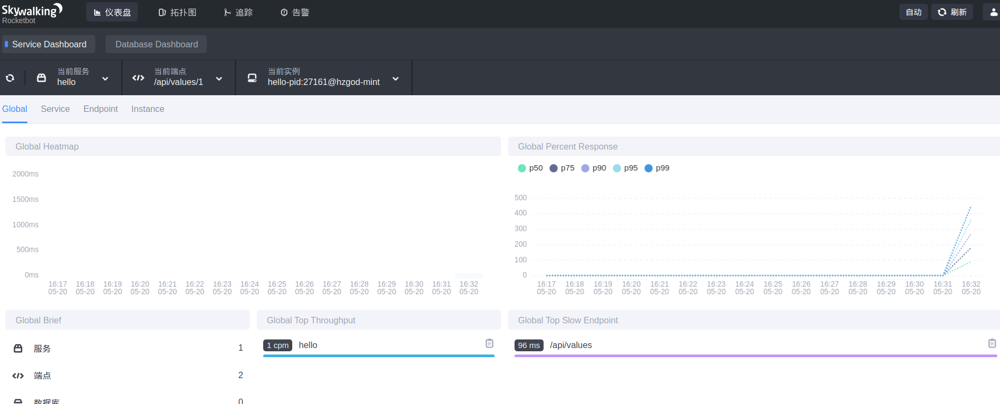

# 微服务-Skywalking部署

## 一、介绍

应用官方的说法：**Apache SkyWalking**是观察性分析平台和应用性能管理系统。提供分布式追踪、服务网格遥测分析、度量聚合和可视化一体化解决方案


GitHub地址：https://github.com/apache/skywalking

## 二、准备工作

Skywalking的架构分成三大块：

1. agent：探针，主要与我们的api或者app之类的集成在一起，用于收集上传客户端信息，然后发送到collector。
1. oap: 主要用于收集agent发送过来的信息，并持久化到相应存储中
1. ui：展示收集在存储中的信息

这次主要会使用docker去部署`oap`和`ui`这2个模块（查看skywalking的github库会发现官方已经为我们准备好了相关的docker部署文件）。

我们需要准备2样东西即可：

1. skywalking为我们准备的Docker相关文件：打开skywalking的github，下载master分之下的Docker文件夹。
1. skywalking对应系统的压缩包：[【点击这里下载】](http://skywalking.apache.org/zh/downloads/)，下载完成后将压缩包名称改成`apache-skywalking-apm-bin`，因为在skywaking为我们准备的Docker配置文件中使用的是这个名称`ENV DIST_NAME=apache-skywalking-apm-bin \`，`COPY "$DIST_NAME.tar.gz" /`，后面没有带版本号。
1. 将`apache-skywalking-apm-bin.tar.gz`分别拷贝到`docker`文件夹的`oap`、`ui`中。

## 三、部署

这里我们使用docker文件夹中的`docker-compose.yml`文件进行部署。查看其中内容，会看到需要我们先准备好2个docker镜像，一个是`skywalking/oap`,一个是`skywalking/ui`。

```yml
...
  oap:
    image: skywalking/oap
...
  ui:
    image: skywalking/ui
...
```

上一步中我们已经准备好了所有的东西，那这里其实只需要使用docker的builder命令来创建这2个镜像即可

* 这里需要注意下，需要修改一下`Dockerfile.oap`和`Dockerfile.ui`文件里的内容
```Dockerfile
...
RUN set -ex; \
    ...
    mv "$DIST_NAME" skywalking; \
    # 修改时区
    ln -sf /usr/share/zoneinfo/Asia/Shanghai /etc/localtime && \
    echo "Asia/Shanghai" > /etc/timezone

WORKDIR skywalking
...
```

生成`oap`和`ui`镜像

```bash
# oap
cd oap文件夹
docker build -t skywalking/oap -f Dockerfile.oap .

# ui
cd ui文件夹
docker build -t skywalking/ui -f Dockerfile.ui .
```

* 官方推荐使用`elasticsearch`作为存储，而且细心的同学可能在查看`docker-compose.yml`的时候也发现了构建的时候确实使用的是`elasticsearch`。但是在`Dockerfile.oap`文件中定义的确实`h2`作为存储，生成的镜像会不会有问题？其实不会的，在`docker-compose.yml`中已经将镜像的环境变量申明为使用`elasticsearch`了。

```yml
...
    environment:
      SW_STORAGE: elasticsearch
      SW_STORAGE_ES_CLUSTER_NODES: elasticsearch:9200
...
```

执行完上面的命令之后，使用`docker images`会看到已经生成了对应的镜像。

```bash
REPOSITORY                    TAG                      IMAGE ID            CREATED             SIZE
skywalking/ui                 latest                   d2a316c65e4b        18 seconds ago      787MB
skywalking/oap                latest                   4a5995eacbe8        49 seconds ago      839MB
```

接下来就很简单了，直接使用`docker-compose`将所有容器启动起来就可以了

```bash
cd `docker-compose.yml所在文件夹`

docker-compose up -d

# 看到下面内容
Creating elasticsearch ... done
Creating oap           ... done
Creating ui            ... done

# 查看容器运行情况
docker-compose ps
    Name                   Command               State                      Ports                   
----------------------------------------------------------------------------------------------------
elasticsearch   /usr/local/bin/docker-entr ...   Up      0.0.0.0:9200->9200/tcp,                    
                                                         0.0.0.0:9300->9300/tcp                     
oap             bash docker-entrypoint.sh        Up      0.0.0.0:11800->11800/tcp, 1234/tcp,        
                                                         0.0.0.0:12800->12800/tcp                   
ui              bash docker-entrypoint.sh        Up      0.0.0.0:8080->8080/tcp  
```

使用浏览器打开`127.0.0.1:8080`，默认账号密码都是`admin`。

到这里，服务端相关的已经部署完毕。接下来就是客户端引入skywalking探针了。

## 四、客户端引入探针

这里我用`NetCore`的webapi项目作为测试。

1. 新建webapi项目
    ```bash
    dotnet new webapi -n skywalkingdemo --no-https
    ```
1. 添加探针程序包：
    ```bash
    dotnet add package SkyAPM.Agent.AspNetCore
    ```
1. 添加环境变量（直接修改`Properties/launchSettings.json`）：
    ```json
    {
        ...
        "skywalkingdemo": {
            "commandName": "Project",
            "launchBrowser": true,
            "launchUrl": "api/values",
            "applicationUrl": "http://localhost:10009",
            "environmentVariables": {
                "ASPNETCORE_ENVIRONMENT": "Development",
                // 添加下面2个环境变量
                "ASPNETCORE_HOSTINGSTARTUPASSEMBLIES": "SkyAPM.Agent.AspNetCore",
                "SKYWALKING__SERVICENAME": "hello"
            }
        }
    }
    ```
1. 添加`skywalking`的配置文件（`skyapm.json`），内容如下：
    ```json
    {
      "SkyWalking": {
        "ServiceName": "hello",
        "Namespace": "",
        "HeaderVersions": [
        "sw6"
        ],
        "Sampling": {
        "SamplePer3Secs": -1,
        "Percentage": -1.0
        },
        "Logging": {
        "Level": "Information",
        "FilePath": "logs/skyapm-{Date}.log"
        },
        "Transport": {
            "Interval": 3000,
            "ProtocolVersion": "v6",
            "QueueSize": 30000,
            "BatchSize": 3000,
            "gRPC": {
                "Servers": "localhost:11800",
                "Timeout": 10000,
                "ConnectTimeout": 10000,
                "ReportTimeout": 600000
            }
        }
      }
    }
    ```
    * 这里需要将文件设置成如果较新则复制（修改项目的`.csproj`文件）,添加如下配置

    ```xml
    <ItemGroup>
        <None Include="skyapm.json" CopyToOutputDirectory="PreserveNewest" />
    </ItemGroup>
    ```
    * 配置文件也可以通过安装skywalking的客户端工具生成配置文件
    ```bash
    # 全局安装工具
    dotnet tool install -g SkyAPM.DotNet.CLI
    # 生成skyapm配置文件
    dotnet skyapm config hello 172.16.102.111:11800
    # 这里的地址填的是skywalking的oap所在服务器的地址
    # 执行命令之后会自动生成与上面配置文件内容一样的文件
    ```
1. F5或者`dotnet run`运行项目即可看到在skywalking的管理页面里看到多了一个`service`
1. 访问`localhost:10009/api/values`和`localhost:10009/api/values/1`就会看到相关访问的记录以及统计信息。
    