# 虚拟化VMware ESXi 6.7服务器安装配置详细步骤图文

## 什么是vSphere?
vSphere是VMware公司在2001年基于云计算推出的一套企业级虚拟化解决方案、核心组件为ESXi。如今，经历了5个版本的改进，已经实现了虚拟化基础架构、高可用性、集中管理、性能监控等一体化解决方案。

## 虚拟机的好处

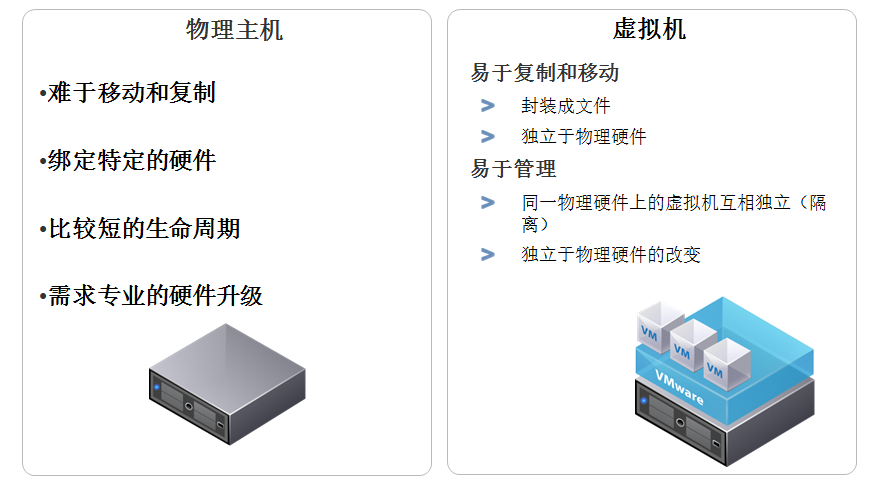

## vSphere基础物理架构

拟化服务器：又称x86服务器，可以由多个ESXi组成，通过网络服务提供CPU和内存资源，所有的虚拟机运行在该服务器中。
存储网络：用于存储所有的虚拟化数据，虚拟机的性能也与之息息相关。存储网络可以使用SAN、NAS等存储技术
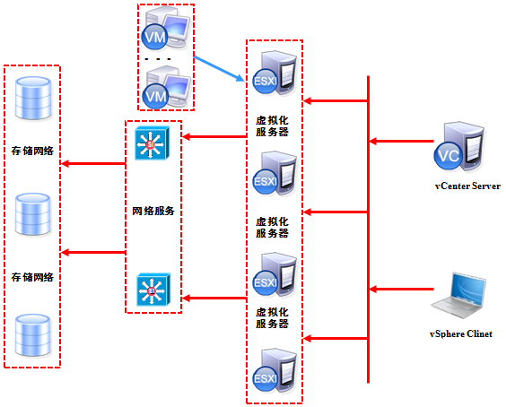

## vSphere基本架构

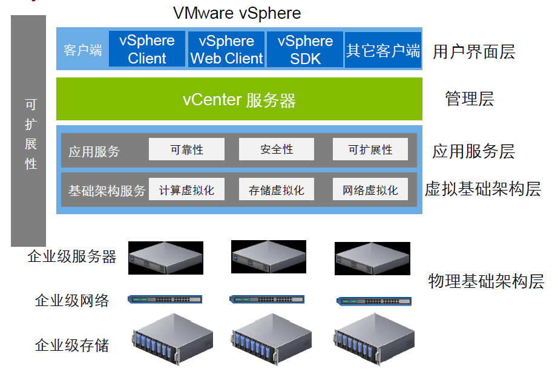

## ESXi安装

* ESXi安装会把整张硬盘覆盖，建议搞个不用的U盘来装引导盘

1. 开机插入ESXi安装盘，选择第一项，回车
    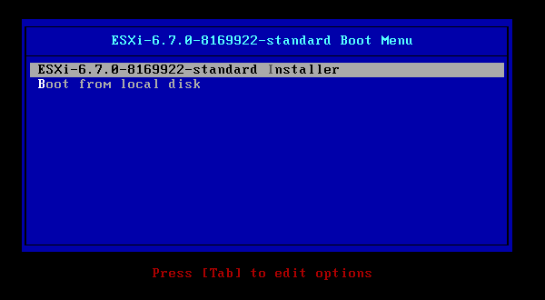

1. 启动后的安装步骤可以说是一路下一步，懂点英语的相信毫无压力(不同版本都差不多，较新版的ESXi要求起码4G内存，不过可以绕过这个验证，网上有教程，这里不赘述)：
    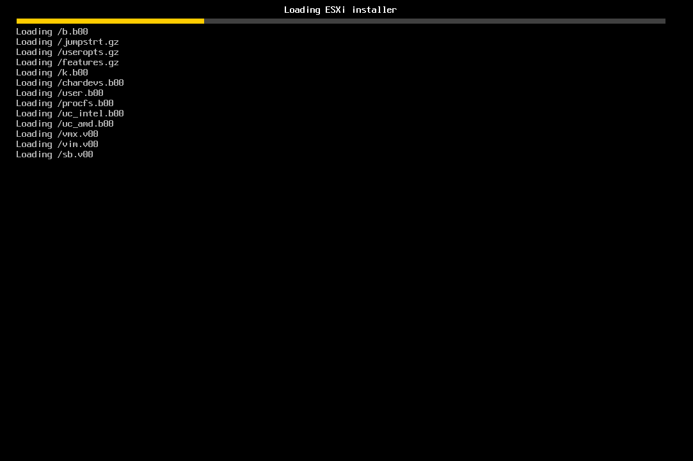
    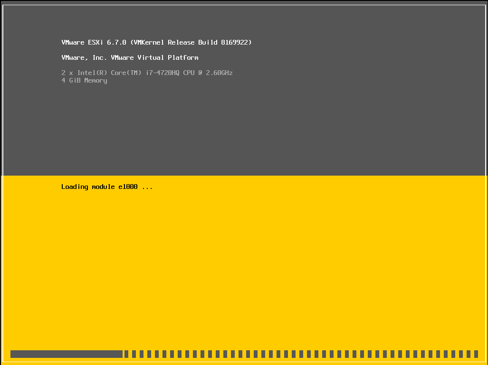
1. 如图，进入ESXi欢迎界面，按下enter键继续
    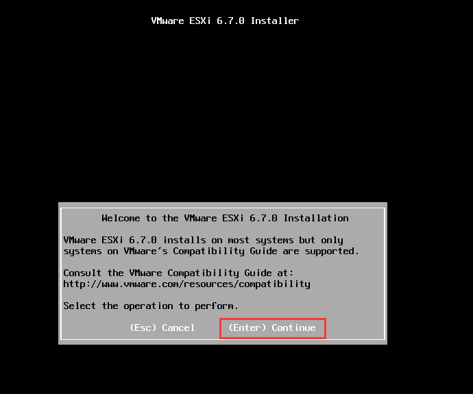
1. 在该安装许可协议界面，按下F11以继续
    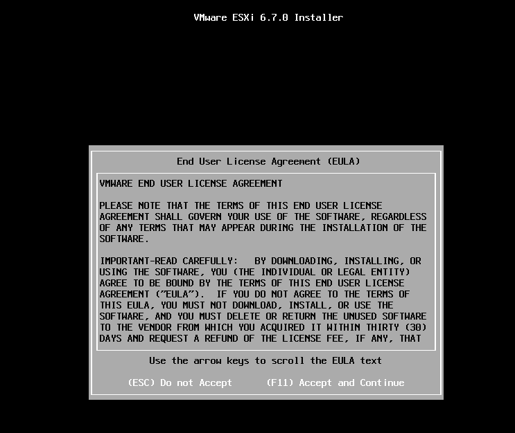
1. 系统会自动检查可用存储设备，之后在该界面选择安装的磁盘位置，回车以继续
    * 注意ESXi会干掉整张硬盘
    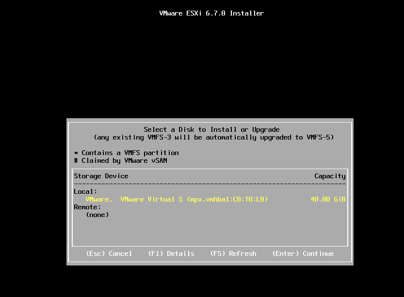
1. 选择US default(美式)键盘
    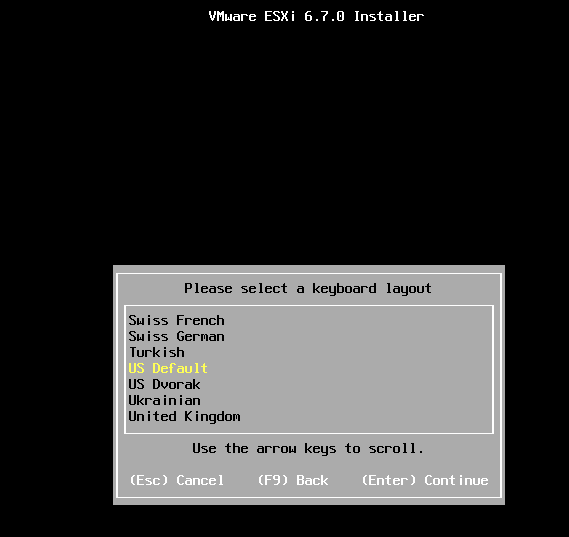
1. 继续，输入root密码;注意密码最少为7位。
    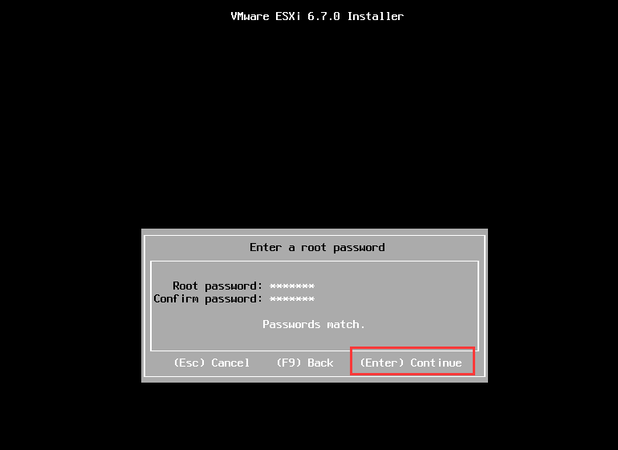
1. 配置完所有信息后来到该界面，按下F11以开始安装
    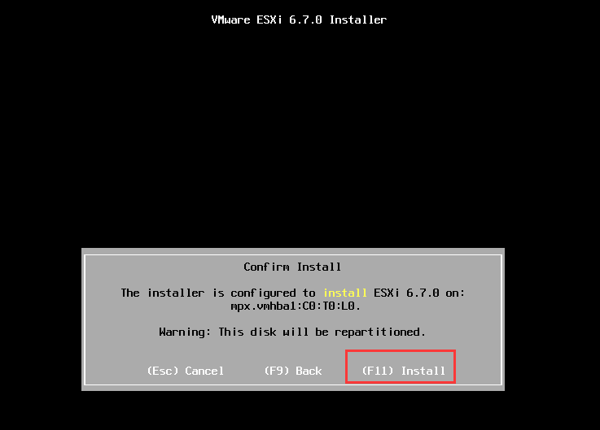
1. 安装完成后，在该界面回车以重启
    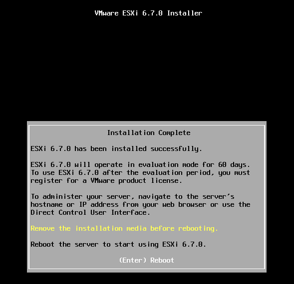
    * 重启之后，刚才祼机硬盘中的已经有了ESXi系统，ESXi服务器全文本界面，因为真实的环境下我们平常基本很少需要在这台服务器上进行操作，有关的操作如创建管理虚拟服务器等，都可以在浏览器vSphereClient上进行(6.5之后官方开始推荐直接浏览器界面配置了); 不过在此之前，我们需要对ESXi的网络进行一些配置，vSphere Client对其的控制也是通过网络进行的，我们必须事先为ESXi配置好访问IP
1. 重启完成后进入该界面，按下F2键弹出登陆界面
    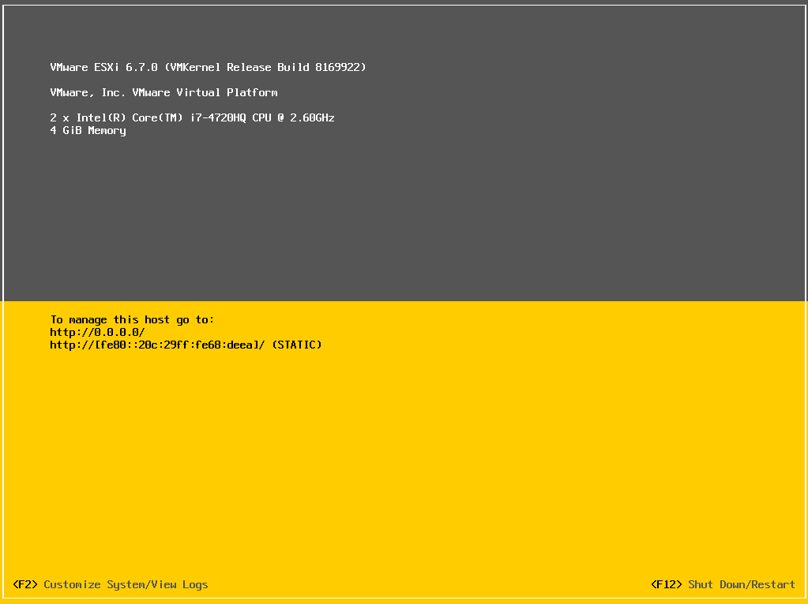
1. 在弹出的登陆界面输入root账号、密码，回车登陆
    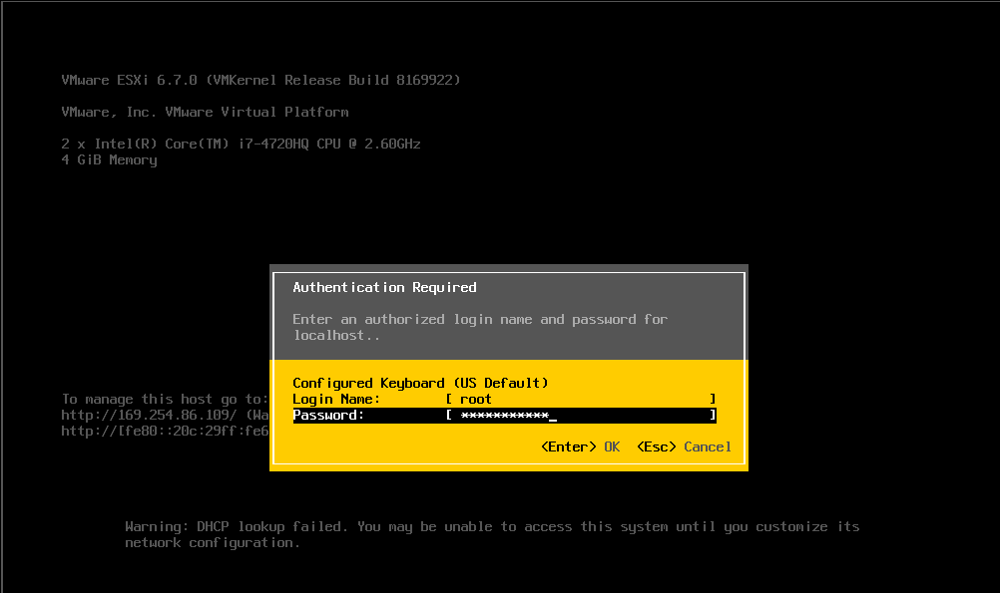
1. 选择 "Configure Management Network"(注意先选下网卡NetworkAdapter，如果驱动正常应该能看见多张网卡，插拔网线有在网卡那儿有提示哪个网卡连接上了，可以以此区分网卡)：
    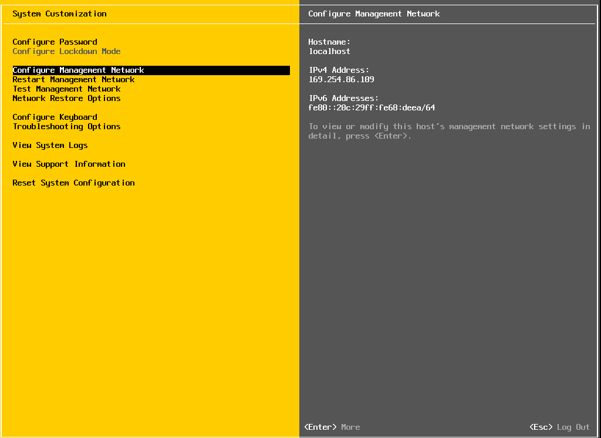
    * Configure Password 配置root密码
    * Configure Management Network 配置网络
    * Restart Management Network   重启网络
    * Test Management Network 使用ping测试网络
    * Network Restore Options   还原配置
    * Troubleshooting Options  故障排查选项
    * View System Logs 查看系统日志
    * Reset System Conf iguration ESXi 出厂设置
    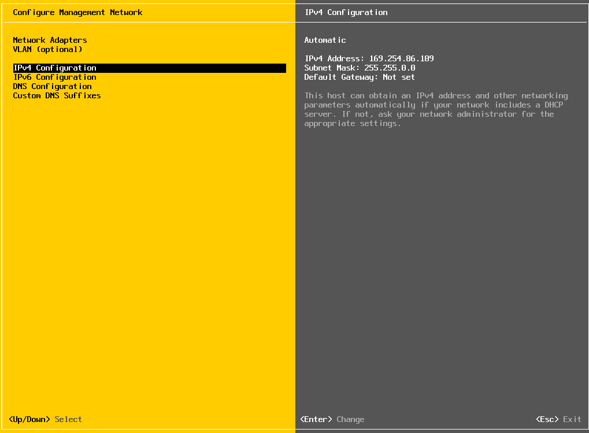
1. 修改IP地址
    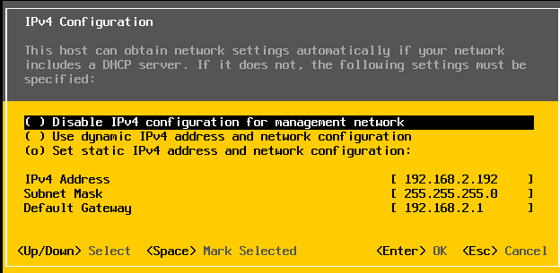
1. 安装成功，这时插上网线，把自己电脑跟ESXi服务器设置同一网段就能通过IP地址在浏览器中访问服务器了
    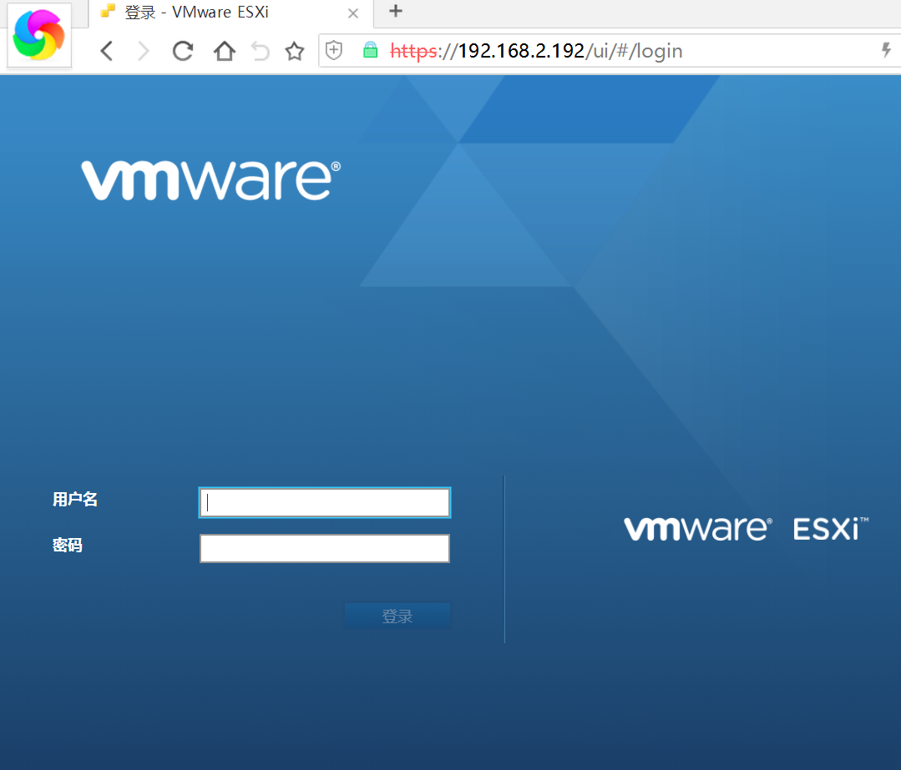
1. 装完了别忘了激活一下，在主机->管理->许可那儿，普通免费用户可以用到最多8核，一般情况是够用了
    
    许可账号：HV4WC-01087-1ZJ48-031XP-9A843
1. 创建虚拟主机
    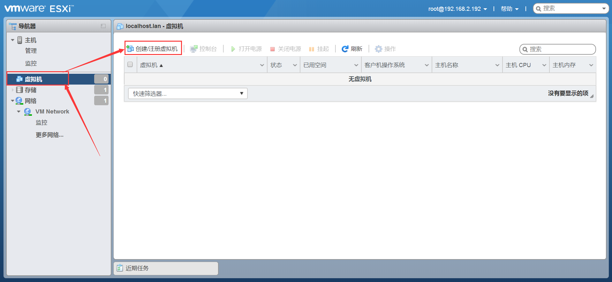
    按照步骤一步一步配置就可以了。
    