# Linux 最常用命令

## 一、linux的目录结构

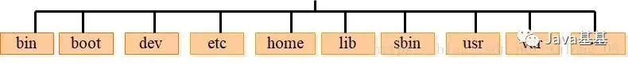

/ 下级目录结构
* bin (binaries)存放二进制可执行文件
* sbin (super user binaries)存放二进制可执行文件，只有root才能访问
* etc (etcetera)存放系统配置文件
* usr (unix shared resources)用于存放共享的系统资源
* home 存放用户文件的根目录
* root 超级用户目录
* dev (devices)用于存放设备文件
* lib (library)存放跟文件系统中的程序运行所需要的共享库及内核模块
* mnt (mount)系统管理员安装临时文件系统的安装点
* boot 存放用于系统引导时使用的各种文件
* tmp (temporary)用于存放各种临时文件
* var (variable)用于存放运行时需要改变数据的文件

## 二、linux常用命令

**命令格式：** 命令 -选项 参数 （选项和参数可以为空）

```bash
ls -la /usr
```

### 2.1 操作文件及目录

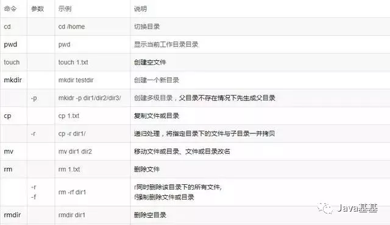
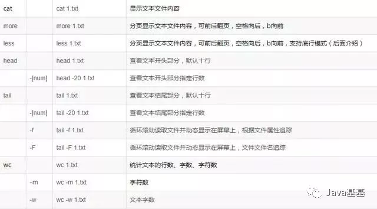


### 2.2 系统常用命令

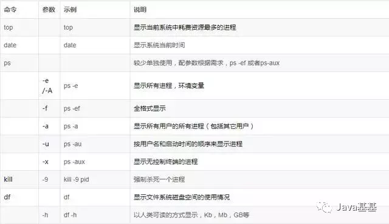


### 2.3 压缩解压缩

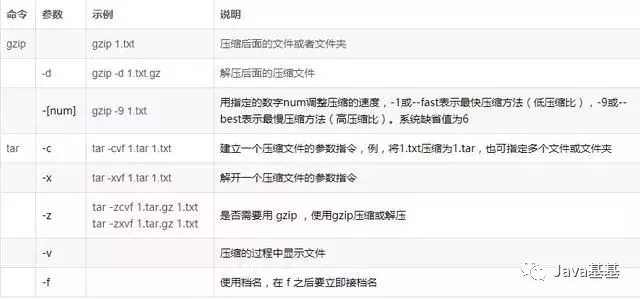

### 2.4 文件权限操作

* linux文件权限的描述格式解读
  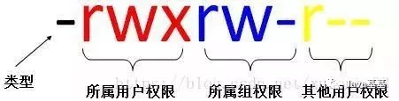
* r 可读权限，w可写权限，x可执行权限（也可以用二进制表示 111 110 100 --> 764）
* 第1位：文件类型（d 目录，- 普通文件，l 链接文件）
* 第2-4位：所属用户权限，用u（user）表示
* 第5-7位：所属组权限，用g（group）表示
* 第8-10位：其他用户权限，用o（other）表示
* 第2-10位：表示所有的权限，用a（all）表示
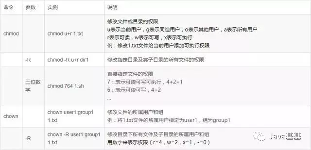

## 三、linux系统常用快捷键及符号命令

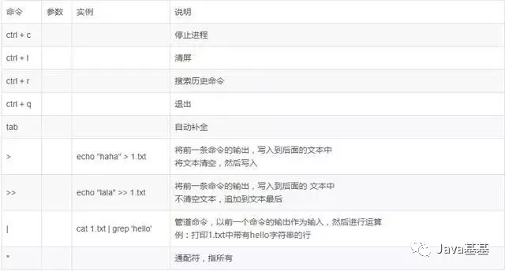

## 四、vim编辑器

vi / vim是Linux上最常用的文本编辑器而且功能非常强大。只有命令，没有菜单，下图表示vi命令的各种模式的切换图。

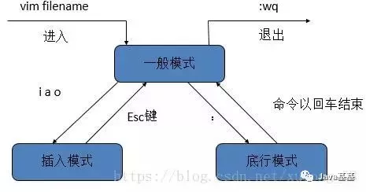

### 4.1 修改文本

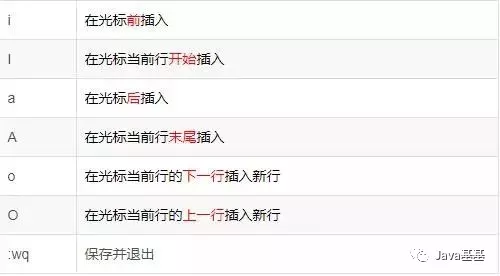

### 4.2 定位命令

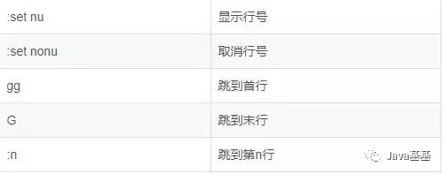

### 4.3 替换和取消命令

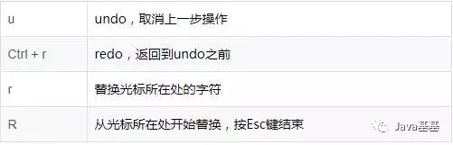

### 4.4 删除命令

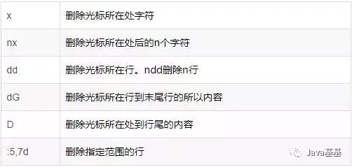

### 4.5 常用快捷键

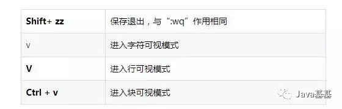