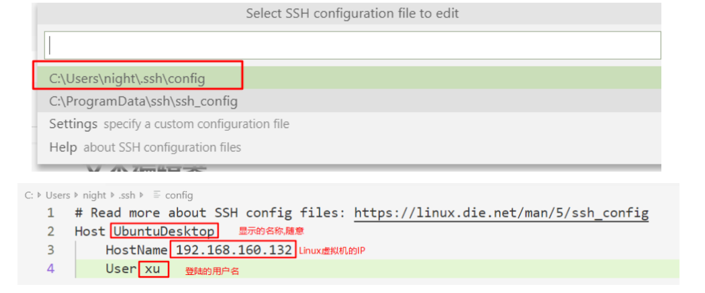
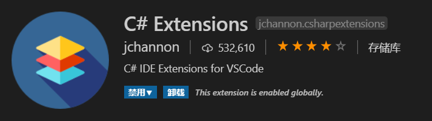
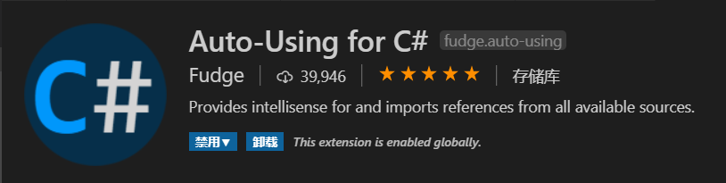
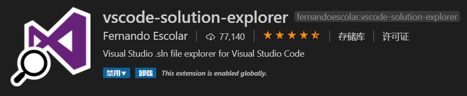
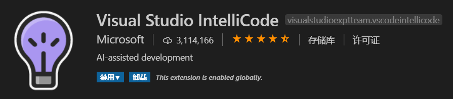

# VSCode

## Remote Development远程开发

1. vscode中安装`Remote Development`扩展（扩展中包含了多个插件),安装完成后,点击左下角出现远程图标.这表示扩展已经安装完成
1. Linux服务器上安装ssh远程连接服务
  ```bash
  # 检查ssh服务是否安装
  systemctl status sshd
  ```
1. 打开vscode设置或者`ctrl shift p`输入remote-ssh:settings打开远程设置，勾选`Remote.SSH:Show Login Terminal`
1. 点击左下角图标选择`Remote-SSH：Connect to Host`选择服务器链接即可（如果是新服务器选择`Configure SSH Hosts...`,选择`xxx\.ssh\config`）
1. 添加远程配置信息
  
1. 配置完之后会在vscode的左边工具栏远程服务器中出现对应的服务器
1. 点击服务器，输入密码即可登陆（要输入2次）
1. 每次都要输入密码很麻烦，可以通过 [【SSH免密登陆】](../linux/cmd.md) 解决

## C# Extensions
这个插件最有用的功能是可以右键新建C#类和C#接口，同时支持各种code snippets，例如 ctor 、prop等，具体功能特性，可以查看插件的说明


## Auto-Using for C#
这个插件自动添加using引用


## vscode-solution-explorer
这个插件给VS Code增加了解决方案tab, 支持新建解决方案、新建工程、添加引用、Nuget包，这个插件非常有用


## Code Runner
即选中一段代码，直接run


## Visual Studio IntelliCode
VS代码智能提示，根据上下文语境，自动推荐你下一步用到的代码，后台基于AI的



## VSCode错误处理

### The SDK 'Microsoft.NET.Sdk.Web' specified could not be found

setting "omnisharp.path": "latest" in VS Code's setting.json.
