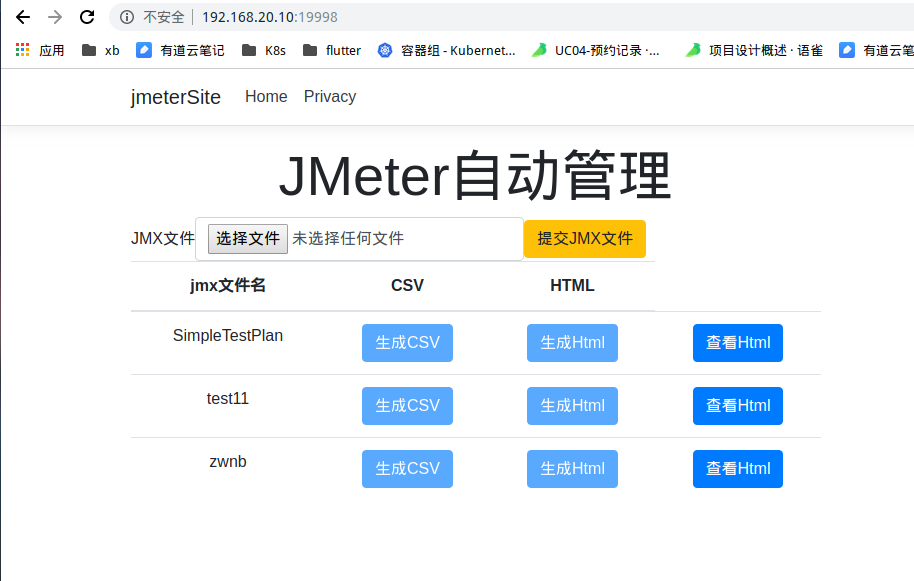

# Doker部署Jmeter

使用我已经做好的镜像直接部署：

1. jmeter服务端容器部署：

    ```bash
    docker run -d -p 4444:4444 --name jserver yasewang/jserver:01
    ```
1. jmeter客户端容器部署：

    ```bash
    docker run -i -d -v /j/jmx:/j/jmx -v /j/csv:/j/csv -v /j/html:/j/html -v /etc/localtime:/etc/localtime --name jclient jclient
    chmod 766 /j/jmx
    chmod 766 /j/csv
    chmod 766 /j/html
    ```
1. jmeter管理网站部署：

    ```bash
    docker run -d -p 19998:80 -v /j:/j -v /var/run/docker.sock:/var/run/docker.sock -v /usr/bin/docker:/usr/bin/docker -v /etc/localtime:/etc/localtime -e LANG="C.UTF-8" --name jsite yasewang/jsite:01
    ```
    * 这里需要特别注意一下，管理网站必须和客户端部署在同一台服务器。
1. 经过上面的流程已经全部部署完了，可以使用 `客户端服务器ip：19998` 访问


* 如果你想要了解整个制作过程，可以继续往下看

梳理一下Jmeter测试的流程：

1. 在待测试服务器部署Jmeter的服务端，运行Jmeter服务器用于收集服务器CPU、内存、NetworkIO等参数。
1. 安装Jmeter客户端（一般在本地机器），配置测试需要的参数或者使用jmx配置文件
1. 使用客户端发送测试请求（可以使用命令行或者GUI客户端操作）
1. Jmeter服务端响应客户端请求，将测试时服务端相关参数收集起来并返回给客户端（GUI直接展示或者返回csv等文件）
1. 如果返回的是csv文件可以用过命令转换成html的格式

我们需要做的工作就是将上面的过程尽量做到部署简化以及最后报告先上可视化。

## 一、待测试服务器部署Jmeter服务端容器

### 制作Jmeter服务端Docker镜像

1. 新建文件夹 `jmeter.server`,将jmeter压缩包里面的`ServerAgent`复制到文件夹中
1. 在 `jmeter.server`文件夹中添加 `Dockerfile` 文件，内容如下：
    
    ```Dockerfile
    FROM java:8
    WORKDIR /jmeter
    COPY . /jmeter
    RUN chmod u+x ./ServerAgent/startAgent.sh
    ENTRYPOINT ["sh", "./ServerAgent/startAgent.sh"]
    ```
1. 生成镜像

    ```bash
    docker build -t xxxx/jserver:v1 .
    ```
1. 上传镜像到镜像仓库
* 完成上面步骤镜像制作部分就完成了

### 目标服务器拉取镜像运行Jmeter服务端探测容器

这一步需要在待监控的服务器上执行

1. 拉取jmeter服务端镜像

    ```bash
    # 就是上一步我们自己制作的镜像
    docker pull xxxx/jserver:v1
    ```
1. 启动jmeter服务端监控容器

    ```bash
    # 宿主机端口可以自行配置
    docker run -d -p 4444:4444 --name jserver xxxx/jserver:v1
    ```
1. 运行起来后可以使用本地jmeter客户端验证一下是否正常

* 至此Jmeter服务端镜像已经制作完成，并且完成了待监控服务器的Jmeter探测容器部署。

## 二、Jmeter客户端Docker部署

### 制作Jmeter客户端端Docker镜像

1. 新建 `jmeter.client` 文件夹，将jmeter压缩包里面的`apache-jmeter`复制到文件夹中
1. 在 `jmeter.client`文件夹中添加 `Dockerfile` 文件，内容如下：

    ```Dockerfile
    FROM java:8
    WORKDIR /jmeterclient
    COPY . /jmeterclient
    ENV JMETER_HOME /jmeterclient/apache-jmeter
    ENV PATH $JMETER_HOME/bin:$PATH
    ```
1. 在 `jmeter.client`文件夹中添加 `sh` 文件夹，添加下面2个脚本：

    ```sh
    # csv.sh 使用jmeter客户端命令根据jmx文件生成csv

    #!/bin/bash
    filename="$1"
    chmod u+x /j/jmx/$filename.jmx
    jmeter -n -t  /j/jmx/$filename.jmx -l /j/csv/$filename.csv
    exit 0

    # html.sh 使用jmeter客户端命令根据csv文件生成html报告

    #!/bin/bash
    filename="$1"
    chmod u+r /j/html
    jmeter -g /j/csv/$filename.csv -o  /j/html/$filename
    exit 0;
    ```
1. 生成镜像

    ```bash
    docker build -t xxxx/jclient:v1 .
    ```
1. 上传镜像到镜像仓库

* 完成上面步骤镜像制作部分就完成了

### Jmeter客户端宿主服务器拉取镜像运行Jmeter客户端容器

这一步需要在的Jmeter客户端宿主服务器上执行

1. 拉取jmeter客户端镜像

    ```bash
    # 就是上一步我们自己制作的镜像
    docker pull xxxx/jclient:v1
    ```
1. 启动jmeter客户端监控容器

    ```bash
    # 这里的几个映射都是一定要的，后面的Jmeter管理网站也要用到这几个目录
    docker run -i -d -v /j/jmx:/j/jmx -v /j/csv:/j/csv -v /j/html:/j/html --name jclient xxxx/jclient:v1
    ```
    * `/j/jmx`: 存放`jmx`格式文件
    * `/j/csv`: 存放生成的`csv`文件
    * `/j/html`: 存方生成的`html`报告

1. 在宿主机修改下面文件夹权限

    ```bash
    chmod 766 /j/jmx
    chmod 766 /j/csv
    ```

1. 运行起来后，需要验证jmeter客户端容器是否正常

    ```bash
    docker exec jclient jmeter -h
    # 查看是否能正常使用jmeter命令，能使用说明正常
    ```

* 至此Jmeter客户端镜像已经制作完成，并且完成了Jmeter客户端服务器的容器部署。

## 三、Jmeter管理网站Docker部署


### Jmeter管理网站内容制作

这里Jmeter网站的作用是要使用命令调用Jmeter客户端完成对目标服务器的测试。

所以网站上要实现的功能流如下：

1. 上传jmx文件

    ```csharp
    // 这里需要注意一下，这个jmx保存目录一定跟上面jmeter客户端容器映射的jmx目录一致
    var filePath = $"/j/jmx/{FileUpload.UploadPublicSchedule.FileName}";

    using (var fileStream = new FileStream(filePath, FileMode.Create))
    {
        await FileUpload.UploadPublicSchedule.CopyToAsync(fileStream);
    }

    ```
1. 使用jmx文件调用jmeter的命令生成csv

    ```csharp
    // 这里的csv.sh就是上一步我们生成jclient容器里面的脚本之一
    var result = _ExecBash("csv.sh", arguments);

    private string _ExecBash(string filename, string arguments)
    {
        // 这里需要注意一下，其实是需要使用jclient容器执行命令的
        var psi = new ProcessStartInfo($"docker", $"exec jclient ./sh/{filename} {arguments}")
        {
            RedirectStandardOutput = true
        };
        var sb = new StringBuilder();
        //启动
        var proc=Process.Start(psi);
        if (proc == null)
        {
            sb.Append("无法执行！");
        }
        else
        {
            //开始读取
            using (var sr = proc.StandardOutput)
            {
                while (!sr.EndOfStream)
                {
                    sb.AppendLine($"{sr.ReadLine()}");
                }

                Thread.Sleep(1000 * 15);

                if (!proc.HasExited)
                {
                    proc.Kill();
                }
            }
        }
        return sb.ToString();
    }
    ```
1. 使用csv文件调用jmeter的命令生成html报告

    ```csharp
    var result = _ExecBash("html.sh", arguments);
    ```
1. 在线展示html报告

    ```csharp
    // 将StartUp.cs文件的Configure方法添加静态文件展示

    app.UseStaticFiles(new StaticFileOptions()
    　　{
            // 这个目录就是我们jmeter客户端生成报告的地址
    　　　　FileProvider = new PhysicalFileProvider("/j/html"),

    　　　　RequestPath = new PathString("/html") 
        });
    ```

* 所有的Jmeter管理网站的核心内容已经介绍完毕了，接下来就是镜像制作了

### Jmeter管理网站镜像制作

1. 网站根目录添加`Dockerfile`文件，内容如下：

    ```Dockerfile
    FROM mcr.microsoft.com/dotnet/core/aspnet:2.2
    WORKDIR /app
    EXPOSE 80
    COPY ./bin/Release/netcoreapp2.2/publish .
    RUN apt-get update && apt-get libltdl7
    ENTRYPOINT ["dotnet", "jmeterSite.dll"]
    ```
1. 编译网站生成Release版本

    ```bash
    dotnet publish -c Release
    ```
1. 生成镜像：
    
    ```bash
    docker build -t xxxx/jsite:v1 .
    ```
1. 上传镜像到镜像仓库

### Jmeter管理网站部署

* 这里需要特别注意，Jmeter管理网站容器一定要和Jmeter客户端容器在一台服务器。

1. 拉取Jmeter管理网站镜像

    ```bash
    docker pull xxxx/jsite:v1
    ```
1. 运行Jmeter管理网站容器

    ```bash
    docker run -d -p 19998:80 -v /j:/j -v /var/run/docker.sock:/var/run/docker.sock -v /usr/bin/docker:/usr/bin/docker -v /etc/localtime:/etc/localtime --name jsite xxxx/jsite:v1
    ```
    * `-v /var/run/docker.sock:/var/run/docker.sock -v /usr/bin/docker:/usr/bin/docker`：这个映射一定要带上，不然`jsite`容器无法使用docker命令。

1. 大功告成，现在可以使用 `Jemeter管理网站ip:19998` 访问管理页面了

最后来一张最终效果图：



