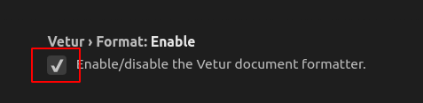
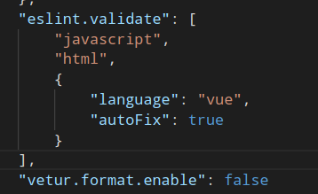

# Vue-VSCode配置

## Vetur格式化禁用  
由于目前eslint基本上采用的是airbnb，有2条限制大家都很熟悉。第一，字符串必须为单引号；第二，函数语句不必加分号。所以我们选择抛弃`vetur`的格式化设置

1. 打开vscode设置
1. 禁用Vetur的“特权”
    
1. 配置使用eslint
    
---
## vue文件`import`路径提示
1. 安装插件：`Path Intellisense`
1. 配置：
    ```json
    "path-intellisense.mappings": {
        "@": "${workspaceRoot}/src"
    }
    ```
    <!-- more -->
1. 在项目中创建jsconfig.json或者tsconfig.json
    ```json
    {
        "compilerOptions": {
            "target": "ES6",
            "module": "commonjs",
            "allowSyntheticDefaultImports": true,
            "baseUrl": "./",
            "paths": {
            "@/*": ["src/*"]
            }
        },
        "exclude": [
            "node_modules"
        ]
    }
    ```